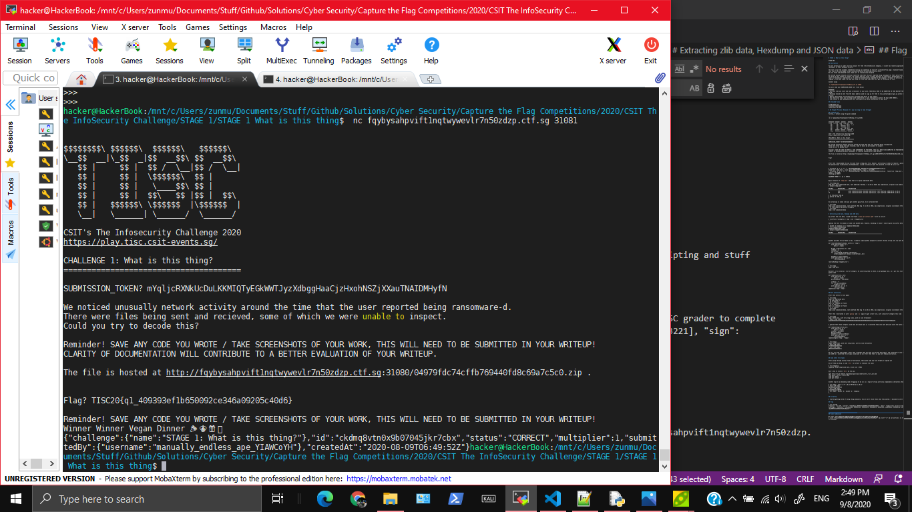

# STAGE 1: What is this thing?

STAGE ONE

## Description

You are working as a cyber security analyst for TISC (The InfoSecurity Company). A client has recently approached us after they were struck by ransomware on their database servers!

The last script the sysadmin remembered running was something he took off a stackoverflow page: stackoverflowed.png attached below!
This lead to a github page: https://github.com/divoc-91/AnorocWare-Server-Patch
We also found some deleted files: Some sort of transactional diagram

We noticed unusual network activity around the time that the user reported being ransomware-d. There were files being sent and received, some of which we were unable to inspect. We suspect they are using a simple password (6 characters, hexadecimal) on the zip files as well as several layers of encoding / compression so it cannot be automatically unpacked by the company's firewall or antivirus. Think of it roughly like zipping a file many times. We need your help to write some code that will get to the bottom of this!

Connect using

`nc fqybysahpvift1nqtwywevlr7n50zdzp.ctf.sg 31081`

You will need your SUBMISSION_TOKEN too! (find below)

REMINDER!
* Save any code you wrote and take screenshots of your work, THESE WILL NEED TO BE SUBMITTED IN YOUR WRITEUP FOR YOUR ATTEMPT TO BE CONSIDERED VALID!
* Writeups should be sent from the email address used to sign up for TISC to tisc_contactus@csit.gov.sg within 48h after the end of your 48h session.
* Emails should have "tiscwriteup your_fullname_goes_here" as the subject.
* You should not share your writeups with anyone else or post them publicly before 08 Sept 2020 0000hrs.
* The clarity of your documentation will contribute to a better evaluation of your work.

## Attached Files

planBscheme.png

stackoverflowed.png

suspectedscript.png

# Solution

Use fcrackzip to bruteforce the password of the zip file and extract out `temp.mess`.

Make a python program that can identify if a file is `gzip`/`xz`/`bzip`/`zlib` compressed, Base64,  a regular hexdump, a list of integers. Then either extract it out (for `gzip`/`xz`/`bzip`/`zlib`), convert into raw data (Base64, hexdump), or convert each integer in the list of integers to a character and write all of the characters to a raw file.

Repeat this process recursively on `temp.mess` and you will get a 

# My Thought Process (Because It's way too long to read through) 

## Cracking Zip

Firstly, I netcat using the given command

```
~$ nc fqybysahpvift1nqtwywevlr7n50zdzp.ctf.sg 31081


$$$$$$$$\ $$$$$$\  $$$$$$\   $$$$$$\
\__$$  __|\_$$  _|$$  __$$\ $$  __$$\
   $$ |     $$ |  $$ /  \__|$$ /  \__|
   $$ |     $$ |  \$$$$$$\  $$ |
   $$ |     $$ |   \____$$\ $$ |
   $$ |     $$ |  $$\   $$ |$$ |  $$\
   $$ |   $$$$$$\ \$$$$$$  |\$$$$$$  |
   \__|   \______| \______/  \______/

CSIT's The Infosecurity Challenge 2020
https://play.tisc.csit-events.sg/

CHALLENGE 1: What is this thing?
======================================

SUBMISSION_TOKEN? PUTINYOURTOKENHERE

We noticed unusually network activity around the time that the user reported being ransomware-d.
There were files being sent and recieved, some of which we were unable to inspect.
Could you try to decode this?

Reminder! SAVE ANY CODE YOU WROTE / TAKE SCREENSHOTS OF YOUR WORK, THIS WILL NEED TO BE SUBMITTED IN YOUR WRITEUP!
CLARITY OF DOCUMENTATION WILL CONTRIBUTE TO A BETTER EVALUATION OF YOUR WRITEUP.

The file is hosted at http://fqybysahpvift1nqtwywevlr7n50zdzp.ctf.sg:31080/04979fdc74cffb769440fd8c69a7c5c0.zip .


Flag?

```

After that I downloaded the zip file and found a temp.mess file. However, extracting it seems to require a password. Since the challenge said the password was 6 characters and hexadecimal, I used fcrackzip to get the password. It took 20 min or so?

```
$ fcrackzip -b -u -v -l 6 -c ':0123456789ABCDEF' 04979fdc74cffb769440fd8c69a7c5c0.zip
found file 'temp.mess', (size cp/uc 245827/245740, flags 3, chk a499)
$ fcrackzip -b -u -v -l 6 -c ':0123456789abcdef' 04979fdc74cffb769440fd8c69a7c5c0.zip   found file 'temp.mess', (size cp/uc 245827/245740, flags 3, chk a499)
checking pw 98967f

PASSWORD FOUND!!!!: pw == 9a035a
```

Basic analysis of `temp.mess` show that it is gzip compressed data
```
$ file temp.mess
temp.mess: gzip compressed data, last modified: Wed Aug  5 11:28:11 2020, max compression, original size modulo 2^32 245647
$ binwalk temp.mess

DECIMAL       HEXADECIMAL     DESCRIPTION
--------------------------------------------------------------------------------
0             0x0             gzip compressed data, maximum compression, last modified: 2020-08-05 11:28:11
15            0xF             gzip compressed data, maximum compression, last modified: 2020-08-05 11:28:11

$ mv temp.mess temp.gz
$ gunzip -d temp.gz
$
```

On extracting it seems like you get another gzip file. So I extracted that
```
$ file temp
temp: gzip compressed data, last modified: Wed Aug  5 11:28:11 2020, max compression, original size modulo 2^32 245554
$ mv temp temp.gz && gunzip -d temp.gz
$ file temp
temp: zlib compressed data
```

## Extracting zlib data

To extract the zlib data, I used zlib-flate (`sudo apt install qpdf` first to use it)
```
$ zlib-flate -uncompress < temp | cat > tempdata.txt
```

## Extracting hexdump and list of integers (JSON Data)
Opening the text file makes it seem like base64 data. However, decoding it doesn't seem to give any useful data
```
$ base64 -d tempdata.txt > tempdata-b64decoded
$ file tempdata-b64decoded
tempdata-b64decoded: data
$ binwalk tempdata-b64decoded

DECIMAL       HEXADECIMAL     DESCRIPTION
--------------------------------------------------------------------------------


```

Another possible form of data is Hex. I coded a simple python program to convert the hex string into raw byte data
```
def reverseHexDump(filename, outFile = "temp"):
    with open(filename) as f:
        data = f.read()
    
    # Read 2 characters at a time
    intData = []
    charAtTime = 2
    for i in range(0,len(data),charAtTime):
        intData.append(int( data[i:i+charAtTime] ,16))
    
    byteData = bytes(intData)
    with open(outFile,'wb') as f:
        f.write(byteData)

reverseHexDump('tempdata.txt')
```
```
$ file temp
temp: JSON data
```

Moreover, it's actually a list of integers. On converting them to ASCII, I get garbage text, so I put this text into a new file with another python code
```
def readInJson(file, out):
    with open(file) as f:
        data = f.read()
    processedData = eval(data)

    strData = ""
    for i in processedData:
        strData += chr(i)
    with open(out,'w') as f:
        f.write(strData)
readInJson('temp','temp')
```

## Extrcating `xz`

After that extract it out again
```
$ file temp
temp: XZ compressed data
$ mv temp temp.xz
$ xz -d temp.xz
$ file temp
temp: gzip compressed data, last modified: Wed Aug  5 11:28:11 2020, max compression, original size modulo 2^32 215096
```

After that I extracted it with `gunzip` and `xz` again to get a text file, with a bunch of integers this time
```
$ file temp
temp: ASCII text, with very long lines, with no line terminators
$ head -c 100 temp
3738396338346237363535303163346566303236386362623834653061656331323162383562373037373737373730626236
```

I guessed that these integers could mean more byte data so I converted them into byte data and wrote the bytes into raw file
```
def readInIntegers(file,out):
    with open(file) as f:
        data = f.read()
    intData = int(data)
    #print(intData)
    byteData = bytes([intData])
    with open(out,'wb') as f:
        f.write(byteData)
readInIntegers('temp', 'temp1')
```
```
$ file temp1
temp1: ASCII text, with very long lines, with no line terminators
$ head -c20 temp1
[3738396338346237363
$ tail -c20 temp1
306533333239353537L]
$
```
Ok it's just the same number. After that I thought that this may just be hex data again, and converted it into raw byte data again (and that was JSON so I converted the strings inside and so on) After that there is way more tedious extraction.


## Some other file types

After going through several times of extraction, there were some new file formats I figured out

One of them was bzip. I used `dtrx` to extract it (because I'm lazy)
```
$ file tempbzip
tempbzip: bzip2 compressed data, block size = 900k
```

Here's how to install `dtrx` by the way.
```
wget http://ftp.br.debian.org/debian/pool/main/d/dtrx/dtrx_7.1-2_all.deb
sudo dpkg -i dtrx_7.1-2_all.deb
sudo apt update
sudo apt install -f
```

Another type I was decoding (and struggling to do so) is a type of string with only alphanumeric characters.Then I realised it is Base64
```
$ cat temp1 | grep -o -P '.{0,3}[^0-9A-Za-z].{0,4}'
$ head -c20 temp1
UWxwb09URkJXU1pUV1V4
$ tail -c20 temp1
Ulwd29TQ1kwcklDQT0K
$ cat temp1 | base64 -d | base64 -d > tempbzip
$
```

## Scripting

I started getting bored of doing things manually. Also I don't think thats what they wanted. I decided to start scripting the automatic extraction of files. There was probably an online extractor online that could do this for you, but ~I'm not very smart~ I wanted to challenge myself.

After that I let the program run until it crashes correctly, and I can get the flag

```
$ python solve.py
...
an integer is required
Traceback (most recent call last):
  File "solve.py", line 135, in <module>
    scriptRun('test')
  File "solve.py", line 129, in scriptRun
    raise Exception(str(e)+"\nCurrent counter at "+str(counter))
Exception: an integer is required
Current counter at 163
$ cat test163
{"anoroc": "v1.320", "secret": "TISC20{q1_409393ef1b650092ce346a09205c40d6}", "desc": "Submit this.secret to the TISC grader to complete challenge", "constants": [1116352408, 1899447441, 3049323471, 3921009573, 961987163, 1508970993, 2453635748, 2870763221], "sign": "boy0NNVUj2epGX0mAv5bo9nwBqqwcQ"}
```

Wow I took 6.5 hours.

# Flag

`TISC20{q1_409393ef1b650092ce346a09205c40d6}`

## Final Submission

```
$  nc fqybysahpvift1nqtwywevlr7n50zdzp.ctf.sg 31081                 
.
.
.

Flag? TISC20{q1_409393ef1b650092ce346a09205c40d6}

Reminder! SAVE ANY CODE YOU WROTE / TAKE SCREENSHOTS OF YOUR WORK, THIS WILL NEED TO BE SUBMITTED IN YOUR WRITEUP!
Winner Winner Vegan Dinner 🎉🎊🎁🥳
{"challenge":{"name":"STAGE 1: What is this thing?"},"id":"ckdmq8vtn0x9b07045jkr7cbx","status":"CORRECT","multiplier":1,"submittedBy":{"username":"manually_endless_ape_YIAWCoYH"},"createdAt":"2020-08-09T06:49:52Z"}
```



# Final Python Solution
```
# Run in python 2
ZIP_FILE = "04979fdc74cffb769440fd8c69a7c5c0.zip"
PASSWORD = "9a035a"

import os
def route(inname,out):
    if inname != out:
        os.system("mv "+inname+" "+out)
        
def unzip(filename, out="temp.mess"):
    os.system("unzip"+" -P "+PASSWORD+" "+ZIP_FILE)
    route("temp.mess",out)

def unGZ(filename, out):
    os.system("gunzip "+filename)
    route(filename.split('.')[0],out)
def unXz(filename, out):
    command = "xz -d "+filename
    print('Command:' + command)
    os.system(command)
    route(filename.split('.')[0],out)

def unZlib(filename,out):
    command = 'zlib-flate -uncompress < '+filename+' | cat > '+out
    os.system(command)

def reverseHexDump(filename, outFile = "rawFile"):
    with open(filename) as f:
        data = f.read()
    
    # Read 2 characters at a time
    intData = []
    charAtTime = 2
    for i in range(0,len(data),charAtTime):
        intData.append(int( data[i:i+charAtTime] ,16))
    
    byteData = bytes(intData)
    with open(outFile,'wb') as f:
        f.write(byteData)

def readInJson(file, out):
    with open(file) as f:
        data = f.read()
    processedData = eval(data)

    strData = ""
    for i in processedData:
        strData += chr(i)
    with open(out,'w') as f:
        f.write(strData)

#############################################################################
        
def legacy():
    os.system('rm temp*')

    unzip(ZIP_FILE,'temp.gz')
    unGZ('temp.gz','temp.gz')
    unGZ('temp.gz','temp.zlib')
    unZlib('temp.zlib','temp')
    reverseHexDump('temp','temp.json')
    readInJson('temp.json', 'temp.xz')
    os.system('rm temp')
    unXz('temp.xz', 'temp.gz')
    unGZ('temp.gz','temp.xz')
    unXz('temp.xz', 'temp')

    reverseHexDump('temp','temp.json')
    readInJson('temp.json', 'temp')
    reverseHexDump('temp', 'temp')
    readInJson('temp', 'temp.zlib')

    unZlib('temp.zlib','temp.bzip')
    os.system("dtrx temp.bzip && mv temp.bzip.1 temp.zlib")
    unZlib('temp.zlib','temp')
    reverseHexDump('temp','temp.json')
    readInJson('temp.json', 'tempb64')
    readInJson('temp.json', 'test')
    #os.system('$ cat tempb64 | base64 -d > test')
    
    #os.system('rm temp*')

def singleExtraction(filename, outfile):
    cmd = os.popen('file '+filename).read()
    cmdOut = cmd.split(':')[1]
    print(cmdOut)
    
    if 'gzip compressed data' in cmdOut:
        #unGZ(filename,outfile)
        os.system("dtrx "+filename+" && mv "+filename+".1 "+outfile)
        
    elif 'XZ compressed data' in cmdOut:
        os.system('mv '+filename+' '+filename+'.xz')
        unXz(filename+'.xz', outfile)
        
    elif 'zlib compressed data' in cmdOut:
        unZlib(filename, outfile)
        
    elif 'ASCII text, with very long lines' in cmdOut:
        with open(filename) as f:
            data = f.read()
        b64Identify = False
        for i in "ABCDEFGHIJKLMNOPQRSTUVWXYZ":
            if i in data: b64Identify = True
        if b64Identify: #base64
           os.system("cat "+filename+" | base64 -d > "+outfile)
        else:
            reverseHexDump(filename,outfile)
            
    elif 'JSON data' in cmdOut:
        readInJson(filename, outfile)
        
    elif 'bzip2 compressed data' in cmdOut:
        os.system("dtrx "+filename+" && mv "+filename+".1 "+outfile)
        
    else:
        os.system("cp "+filename+" undoneyet")
        raise Exception("Not implemented file type of "+cmdOut)


def scriptRun(ogFile):
    os.system("cp "+ogFile+" "+ogFile+str(0))
    counter = 0
    while True:
        inf , outf = ogFile+str(counter), ogFile+str(counter+1) 
        try:
            singleExtraction(inf, outf)
        except Exception as e:
            print(str(e))
            raise Exception(str(e)+"\nCurrent counter at "+str(counter))
        counter += 1

if True:
    legacy()
#singleExtraction('tempb64', 'temp8')
scriptRun('test')
#reverseHexDump('temp1','temp.json')
```