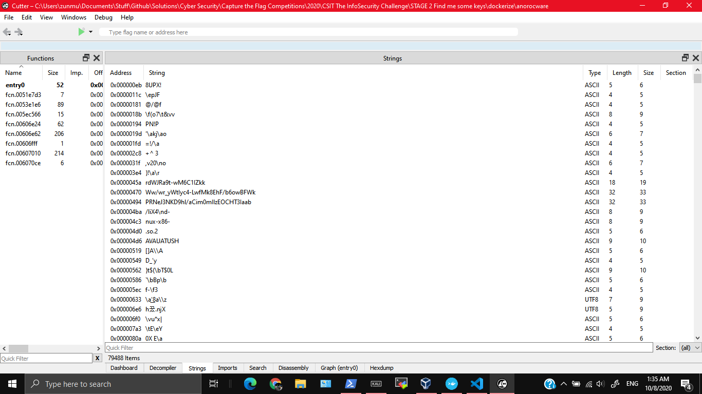
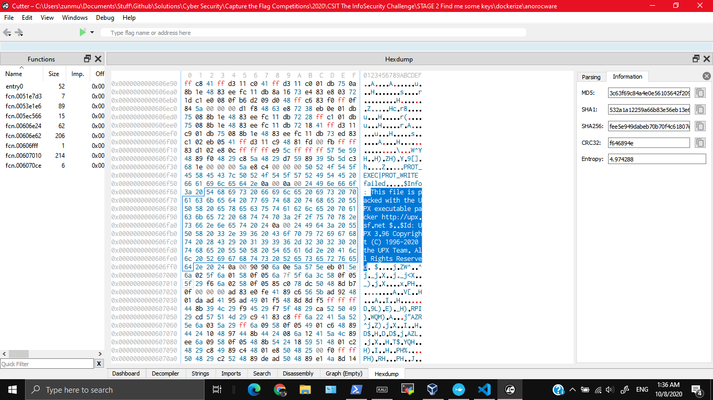
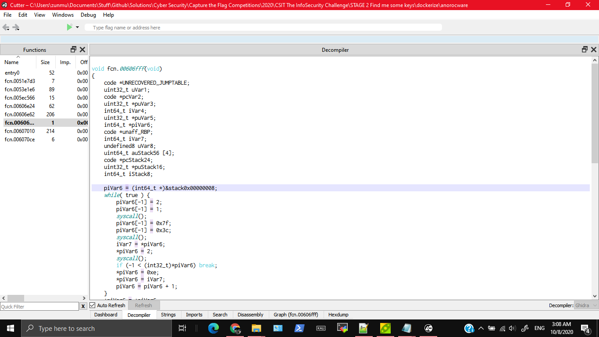
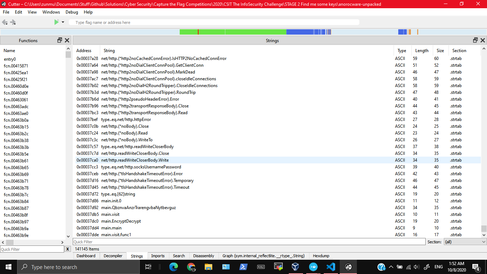
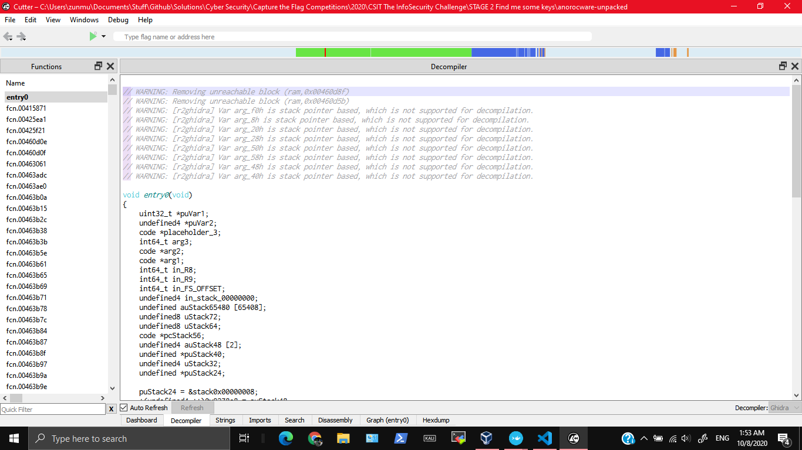
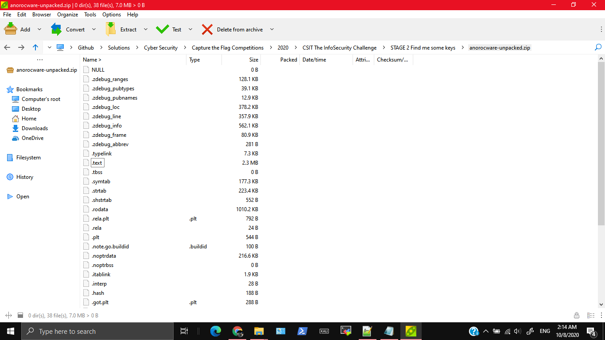
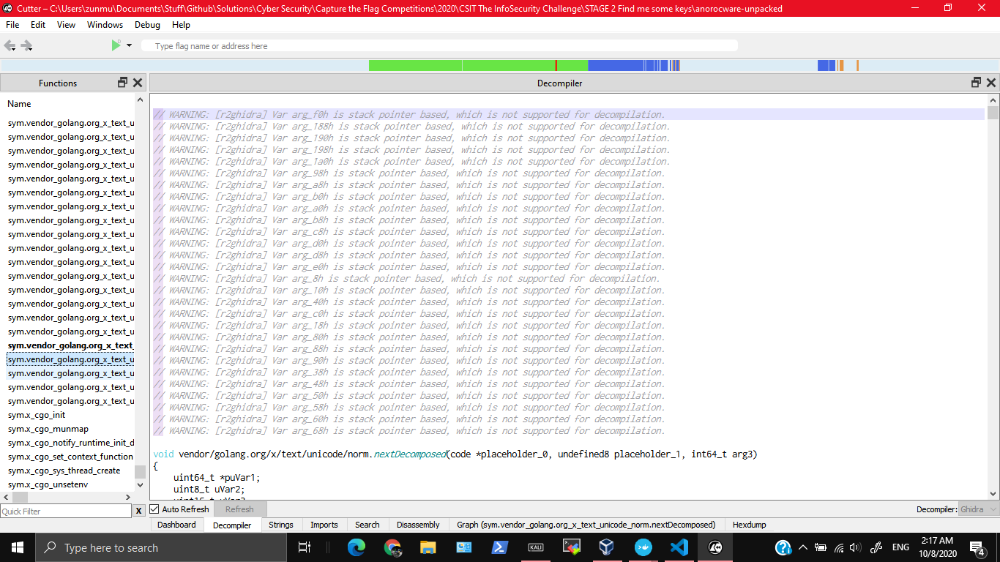
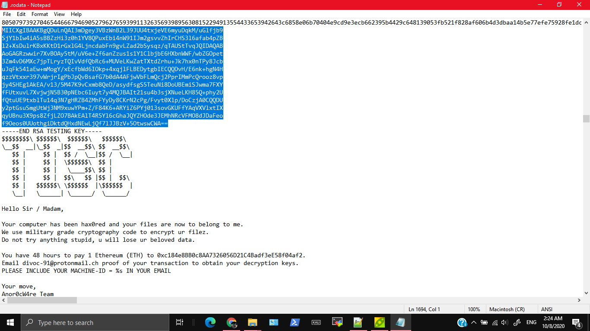

# STAGE 2: Find me some keys

STAGE TWO

## Description

YOU WILL NEED ENCRYPTED.ZIP ATTACHED BELOW

You have recovered the ransomware that has been running on the computers. First, you need to figure out how the ransomware works, what encryption algorithm it uses.

Please handle the anorocware executable with caution, we have provided a Dockerfile for you to containerise the ransomware. You may also choose to use a Virtual Machine.

Find the public key that is embedded in the binary.
Hash the base64 string of the public key using sha256 and submit flag as TISC20{sha256 hash of the base64 encoded public key}

ANSWER FORMAT EXAMPLE:

The key file will look something like this but longer:
`LS0tLS1CRUdJTiBQVUJMSUMgS0VZLS0tLS0NCmMyOXRaU0JpWVhObE5qUWdjM1J5YVc1bklHZHZaWE1nYUdWeVpRPT0NCi0tLS0tRU5EIFBVQkxJQyBLRVktLS0tLQ==`

Internally it contains something like this:
```
-----BEGIN PUBLIC KEY-----
c29tZSBiYXNlNjQgc3RyaW5nIGdvZXMgaGVyZQ==
-----END PUBLIC KEY-----
```

You will need to perform a sha256 hash on the whole key file, i.e. `sha256("LS0tLS1CRUdJTiBQVUJMSUMgS0VZLS0tLS0NCmMyOXRaU0JpWVhObE5qUWdjM1J5YVc1bklHZHZaWE1nYUdWeVpRPT0NCi0tLS0tRU5EIFBVQkxJQyBLRVktLS0tLQ==")` to obtain `799f319d8400243a8331d70ae7df4bacf0290dca303b138b03263655e9548caf`

Then submit flag as `TISC20{799f319d8400243a8331d70ae7df4bacf0290dca303b138b03263655e9548caf}`

REMINDER!

Save any code you wrote and take screenshots of your work within your allocated 48h session, THESE WILL NEED TO BE SUBMITTED IN YOUR WRITEUP FOR YOUR ATTEMPT TO BE CONSIDERED VALID!
Writeups should be sent from the email address used to sign up for TISC to tisc_contactus@csit.gov.sg within 48h after the end of your 48h session.
Emails should have "tiscwriteup your_fullname_goes_here" as the subject.
You should not share your writeups with anyone else or post them publicly before 08 Sept 2020 0000hrs.
The clarity of your documentation will contribute to a better evaluation of your work.

## Attached Files

encrypted.zip

# Solution

## Finding out it's UPX packed

I'm using Windows, so I need to setup docker first. ~~Totally didn't spend 1h 45 min trying to extract a linux VM becuase my original one broke and failing~~. A good way to do it is to `choco install docker-toolbox`. It sets up the server for you, so all you need to do is to open a program, and you get access to a command prompt with docker access.

Firstly, I decompiled the program using [Cutter](https://cutter.re/) (which uses Ghidra's Decompiler). Cutter is a good tool for Windows (Don't have to deal with Java and cumbersome UI and setup). It doesn't seem like it has any meaningful strings.



However, on looking at the hex dump, it seems like it is packed with UPX packer? That seems interesting (maybe it's why the decompiler couldn't fully decompile ~~or it's just me being lazy to read~~).





I set up the container by running `docker build dockerize`. After that I ran some basic commands to figure out what it was doing (since I can't actually read the decompiled code properly). By the way if you want to get a terminal out of the container run `docker run -i -t CONTAINER_ID bash`
```
$ docker run anorocware './anorocware'
:(
$ docker run anorocware 'ltrace ./anorocware'
Couldn't find .dynsym or .dynstr in "/proc/8/exe"
$ docker run anorocware 'strace anorocware' > strace.log
```

After some googling I realised you could easily unpack the executable with a linux command. I installed upx in the docker container (actually in normal linux works too) and unpacked the executable.
```
root@23bbdce9e1da:~# apt install upx
Reading package lists... Done
Building dependency tree
Reading state information... Done
Note, selecting 'upx-ucl' instead of 'upx'
The following additional packages will be installed:
  libucl1
The following NEW packages will be installed:
  libucl1 upx-ucl
0 upgraded, 2 newly installed, 0 to remove and 4 not upgraded.
Need to get 417 kB of archives.
After this operation, 2158 kB of additional disk space will be used.
Do you want to continue? [Y/n] y
.
.
.
.
Processing triggers for libc-bin (2.31-0ubuntu9) ...
root@23bbdce9e1da:~# upx
                       Ultimate Packer for eXecutables
                          Copyright (C) 1996 - 2018
UPX 3.95        Markus Oberhumer, Laszlo Molnar & John Reiser   Aug 26th 2018

Usage: upx [-123456789dlthVL] [-qvfk] [-o file] file..

Commands:
  -1     compress faster                   -9    compress better
  -d     decompress                        -l    list compressed file
  -t     test compressed file              -V    display version number
  -h     give more help                    -L    display software license
Options:
  -q     be quiet                          -v    be verbose
  -oFILE write output to 'FILE'
  -f     force compression of suspicious files
  -k     keep backup files
file..   executables to (de)compress

Type 'upx --help' for more detailed help.

UPX comes with ABSOLUTELY NO WARRANTY; for details visit https://upx.github.io
root@23bbdce9e1da:~# upx -d anorocware
                       Ultimate Packer for eXecutables
                          Copyright (C) 1996 - 2018
UPX 3.95        Markus Oberhumer, Laszlo Molnar & John Reiser   Aug 26th 2018

        File size         Ratio      Format      Name
   --------------------   ------   -----------   -----------
   7406375 <-   3993332   53.92%   linux/amd64   anorocware

Unpacked 1 file.
root@23bbdce9e1da:~# ls
anorocware  clients.db.anoroc  email  images  keydetails-enc.txt  ransomnote-anoroc.txt  secret_investments.db.anoroc
```
## Strings

After that I copied the unpacked executable out from the docker container and analysed it in Cutter. The results are much more promising. The decompiled code is more readable.

```
$ docker cp reverent_allen:/root/anorocware anorocware-unpacked
```





There was also a potential long string `rdWJRa9t-wM6C1IZkkWw/wr_yWtIyc4-LwfMk8EhF/b6owBFWkPRNeJ3NKD9hl/aCim0mIlzEOCHT3IaabM` which could be the key but probably not.

The function names remind me a lot of Java. On some googling, it's actually possible to convert from Java to Linux Executable through the use of [gcj](https://stackoverflow.com/questions/29429976/how-to-convert-a-java-or-a-jar-file-into-a-linux-executable-file-without-a) and also some methods. Maybe it is possible to reverse the change?

Let's analyse the file. Running ltrace on it seems a lot more promising this time.
```
root@23bbdce9e1da:~# ltrace ./anorocware
malloc(56)                                                                                  = 0xbca2a0
pthread_attr_init(0xbca2a0, 0, 65, 0xbca2d0)                                                = 0
pthread_attr_getstacksize(0xbca2a0, 0x7ffda6f2b060, 65, 0xbca2d0)                           = 0
pthread_attr_destroy(0xbca2a0, 0x7ffda6f2b060, 1, 0xbca2d0)                                 = 0
free(0xbca2a0)                                                                              = <void>
mmap(0, 0x40000, 3, 34)                                                                     = 0x7f4a98da0000
mmap(0, 0x20000, 0, 34)                                                                     = 0x7f4a98d80000
mmap(0, 0x100000, 0, 34)                                                                    = 0x7f4a98c80000
mmap(0, 0x800000, 0, 34)                                                                    = 0x7f4a98480000
mmap(0, 0x4000000, 0, 34)                                                                   = 0x7f4a94480000
mmap(0, 0x20000000, 0, 34)                                                                  = 0x7f4a74480000
mmap(0xc000000000, 0x4000000, 0, 34)                                                        = 0xc000000000
mmap(0xc000000000, 0x4000000, 3, 50)                                                        = 0xc000000000
mmap(0, 0x2000000, 3, 34)                                                                   = 0x7f4a72480000
mmap(0, 0x210808, 3, 34)                                                                    = 0x7f4a7226f000
mmap(0x7f4a98d80000, 0x20000, 3, 50)                                                        = 0x7f4a98d80000
.
.
.
000000c000057af8:  8afdad80b547b63b  43b2a29ce3427104
000000c000057b08:  a590fd826b98e69c  2cfec8a1b2b10275
000000c000057b18:  6a1ae8c9116e8fc8  43b2a29ce3427104
000000c000057b28:  00000007676000d0  00000007676000d0
000000c000057b38:  000000c0000ece38  000000c0000ecf90
000000c000057b48:  0000000000000004  00000007676000d0
000000c000057b58:  000000c0000ecf90  000000c0000ecd20
000000c000057b68:  000000000044996f <runtime.sighandler+1967>  0000000000010247
000000c000057b78:  002b000000000033  0000000000000004
000000c000057b88:  000000000000000e  0000000000000000
000000c000057b98:  00000007676000d0  000000c000057c80
000000c000057ba8:  0000000000000000  0000000000000000
000000c000057bb8:  0000000000000000
runtime.sigtramp(0x7, 0x0, 0xc000050000, 0x0, 0x8000, 0x4, 0x2cfec8a1b2b10275, 0x8afdad80b547b63b, 0x43b2a29ce3427104, 0xa590fd826b98e69c, ...)
        /usr/lib/go/src/runtime/sys_linux_amd64.s:389 +0x43

goroutine 12 [running]:
+++ killed by SIGSEGV +++
```

Static analysis on the file type is interesting
```
$ file anorocware-unpacked
anorocware-unpacked: ELF 64-bit LSB executable, x86-64, version 1 (SYSV), dynamically linked, interpreter /lib64/ld-linux-x86-64.so.2, Go BuildID=rdWJRa9t-wM6C1IZkkWw/wr_yWtIyc4-LwfMk8EhF/b6owBFWkPRNeJ3NKD9hl/aCim0mIlzEOCHT3IaabM, not stripped
$ binwalk anorocware-unpacked

DECIMAL       HEXADECIMAL     DESCRIPTION
--------------------------------------------------------------------------------
0             0x0             ELF, 64-bit LSB executable, AMD x86-64, version 1 (SYSV)
3065246       0x2EC59E        Unix path: /dev/stdin/etc/hosts12207031256103515625: parsing :authorityAdditionalBad varintClassCHAOSClassCSNETConnectionContent-IdDSA-SHA2
3066237       0x2EC97D        Unix path: /dev/stderr/dev/stdout/index.html30517578125: frame.sp=Bad GatewayBad RequestClassHESIODCookie.PathENABLE_PUSHEND_HEADERSEarly H
3069522       0x2ED652        Unix path: /etc/protocols/etc/ssl/certs/proc/self/exe/var/ssl/certs1907348632812595367431640625: extra text: <not Stringer>Accept-CharsetCo
3070519       0x2EDA37        Unix path: /etc/machine-id/etc/mdns.allow/etc/mime.types0601021504Z0700476837158203125: cannot parse :ValidateLabels<invalid Value>ASCII_He
3072972       0x2EE3CC        Unix path: /etc/ssl/cert.pem0123456789ABCDEFX0123456789abcdefx060102150405Z07001192092895507812559604644775390625: missing method ; SameSit
3077222       0x2EF466        Unix path: /usr/share/zoneinfo/37252902984619140625Egyptian_HieroglyphsIDS_Trinary_OperatorInsufficient StorageMAX_HEADER_LIST_SIZEMeroitic
3079808       0x2EFE80        Unix path: /etc/apache/mime.types/etc/ssl/ca-bundle.pem/lib/time/zoneinfo.zip/usr/local/share/certs4656612873077392578125DEBUG_HTTP2_GOROUT
3081372       0x2F049C        Unix path: /etc/apache2/mime.types/etc/pki/tls/cacert.pem23283064365386962890625<invalid reflect.Value>CLIENT_TRAFFIC_SECRET_0Logical_Order
3083189       0x2F0BB5        Unix path: /usr/share/lib/zoneinfo//var/lib/dbus/machine-id116415321826934814453125582076609134674072265625Request Entity Too Large", requi
3095270       0x2F3AE6        Unix path: /etc/pki/tls/certs/ca-bundle.crt28421709430404007434844970703125: day-of-year does not match dayMapIter.Value called before Next
3117838       0x2F930E        Unix path: /etc/pki/ca-trust/extracted/pem/tls-ca-bundle.pemECDSA signature contained zero or negative valuescasgstatus: waiting for Gwaiti
3127445       0x2FB895        Base64 standard index table
3409752       0x340758        Intel x86 or x64 microcode, pf_mask 0x00, 1A00-01-03, size 259
3451582       0x34AABE        VxWorks symbol table, big endian, first entry: [type: initialized data, code address: 0x800, symbol address: 0x100]
3453088       0x34B0A0        Unix path: /usr/lib/go
3521376       0x35BB60        SHA256 hash constants, little endian
3521392       0x35BB70        SHA256 hash constants, little endian
3883602       0x3B4252        Cisco IOS microcode, for ""
5111920       0x4E0070        Unix path: /usr/lib/go/src/os/executable.go
5142496       0x4E77E0        Unix path: /sys/kernel/mm/transparent_hugepage/hpage_pmd_size
5160905       0x4EBFC9        Boot section Start 0x42424242 End 0x42424242
5160909       0x4EBFCD        Boot section Start 0x42424242 End 0x0
5160913       0x4EBFD1        Boot section Start 0x0 End 0x0
5160917       0x4EBFD5        Boot section Start 0x0 End 0x0
5901625       0x5A0D39        Unix path: /usr/lib/go/src/runtime/runtime-gdb.py
6996591       0x6AC26F        mcrypt 2.2 encrypted data, algorithm: blowfish-448, mode: CBC, keymode: 4bit
7090183       0x6C3007        mcrypt 2.2 encrypted data, algorithm: blowfish-448, mode: CBC, keymode: 8bit
```

On a whim based on this [resource](https://stackoverflow.com/questions/28057645/decompiling-java-packed-in-exe-find-the-zip-file-in-a-binary-stream) I decided to try unzipping the file. To my surprise it's extractable (even though no zip file header or something)!



Ok I misjudged the code. It looks more like Golang now, because the function names literally have `golang` in them. Welp no easy way out.



Ok back to looking through the zip file. On opening all the files in notepad, I found something interesting scrolling through `.rodata`



I took 2.5 hours to reach here so not bad?

## Help I'm there but not?

Well now I have the below base 64 data?, so time to hash it with an online tool? This gives me a hash of `c6ef8326e531a776a3a1ee9876103f9e2576f223dfdecf58de31cd603589b73c`

```
MIICXgIBAAKBgQDuLnQAI3mDgey3VBzWnB2L39JUU4txjeVE6myuDqkM/uGlfjb9
SjY1bIw4iA5sBBZzHi3z0h1YV8QPuxEbi4nW91IJm2gsvvZhIrCHS3l6afab4pZB
l2+XsDulrKBxKKtD1rGxlG4LjncdabFn9gvLZad2bSysqz/qTAUStTvqJQIDAQAB
AoGAGRzwwir7XvBOAy5tM/uV6e+Zf6anZzus1s1Y1ClbjbE6HXbnWWF/wbZGOpet
3Zm4vD6MXc7jpTLryzTQIvVdfQbRc6+MUVeLKwZatTXtdZrhu+Jk7hx0nTPy8Jcb
uJqFk541aEw+mMogY/xEcfbWd6IOkp+4xqjlFLBEDytgbIECQQDvH/E6nk+hgN4H
qzzVtxxr397vWrjrIgPbJpQvBsafG7b0dA4AFjwVbFLmQcj2PprIMmPcQrooz8vp
jy4SHEg1AkEA/v13/5M47K9vCxmb8QeD/asydfsgS5TeuNi8DoUBEmiSJwma7FXY
fFUtxuvL7XvjwjN5B30pNEbc6Iuyt7y4MQJBAIt21su4b3sjXNueLKH85Q+phy2U
fQtuUE9txblTu14q3N7gHRZB4ZMhFYyDy8CKrN2cPg/Fvyt0Xlp/DoCzjA0CQQDU
y2ptGsuSmgUtWj3NM9xuwYPm+Z/F84K6+ARYiZ6PYj013sovGKUFfYAqVXVlxtIX
qyUBnu3X9ps8ZfjLZO7BAkEAlT4R5Yl6cGhaJQYZHOde3JEMhNRcVFMO8dJDaFeo
f9Oeos0UUothgiDktdQHxdNEwLjQf7lJJBzV+5OtwswCWA==
```

[Without the new lines](http://removelinebreaks.net/) I get `MIICXgIBAAKBgQDuLnQAI3mDgey3VBzWnB2L39JUU4txjeVE6myuDqkM/uGlfjb9SjY1bIw4iA5sBBZzHi3z0h1YV8QPuxEbi4nW91IJm2gsvvZhIrCHS3l6afab4pZBl2+XsDulrKBxKKtD1rGxlG4LjncdabFn9gvLZad2bSysqz/qTAUStTvqJQIDAQABAoGAGRzwwir7XvBOAy5tM/uV6e+Zf6anZzus1s1Y1ClbjbE6HXbnWWF/wbZGOpet3Zm4vD6MXc7jpTLryzTQIvVdfQbRc6+MUVeLKwZatTXtdZrhu+Jk7hx0nTPy8JcbuJqFk541aEw+mMogY/xEcfbWd6IOkp+4xqjlFLBEDytgbIECQQDvH/E6nk+hgN4HqzzVtxxr397vWrjrIgPbJpQvBsafG7b0dA4AFjwVbFLmQcj2PprIMmPcQrooz8vpjy4SHEg1AkEA/v13/5M47K9vCxmb8QeD/asydfsgS5TeuNi8DoUBEmiSJwma7FXYfFUtxuvL7XvjwjN5B30pNEbc6Iuyt7y4MQJBAIt21su4b3sjXNueLKH85Q+phy2UfQtuUE9txblTu14q3N7gHRZB4ZMhFYyDy8CKrN2cPg/Fvyt0Xlp/DoCzjA0CQQDUy2ptGsuSmgUtWj3NM9xuwYPm+Z/F84K6+ARYiZ6PYj013sovGKUFfYAqVXVlxtIXqyUBnu3X9ps8ZfjLZO7BAkEAlT4R5Yl6cGhaJQYZHOde3JEMhNRcVFMO8dJDaFeof9Oeos0UUothgiDktdQHxdNEwLjQf7lJJBzV+5OtwswCWA==`. This gives me a hash of `867fc2756be891892d56eadd5c275d9d2d0146972b0f4d6decfc5f2ee51a3a5d`

Ok now I'm stuck. I've tried both hashes but both are rejected?

I've tried converting the base64 into raw data, putting that into a file, and doing SHA256 on that but the hash still doesn't work
```
$ echo "MIICXgIBAAKBgQDuLnQAI3mDgey3VBzWnB2L39JUU4txjeVE6myuDqkM/uGlfjb9SjY1bIw4iA5sBBZzHi3z0h1YV8QPuxEbi4nW91IJm2gsvvZhIrCHS3l6afab4pZBl2+XsDulrKBxKKtD1rGxlG4LjncdabFn9gvLZad2bSysqz/qTAUStTvqJQIDAQABAoGAGRzwwir7XvBOAy5tM/uV6e+Zf6anZzus1s1Y1ClbjbE6HXbnWWF/wbZGOpet3Zm4vD6MXc7jpTLryzTQIvVdfQbRc6+MUVeLKwZatTXtdZrhu+Jk7hx0nTPy8JcbuJqFk541aEw+mMogY/xEcfbWd6IOkp+4xqjlFLBEDytgbIECQQDvH/E6nk+hgN4HqzzVtxxr397vWrjrIgPbJpQvBsafG7b0dA4AFjwVbFLmQcj2PprIMmPcQrooz8vpjy4SHEg1AkEA/v13/5M47K9vCxmb8QeD/asydfsgS5TeuNi8DoUBEmiSJwma7FXYfFUtxuvL7XvjwjN5B30pNEbc6Iuyt7y4MQJBAIt21su4b3sjXNueLKH85Q+phy2UfQtuUE9txblTu14q3N7gHRZB4ZMhFYyDy8CKrN2cPg/Fvyt0Xlp/DoCzjA0CQQDUy2ptGsuSmgUtWj3NM9xuwYPm+Z/F84K6+ARYiZ6PYj013sovGKUFfYAqVXVlxtIXqyUBnu3X9ps8ZfjaLZO7BAkEAlT4R5Yl6cGhaJQYZHOde3JEMhNRcVFMO8dJDaFeof9Oeos0UUothgiDktdQHxdNEwLjQf7lJJBzV+5OtwswCWA==" | base64 -d > key
$ file key
key: DER Encoded Key Pair, 1024 bits
$ binwalk key

DECIMAL       HEXADECIMAL     DESCRIPTION
--------------------------------------------------------------------------------
0             0x0             Private key in DER format (PKCS header length: 4, sequence length: 606

$ sha256sum key
2effaa383cfb3430ca040a3159a877b8ac38d933c7a7f529194e1531a3016e07  key
```

 Did they want the base 64 string of the file?
```
$ cat .rodata.txt | base64  | sha256sum
9673c4ff9a8094f0ebb36227f1c1fc894b9c9e675ddd526c70e167d0af978b13
```

Nope it still fails. After a while I realised that this doesn't meet the format wanted at all. The headers and footers were `-----BEGIN RSA TESTING KEY-----` and `-----END RSA TESTING KEY-----`. However, they should be `-----BEGIN PUBLIC KEY-----` and `-----END PUBLIC KEY-----`? However, I couldn't find any other string or key, so I was quite confused at this point

Out of a whim I decided to try converting the given base64 example string into a file. To my surprise I got ASCII Text inside. Maybe I just read the question entirely wrongly, and what they wanted was the SHA256 hash of a base64 string containing the Key.

```
$ echo "LS0tLS1CRUdJTiBQVUJMSUMgS0VZLS0tLS0NCmMyOXRaU0JpWVhObE5qUWdjM1J5YVc1bklHZHZaWE1nYUdWeVpRPT0NCi0tLS0tRU5EIFBVQkxJQyBLRVktLS0tLQ==" | base64 -d > given-example
$ file given-example
given-example: ASCII text, with CRLF line terminators
$ cat given-example
-----BEGIN PUBLIC KEY-----
c29tZSBiYXNlNjQgc3RyaW5nIGdvZXMgaGVyZQ==
-----END PUBLIC KEY-----
```

I just decided to do the same but for this text
```
-----BEGIN RSA TESTING KEY-----
MIICXgIBAAKBgQDuLnQAI3mDgey3VBzWnB2L39JUU4txjeVE6myuDqkM/uGlfjb9
SjY1bIw4iA5sBBZzHi3z0h1YV8QPuxEbi4nW91IJm2gsvvZhIrCHS3l6afab4pZB
l2+XsDulrKBxKKtD1rGxlG4LjncdabFn9gvLZad2bSysqz/qTAUStTvqJQIDAQAB
AoGAGRzwwir7XvBOAy5tM/uV6e+Zf6anZzus1s1Y1ClbjbE6HXbnWWF/wbZGOpet
3Zm4vD6MXc7jpTLryzTQIvVdfQbRc6+MUVeLKwZatTXtdZrhu+Jk7hx0nTPy8Jcb
uJqFk541aEw+mMogY/xEcfbWd6IOkp+4xqjlFLBEDytgbIECQQDvH/E6nk+hgN4H
qzzVtxxr397vWrjrIgPbJpQvBsafG7b0dA4AFjwVbFLmQcj2PprIMmPcQrooz8vp
jy4SHEg1AkEA/v13/5M47K9vCxmb8QeD/asydfsgS5TeuNi8DoUBEmiSJwma7FXY
fFUtxuvL7XvjwjN5B30pNEbc6Iuyt7y4MQJBAIt21su4b3sjXNueLKH85Q+phy2U
fQtuUE9txblTu14q3N7gHRZB4ZMhFYyDy8CKrN2cPg/Fvyt0Xlp/DoCzjA0CQQDU
y2ptGsuSmgUtWj3NM9xuwYPm+Z/F84K6+ARYiZ6PYj013sovGKUFfYAqVXVlxtIX
qyUBnu3X9ps8ZfjLZO7BAkEAlT4R5Yl6cGhaJQYZHOde3JEMhNRcVFMO8dJDaFeo
f9Oeos0UUothgiDktdQHxdNEwLjQf7lJJBzV+5OtwswCWA==
-----END RSA TESTING KEY-----
```

Nope still fails. Even if I change the header and footer to `-----BEGIN PUBLIC KEY-----` and so on, there is no effect. 

### Flags I have tried and failed
* `TISC20{d38fa9a877cd20976238a7381f80f73b5ce40330e02adee8045435b569ad8e2c}`
* `TISC20{17d4103d53fd8542fe28c914b92aeeaee05a808927a0a6359c9b4ec45b184b1b}`
* `TISC20{867fc2756be891892d56eadd5c275d9d2d0146972b0f4d6decfc5f2ee51a3a5d}`
* `TISC20{2effaa383cfb3430ca040a3159a877b8ac38d933c7a7f529194e1531a3016e07}`
* `TISC20{8ea0df3e76c622131aaa5b50981093c84e1b886abe7259916bd5423b53c4741f}`
* `TISC20{7f85734b9dcd34e2b20aebeabe184b6f0877f35b47c42474304c15b16375179d}`

## Couldn't finish in time

Welp I couldn't finish this in time. Nevertheless, it seemed like an interesting challenge, and I learnt somethings about UPX packing binaries, .rodata, Go binaries (I still couldn't really read the code though) and stuff.
