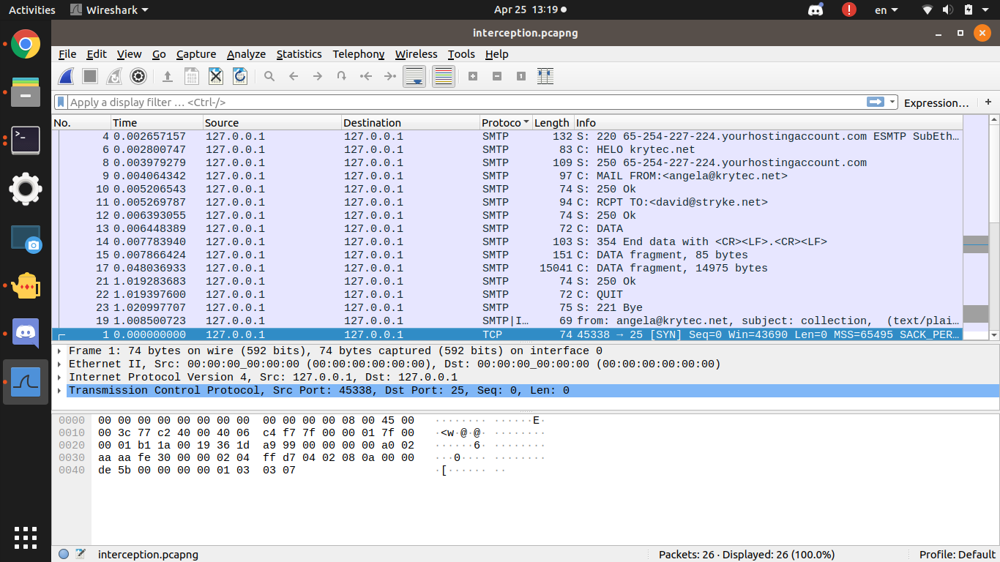

# Rendezvous
300, Forensics, 52 Solves as of Solving

## Description
The police managed to intercept a communication between two parties that have been known to participate in illegal activities. Based on the intelligence we've received from our informants on the ground, they are planning a face to face meeting for an illegal transaction. Are you able to help us identify where that meeting might take place?

The flag for this challenge is the name of the location in lowercase characters. The following is the format for this flag: CTFSG{xxx_xxxxx_xxxx_xxxx}

p.s. each 'x' corresponds to one character.

## Given
interception.pcapng

## Solution

Analysing the pcapng in wireshark, you notice some SMTP data. Following the TCP stream you get the message and the attachment `rendezvous` encoded in base 64.




Using a python program with the [base64 library](https://stackabuse.com/encoding-and-decoding-base64-strings-in-python/) to decode the data, you get an image 


Looks ordinary. Let's check binwalk.
```
$ binwalk attachment 

DECIMAL       HEXADECIMAL     DESCRIPTION
--------------------------------------------------------------------------------
0             0x0             JPEG image data, JFIF standard 1.01
30            0x1E            TIFF image data, big-endian, offset of first image directory: 8
```

There's some TIFF image data apparently, let's check out the image properties.


Apparently there's some coordinates to check out. Putting the coordinates `1°19'50.73"N 103°50'49.84"E` in Google Maps, you get somewhere in Toa Payoh.


Satellite View


# Flag

`CTFSG{toa_payoh_town_park}`
