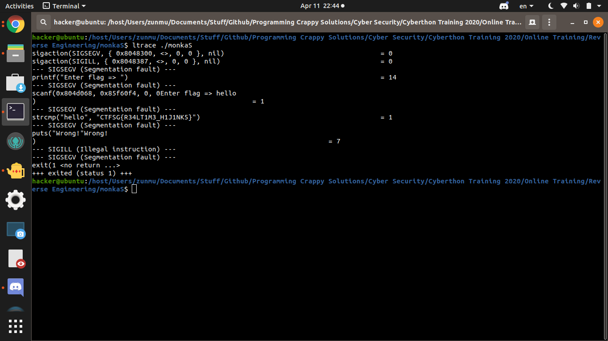

# monkaS
400
RE
5 SOLVES

DESCRIPTION

# Description
What the heck? This binary seems impossible to analyze statically. Is there another type of analysis that we can use

# Solution
Just run ltrace on the program. Why? idk, dynamic analysis? better than gdb manual stepping and analysis?
Also trying to find strcmp

#Flag 
`"CTFSG{R34LT1M3_H1J1NK5}`
