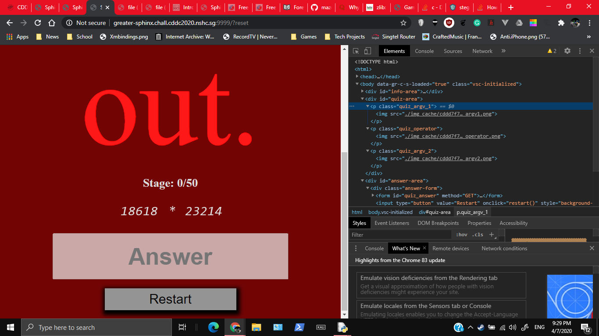

# Greater Sphinx of Unduplicitous Corp

913 GATE 4, 18 SOLVES so far (Unsolved)

## Description

Ahhh, yet another one. This time round, get to Stage 50 as soon as possible.

http://greater-sphinx.chall.cddc2020.nshc.sg:9999/

## Attached Files

None

## Available Hints

Hint (10 points): Automated OCR ~~Thanks captain obvious~~

# Solution


This seems the same as the last one. The javascript code also looks the same. But wait. The client side time limit is working? You can't just read the the argv and operator off the HTML file as they are now in an image?



Well the operators seem easy enough, just download the images of all the operators, and compare them with the image link in the HTML at runtime.
- ~~Is what I would say, but that fails for some reason don't do that (nvm it's a coding mistake)~~ 
- But then OCR fails, so I think I'm supposed to do this?

Either way I'm planning to use a python OCR (Optical Character Recognition) module to do my job anyway so let's get started!. Firstly, I've decided to use tesseract-ocr, and I followed these guides
1. [tesseract github](https://github.com/tesseract-ocr/tesseract/wiki)
2. [Using tesseract OCR python](https://www.pyimagesearch.com/2017/07/10/using-tesseract-ocr-python/)

Upon tesseract OCR, it's quite slow though, and never quite gets me all the way there. I tried storing the images with the text once OCR has been done on them, so that the program could look up. But this brings to light another issue: The OCR is not accurate.

```
b'<!DOCTYPE html>\n<html>\n<head>\n\t<title>Sphinx</title>\n\t<link rel="stylesheet" href="./css/css.css">\n\t<script type="text/javascript" src="./js/jquery-3.4.0.min.js"></script>\n</head>\n<body>\n<div id="info-area">\n\t<div class="countdown"></div>\n\t<div class="stage">Stage: 4/50</div>\n</div>\n<div id="quiz-area">\n\t<p class="quiz_argv_1"></p>\n\t<p class="quiz_operator"></p>\n\t<p class="quiz_argv_2"></p>\n</div>\n<div id="answer-area">\n\t<div class="answer-form">\n\t\t<form id="quiz_answer" method="GET">\n\t\t\t<input type="text" name="answer" placeholder="Answer" autocomplete="off" autofocus>\n\t\t\t<input type="button" value="Submit" onclick="submit()">\n\t\t</form>\n\t</div>\n</div>\n<script type="text/javascript" src="./js/js.js"></script>\n</body>\n</html>\n'
```


# Flag

``