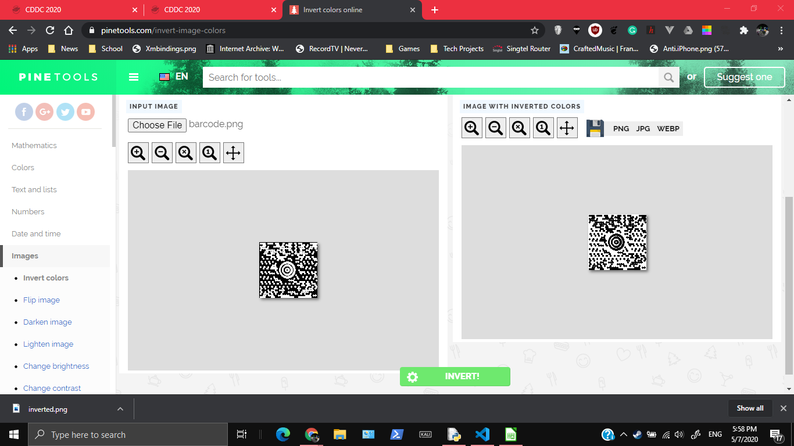
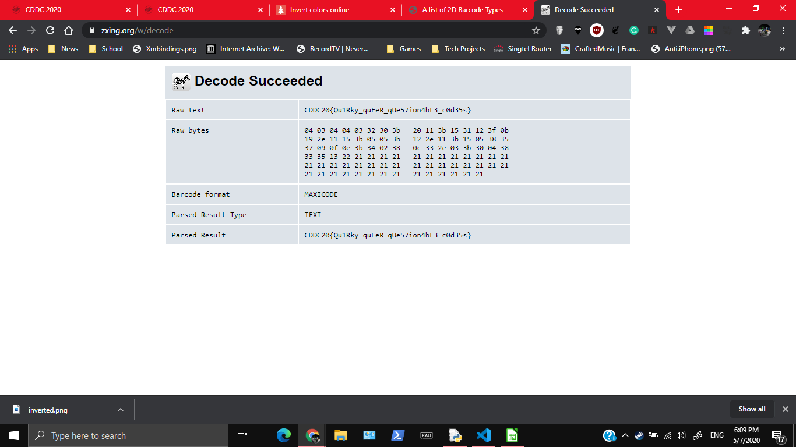

# How QueeR...

769, GATE 4, 26 SOLVES

## Description

We reailsed that Unduplicitous Corp uses this code for their assets tagging. But we can't figure out how exactly to decode it, hmm.

MD5("barcode.gif"): df90bf8d0533e5757ea1fede8743adbc

## Attached Files

[barcode.gif](https://junior-api.cddc2020.nshc.sg/file?id=ckc6524h9jyj608272kkwcvdt&name=barcode.gif)

# Solution

I actually didn't know how to do this challenge at the start. My guess was that it was a stegonography challenge or something similar but `zsteg` or `gimp` or  `binwalk` didn't get anything

One of my friends gave me a suggestion that it was a kind of barcode. Doing some googling, I got this [website](https://support.idautomation.com/2D-Barcode-Fonts/A-list-of-2D-Barcode-Types/_2694). It showed that there was a file format called MAXICODE which looked very similar to the image.

Firstly I converted it into a `.png` file using an online converter. After that, to make it look more like a MAXICODE Barcode, I inverted the image using an [online tool](https://pinetools.com/invert-image-colors)

After that I used an [online decoder](https://zxing.org/w/decode.jspx) to decode the image. 

# Flag

`CDDC20{Qu1Rky_quEeR_qUe57ion4bL3_c0d35s}`
