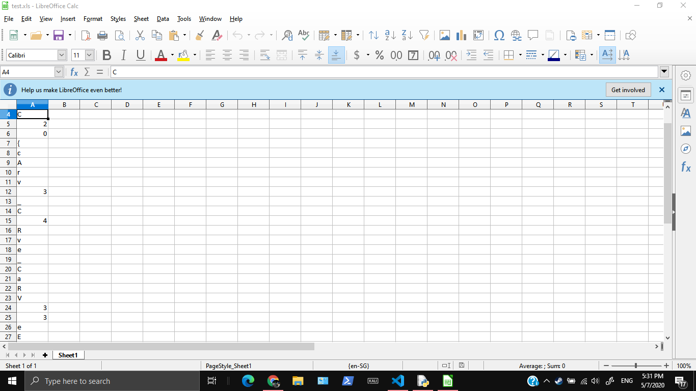

# Recycling Bin

794, GATE 4, 25 SOLVES

## Description

Found this file in one of the Unduplicitous Corp's PCs Recycle Bin. Can you walk me through this?

MD5("1.img"): 7332683a72ad4bd5631bbaa9889a7531

## Attached Files

[1.img](https://junior-api.cddc2020.nshc.sg/file?id=ckc4y2dqt05uv0883q3yh9e72&name=1.img)

# Solution

Firstly, open up the `.img` file and extract it out. Most of the files inside seem uninteresting.

After that, [my friend](https://github.com/undefined-func) suggested the `test.zip` could actually be an excel file. By changing it's extension to `.xls` and opening it, you can spot the flag.

# Flag 

`CDDC20{cArv3_C4Rve_CaRV33eE}`
