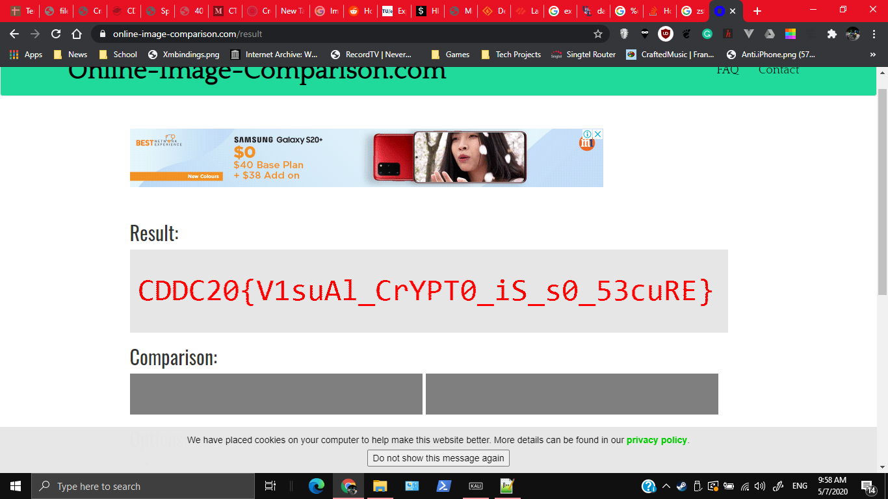

# Visual Noise

636, GATE 4, 29 SOLVES as of solving

## Description

I intercepted some emails from Unduplicitous Corp, that had these pictures attached to them. Looks like visual noise but then again, I can't be sure....

MD5("so-noisy.png"): 0ec6ae0ccba7aa6e9a5726b186bcde9e
MD5("much-confusing.png"): aa685b5a77aae415cc85ae0dcb8048d3

## Attached Files

[so-noisy.png](https://junior-api.cddc2020.nshc.sg/file?id=ckc4y0q0205s90883qe9y5o8l&name=so-noisy.png)

[much-confusing.png](https://junior-api.cddc2020.nshc.sg/file?id=ckc4y0q3w05sj0883389pdsjt&name=much-confusing.png)

# Solution

After downloading the images, I ran some programs on them. `file` and `strings` don't appear to give a meaningful output

`binwalk` appears promising though, but then you realise all png files have zlib compressed data.
```
$ binwalk -e so-noisy.png

DECIMAL       HEXADECIMAL     DESCRIPTION
--------------------------------------------------------------------------------
0             0x0             PNG image, 1834 x 256, 1-bit grayscale, non-interlaced
41            0x29            Zlib compressed data, default compression

$ binwalk -e much-confusing.png

DECIMAL       HEXADECIMAL     DESCRIPTION
--------------------------------------------------------------------------------
0             0x0             PNG image, 1834 x 256, 1-bit grayscale, non-interlaced
41            0x29            Zlib compressed data, default compression
```

How about `exiftool`?
```
$ exiftool so-noisy.png 
ExifTool Version Number         : 11.99
File Name                       : so-noisy.png
Directory                       : .
File Size                       : 44 kB
File Modification Date/Time     : 2020:07:04 07:09:59-04:00
File Access Date/Time           : 2020:07:04 08:45:03-04:00
File Inode Change Date/Time     : 2020:07:04 08:44:59-04:00
File Permissions                : rwxrwx---
File Type                       : PNG
File Type Extension             : png
MIME Type                       : image/png
Image Width                     : 1834
Image Height                    : 256
Bit Depth                       : 1
Color Type                      : Grayscale
Compression                     : Deflate/Inflate
Filter                          : Adaptive
Interlace                       : Noninterlaced
Image Size                      : 1834x256
Megapixels                      : 0.470
$ exiftool much-confusing.png 
ExifTool Version Number         : 11.99
File Name                       : much-confusing.png
Directory                       : .
File Size                       : 44 kB
File Modification Date/Time     : 2020:07:04 07:10:20-04:00
File Access Date/Time           : 2020:07:04 08:45:03-04:00
File Inode Change Date/Time     : 2020:07:04 19:50:31-04:00
File Permissions                : rwxrwx---
File Type                       : PNG
File Type Extension             : png
MIME Type                       : image/png
Image Width                     : 1834
Image Height                    : 256
Bit Depth                       : 1
Color Type                      : Grayscale
Compression                     : Deflate/Inflate
Filter                          : Adaptive
Interlace                       : Noninterlaced
Image Size                      : 1834x256
Megapixels                      : 0.470
```
 

Well looks normal. I started wondering, why did they give 2 images? Well they look the same, and have the same width and height. Is it so you can combine them somehow? Hence I tried using an [online image comparison tool ](https://online-image-comparison.com/result)



# Flag

`CDDC20{V1suAl_CrYPT0_iS_s0_53cuRE}`