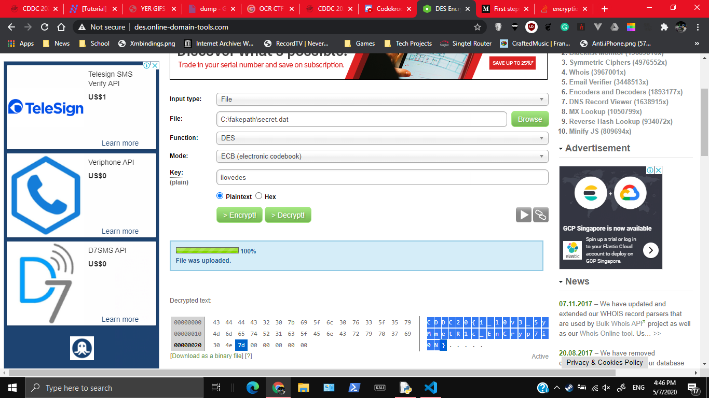

# ilovedes

817, GATE 4, 24 SOLVES

## Description

I heard that the CFO of Unduplicitous Corp loves using DES to encrypt his data, LOL.

MD5("secret.dat"): da0e4d339b8265938587848a52758819

## Attached Files

[secret.dat](https://junior-api.cddc2020.nshc.sg/file?id=ckc4wpg2v051907562chwowep&name=secret.dat)

# Solution 

Just decrypt the .dat file with the password `ilovedes` (since the password needs to be 8 bytes/characters)

# Flag

`CDDC20{i_l0v3_5yMmetR1c_EnCryp7i0N}`