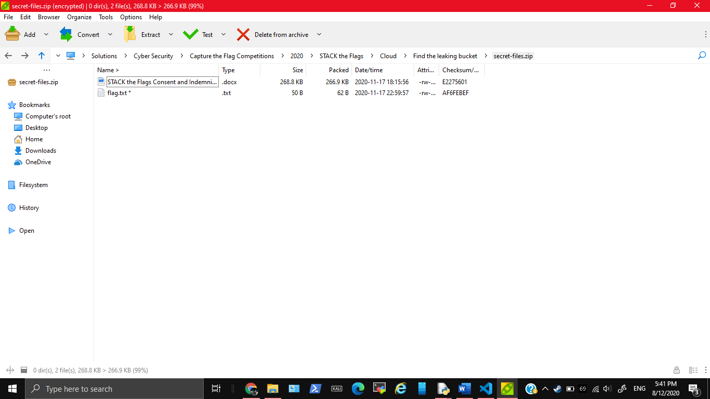

# Find the leaking bucket!

978, CLOUD, 12 SOLVES

### Description

It was made known to us that agents of COViD are exfiltrating data to a hidden S3 bucket in AWS! We do not know the bucket name! One tip from our experienced officers is that bucket naming often uses common words related to the company’s business.

Do what you can! Find that hidden S3 bucket (in the format “word1-word2-s4fet3ch”) and find out what was exfiltrated!

[Company Website](https://d1ynvzedp0o7ys.cloudfront.net/)

This challenge:
- Unlocks other challenge(s)
- Is eligible for Awesome Write-ups Award
- Prerequisite for Mastery Award - Cloud Guru

Please ignore these troll buckets:
- s3://intelligent-intelligent-s4fet3ch/
- s3://steve-jobs-s4fet4ch/
- s3://mobile-cybersecurity-s4fet3ch/

### Available Hints

#### Hint #1

Encrypted zip files does not mean you are safe!

## Solution 

We didn't actually solve the whole challenge, because we couldn't extract the zip file

### Brute-forcing bucket name

The website reveals nothing much, even when inspecting it


With the help of my friend undefined-func, we extracted all the important words on the website, and used a python program `Solution Programs/solve.py` to brute force all the possible buckets

Output of our program
```
<Response [200]>
<?xml version="1.0" encoding="UTF-8"?>
<ListBucketResult xmlns="http://s3.amazonaws.com/doc/2006-03-01/"><Name>think-innovation-s4fet3ch</Name><Prefix></Prefix><Marker></Marker><MaxKeys>1000</MaxKeys><IsTruncated>false</IsTruncated><Contents><Key>secret-files.zip</Key><LastModified>2020-11-17T15:59:54.000Z</LastModified><ETag>&quot;ac4f39a2bb4c6a4e495bb8819ff8fd39&quot;</ETag><Size>273804</Size><StorageClass>STANDARD</StorageClass></Contents></ListBucketResult>
[('think', 'innovation', 'https://think-innovation-s4fet3ch.s3-ap-southeast-1.amazonaws.com/')]
```

Ignoring the troll buckets, we got `think-innovation`. The python program above also gets the HTML content, which suggests a file hosted there `secret-files.zip`. We can download it from https://think-innovation-s4fet3ch.s3-ap-southeast-1.amazonaws.com/secret-files.zip

However, the zipfile is password protected. Using a python program and the same word list in `Solution Programs/solve2.py` to brute force doesn't give any progress



### Extracting the files (After the CTF)

I heard (on the discord) that the idea is that since the zip file has the Constent and Indemity form, the idea is to download this form from the website or something. After that use the doc with pkcrack/bkcrack to crack the zip file and get `flag.txt`

I firstly downloaded the document from [here](https://ctf.tech.gov.sg/2020/participation) on the CTF website. I used pkcrack and followed [here](https://github.com/keyunluo/pkcrack) to set it up.
```
$ /home/hacker/pkcrack/bin/pkcrack
Usage: /home/hacker/pkcrack/bin/pkcrack -c <crypted_file> -p <plaintext_file> [other_options],
where [other_options] may be one or more of
 -o <offset>    for an offset of the plaintext into the ciphertext,
                        (may be negative)
 -C <c-ZIP>     where c-ZIP is a ZIP-archive containing <crypted_file>
 -P <p-ZIP>     where p-ZIP is a ZIP-archive containing <plaintext_file>
 -d <d-file>    where d-file is the name of the decrypted archive which
                will be created by this program if the correct keys are found
                (can only be used in conjunction with the -C option)
 -i     switch off case-insensitive filename matching in ZIP-archives
 -a     abort keys searching after first success
 -n     no progress indicator
 $ /
home/hacker/pkcrack/bin/pkcrack -C secret-files.zip -c STACK\ the\ Flags\ Consent\ and\ Indemnity\ Form.docx -P STACK_the_Flags_Consent_and_Indemnity_Form.zip -p STACK_
the_Flags_Consent_and_Indemnity_Form.docx -d cracked.zip -a
Warning! Plaintext is longer than Ciphertext!
Files read. Starting stage 1 on Tue Dec  8 19:35:01 2020
Generating 1st generation of possible key2_273461 values...done.
Found 4194304 possible key2-values.
Now we're trying to reduce these...
Lowest number: 963 values at offset 269130
Lowest number: 951 values at offset 269125
Lowest number: 909 values at offset 269049
Lowest number: 907 values at offset 268554
Lowest number: 899 values at offset 268553
Lowest number: 885 values at offset 268551
Lowest number: 829 values at offset 268550
Lowest number: 814 values at offset 268431
Lowest number: 813 values at offset 268424
Lowest number: 794 values at offset 268423
Lowest number: 763 values at offset 268422
Lowest number: 756 values at offset 268417
Lowest number: 697 values at offset 268414
Lowest number: 685 values at offset 268406
Lowest number: 666 values at offset 268405
Lowest number: 655 values at offset 268404
Lowest number: 648 values at offset 268402
Lowest number: 627 values at offset 268400
Lowest number: 596 values at offset 268398
Lowest number: 571 values at offset 268378
Lowest number: 531 values at offset 268375
Lowest number: 506 values at offset 268370
Lowest number: 500 values at offset 268322
Lowest number: 474 values at offset 268321
Lowest number: 448 values at offset 268318
Lowest number: 443 values at offset 268316
Lowest number: 435 values at offset 268200
Lowest number: 429 values at offset 268194
Lowest number: 428 values at offset 268193
Lowest number: 427 values at offset 268180
Lowest number: 413 values at offset 268174
Lowest number: 396 values at offset 268173
Lowest number: 386 values at offset 268172
Lowest number: 376 values at offset 268171
Lowest number: 357 values at offset 268169
Lowest number: 343 values at offset 268168
Lowest number: 319 values at offset 268167
Lowest number: 302 values at offset 268166
Lowest number: 296 values at offset 268165
Lowest number: 277 values at offset 268164
Lowest number: 270 values at offset 268155
Lowest number: 258 values at offset 268154
Lowest number: 250 values at offset 268128
Lowest number: 243 values at offset 268125
Lowest number: 239 values at offset 267997
Lowest number: 232 values at offset 267994
Lowest number: 213 values at offset 267991
Lowest number: 191 values at offset 267989
Lowest number: 170 values at offset 267984
Lowest number: 160 values at offset 267978
Lowest number: 157 values at offset 267977
Lowest number: 152 values at offset 267974
Lowest number: 137 values at offset 267965
Lowest number: 123 values at offset 267964
Lowest number: 118 values at offset 267962
Lowest number: 107 values at offset 267918
Lowest number: 95 values at offset 267917
Done. Left with 95 possible Values. bestOffset is 267917.
Stage 1 completed. Starting stage 2 on Tue Dec  8 19:35:20 2020
Stage 2 completed. Starting zipdecrypt on Tue Dec  8 19:35:25 2020
No solutions found. You must have chosen the wrong plaintext.
Finished on Tue Dec  8 19:35:25 2020
```

After searching and reading from the discord, I realised you need to know how to compress the zip correctly. Using other zip programs may use other weird algorithms like 7z or something

```
$ zip -r used_to_crack.zip STACK_the_Flags_Consent_and_Indemnity_Form.docx
  adding: STACK_the_Flags_Consent_and_Indemnity_Form.docx (deflated 1%)
$ /home/hacker/pkcrack/bin/pkcrack -C secret-files.zip -c STACK\ the\ Flags\ Consent\ and\ Indemnity\ Form.docx -P used_to_crack.zip -p STACK_the_Flags_Consent_and_Indemni
ty_Form.docx -d cracked.zip -a
Files read. Starting stage 1 on Tue Dec  8 19:47:44 2020
Generating 1st generation of possible key2_273321 values...done.
Found 4194304 possible key2-values.
Now we're trying to reduce these...
Lowest number: 997 values at offset 265129
Lowest number: 920 values at offset 265125
Lowest number: 853 values at offset 265124
Lowest number: 830 values at offset 265122
Lowest number: 804 values at offset 265121
Lowest number: 764 values at offset 265095
Lowest number: 740 values at offset 265081
Lowest number: 725 values at offset 265053
Lowest number: 675 values at offset 265052
Lowest number: 657 values at offset 265051
Lowest number: 624 values at offset 254966
Lowest number: 594 values at offset 249971
Lowest number: 555 values at offset 249879
Lowest number: 547 values at offset 249869
Lowest number: 505 values at offset 249847
Lowest number: 495 values at offset 249846
Lowest number: 491 values at offset 249832
Lowest number: 422 values at offset 249830
Lowest number: 376 values at offset 249804
Lowest number: 338 values at offset 249798
Lowest number: 335 values at offset 247693
Lowest number: 282 values at offset 247689
Lowest number: 246 values at offset 247686
Lowest number: 216 values at offset 247684
Lowest number: 202 values at offset 247672
Lowest number: 198 values at offset 247639
Lowest number: 193 values at offset 247624
Lowest number: 179 values at offset 247623
Lowest number: 163 values at offset 247621
Lowest number: 150 values at offset 247137
Lowest number: 147 values at offset 247132
Lowest number: 124 values at offset 247131
Lowest number: 119 values at offset 247130
Lowest number: 117 values at offset 247127
Lowest number: 110 values at offset 247123
Lowest number: 103 values at offset 247111
Lowest number: 101 values at offset 247098
Lowest number: 94 values at offset 247097
Done. Left with 94 possible Values. bestOffset is 247097.
Stage 1 completed. Starting stage 2 on Tue Dec  8 19:48:21 2020
Ta-daaaaa! key0=f5af793b, key1=6d3ea7ba, key2=9b71082d
Probabilistic test succeeded for 26229 bytes.
Ta-daaaaa! key0=f5af793b, key1=6d3ea7ba, key2=9b71082d
Probabilistic test succeeded for 26229 bytes.
Ta-daaaaa! key0=f5af793b, key1=6d3ea7ba, key2=9b71082d
Probabilistic test succeeded for 26229 bytes.
Stage 2 completed. Starting zipdecrypt on Tue Dec  8 19:48:21 2020
Decrypting flag.txt (1918da1aa13583f007af7db7)... OK!
Decrypting STACK the Flags Consent and Indemnity Form.docx (336ab103cd78d1b9756efc91)... OK!
Finished on Tue Dec  8 19:48:21 2020
$ unzip cracked.zip
Archive:  cracked.zip
 extracting: flag.txt
  inflating: STACK the Flags Consent and Indemnity Form.docx
$ cat flag.txt
govtech-csg{EnCrYpT!0n_D0e$_NoT_M3@n_Y0u_aR3_s4f3}
```

An interesting challenge. Taking effort after the competition to try this was worth it.

## Flag

`govtech-csg{EnCrYpT!0n_D0e$_NoT_M3@n_Y0u_aR3_s4f3}`