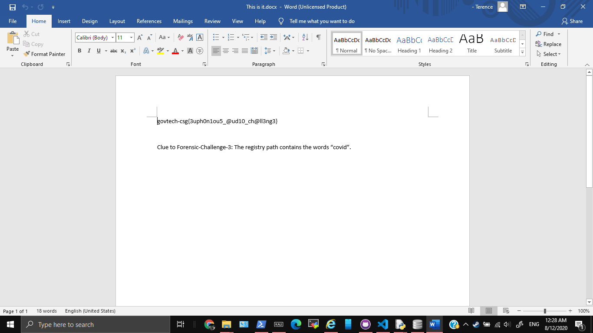

# Voices in the head

1692, FORENSICS, 26 SOLVES

### Description

We found a voice recording in one of the forensic images but we have no clue what's the voice recording about. Are you able to help?

Please view this Document for download instructions.

This challenge:
- Unlocks other challenge(s)
- Is eligible for Awesome Write-ups Award
- Prerequisite for Mastery Award - Forensicator

Hint:
Xiao wants to help. Will you let him help you?

Hint #1:
If you want to keep a secret, you must also hide it from yourself.

## Solution

We didn't manage to finish it in time for the CTF Challenge.

Firstly, I tried LSB, which gave garbage data. The waveform also looked normal

Then my friend got a spectogram. On redoing the challenge myself I used an [online tool](https://convert.ing-now.com/audio-spectrogram-creator/) to achieve similar results.


The text gives you `aHR0cHM6Ly9wYXN0ZWJpbi5jb20vakVUajJ1VWI=`. After decoding it with base64, you get the link https://pastebin.com/jETj2uUb. This link then has the text
```
++++++++++[>+>+++>+++++++>++++++++++<<<<-]>>>>++++++++++++++++.------------.+.++++++++++.----------.++++++++++.-----.+.+++++..------------.---.+.++++++.-----------.++++++.
```

This looks like brainfuck, and after using https://www.dcode.fr/brainfuck-language to decode it, we get `thisisnottheflag`. What a scam

After a while, my friend realised that xiao could refer to xiao stenography. I downloaded it [here](https://xiao-steganography.en.softonic.com/download), and extracted the zip file, using the password `thisisnottheflag`. However, the zip file I'm left with has the flag, and is also password protected

### After the CTF

From the discord server, our team gathered the remaining part of the solution

1. Strings the zip file and get the password
    ```
    $ strings xiaoout.zip
    This is it.docx

    ...

    rwYT
    =.+|
    This is it.docx
    govtech-csg{Th1sisn0ty3tthefl@g}PK
    ```
1. Use `govtech-csg{Th1sisn0ty3tthefl@g}` as the password to extract the zip and get the flag from the `.docx` file
    

## Flag

`govtech-csg{3uph0n1ou5_@ud10_ch@ll3ng3}`

