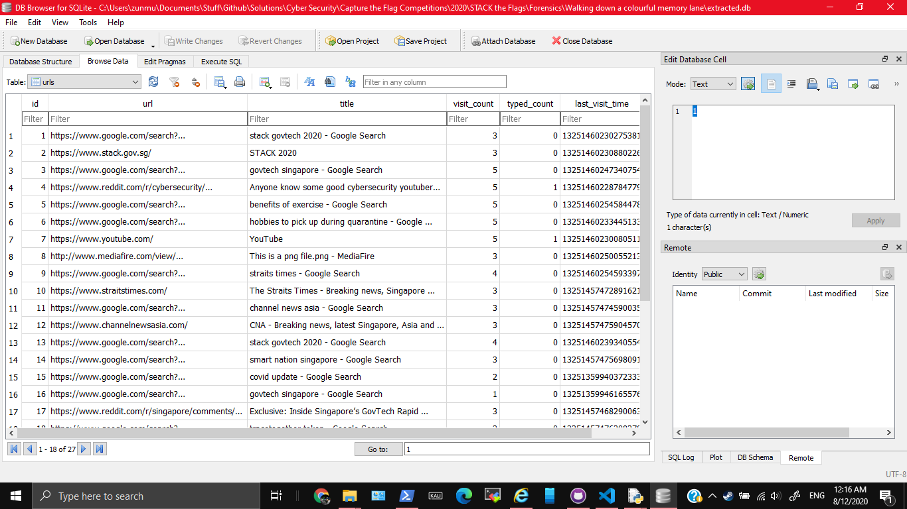
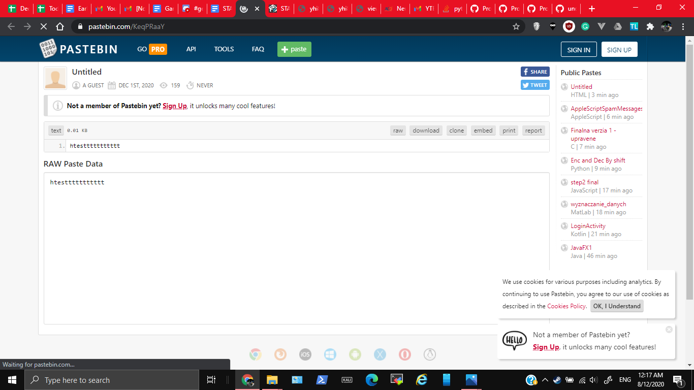

# Walking down a colourful memory lane

992, FORENSICS, 6 SOLVES

### Description

We are trying to find out how did our machine get infected. What did the user do?

Please view this Document for download instructions.

This challenge:
- Is eligible for Awesome Write-ups Award
- Prerequisite for Mastery Award - Forensicator

## Solution

### Volatility

My friend undefined-func used volatility to extract out some files during the challenge, the most important one is `file.None.0xfffffa801a81fab0.dat`

On redoing the challnge here are the steps he told me
1. First step of volatility is always `imageinfo` to know what profile to use
    1. The profile we could use is `Win7SP1x64` from the output below
    ```
    $ volatility imageinfo -f forensics-challenge-1.mem
    Volatility Foundation Volatility Framework 2.6
    INFO    : volatility.debug    : Determining profile based on KDBG search...
            Suggested Profile(s) : Win7SP1x64, Win7SP0x64, Win2008R2SP0x64, Win2008R2SP1x64_24000, Win2008R2SP1x64_23418, Win2008R2SP1x64, Win7SP1x64_24000, Win7SP1x64_23418
                        AS Layer1 : WindowsAMD64PagedMemory (Kernel AS)
                        AS Layer2 : FileAddressSpace (/mnt/c/Users/zunmu/Documents/Stuff/forensics-challenge-1.mem)
                        PAE type : No PAE
                            DTB : 0x187000L
                            KDBG : 0xf800029fb0a0L
            Number of Processors : 1
        Image Type (Service Pack) : 1
                    KPCR for CPU 0 : 0xfffff800029fcd00L
                KUSER_SHARED_DATA : 0xfffff78000000000L
            Image date and time : 2020-12-03 09:12:22 UTC+0000
        Image local date and time : 2020-12-03 17:12:22 +0800
    ```
1. As the challenge said "how did our machine get infected. What did the user do?", we can think that maybe the user did something through the network. 
    1. So we should `netscan`
    ```
    $ volatility --profile=Win7SP1x64 netscan -f forensics-challenge-1.mem
    Volatility Foundation Volatility Framework 2.6
    Offset(P)          Proto    Local Address                  Foreign Address      State            Pid      Owner          Created
    0x7dc07790         UDPv4    0.0.0.0:68                     *:*                                   756      svchost.exe    2020-12-03 09:12:15 UTC+0000
    0x7dc6d700         UDPv4    0.0.0.0:58881                  *:*                                   500      svchost.exe    2020-12-03 09:11:26 UTC+0000
    0x7dc9b010         UDPv4    0.0.0.0:49797                  *:*                                   692      chrome.exe     2020-12-03 09:12:14 UTC+0000
    0x7dcbad70         UDPv4    0.0.0.0:59347                  *:*                                   692      chrome.exe     2020-12-03 09:11:25 UTC+0000
    0x7dcbad70         UDPv6    :::59347                       *:*                                   692      chrome.exe     
    ```
    ```
    2020-12-03 08:52:06 UTC+0000
    0x7e3b0010         UDPv4    0.0.0.0:3702                   *:*                                   252      svchost.exe    2020-12-03 08:52:06 UTC+0000
    0x7e3b0350         UDPv4    0.0.0.0:54247                  *:*                                   252      svchost.exe    2020-12-03 08:52:06 UTC+0000
    0x7e3b0350         UDPv6    :::54247                       *:*                                   252      svchost.exe    2020-12-03 08:52:06 UTC+0000
    0x7dc18580         TCPv4    192.168.197.128:49308          23.44.5.89:80        ESTABLISHED      2904     chrome.exe    
    0x7dc46cf0         TCPv4    192.168.197.128:49307          192.124.249.31:80    ESTABLISHED      2904     chrome.exe    
    0x7dccdcf0         TCPv4    -:49293                        151.101.9.140:443    CLOSED           692      chrome.exe    
    0x7dcfa810         TCPv4    -:49301                        119.9.70.218:443     CLOSED           692      chrome.exe    
    0x7dd38c50         TCPv4    192.168.197.128:49278          23.5.165.147:80      ESTABLISHED      2904     chrome.exe    
    0x7dda5010         TCPv4    192.168.197.128:49309          104.18.21.226:80     ESTABLISHED      2904     chrome.exe    
    0x7e0737f0         TCPv6    -:0                            38ab:2f1a:80fa:ffff:38ab:2f1a:80fa:ffff:0 CLOSED           4        System
    0x7e3b19e0         TCPv6    -:0                            38ab:2f1a:80fa:ffff:38ab:2f1a:80fa:ffff:0 CLOSED         
    ```
1. We see chrome (with the id `2904`) got ESTABLISHED connection, which is suspicious. 
    1. I tried dumping out the data, and seeing the URL's unside
    ```
    $ volatility -f forensics-challenge-1.mem --profile=Win7SP1x64 memdump dumpfiles --dump-dir=./ -p 2904
    Volatility Foundation Volatility Framework 2.6
    ************************************************************************
    Writing chrome.exe [  2904] to 2904.dmp
    $ strings 2904.dmp | grep "http://"
    ```
    ```
    http://ocsp.digicert.com0:
    )http://crl3.digicert.com/Omniroot2025.crl0m
    http://www.mediafire.com/view/5wo9db2pa7gdcoc/This_is_a_png_file.png/file
    http://www.mediafire.com/view/5wo9db2pa7gdcoc/This_is_a_png_file.png/file
    http://mediafire.com/
    MmCahttp://s@^
    http://a
    ReTahttp://s
    FMslhttp://w
    http://www.mediafire.com/view/5wo9db2pa7gdcoc/This_is_a_png_file.png/file
    $http://certs.godaddy.com/repository/1301
    &http://crl.godaddy.com/gdig2s1-910.crl0]
    +http://certificates.godaddy.com/repository/0
    http://ocsp.godaddy.com/0@
    4http://certificates.godaddy.com/repository/gdig2.crt0
    $
    ```
    You can see the suspicious URL to work from: http://www.mediafire.com/view/5wo9db2pa7gdcoc/This_is_a_png_file.png/file More about how to deal with this URL in the later part of the writeup
    1. Alternatively we can use the `chromehistory` command to check. You can get the plugin from [here](https://blog.superponible.com/2014/08/31/volatility-plugin-chrome-history/). Then you can get the suspicious URL to work through there
    1. Following https://www.petermstewart.net/memlabs-memory-forensics-challenges-lab-2-write-up/ to extract chrome history
    ```
    $ volatility -f forensics-challenge-1.mem --profile=Win7SP1x64 filescan > filescan.txt
    Volatility Foundation Volatility Framework 2.6
    $ head filescan.txt
    Offset(P)            #Ptr   #Hnd Access Name
    ------------------ ------ ------ ------ ----
    0x000000007d292510      1      1 R--r-d \Device\HarddiskVolume1\Program Files\Google\Chrome\Application\86.0.4240.198\chrome_100_percent.pak
    0x000000007d292900     12      0 R--r-d \Device\HarddiskVolume1\Windows\System32\wercplsupport.dll
    0x000000007dc018b0      2      1 ------ \Device\NamedPipe\mojo.2904.1772.18008832196772932115
    0x000000007dc01a00      1      1 R--rw- \Device\HarddiskVolume1\Program Files\Google\Chrome\Application\86.0.4240.198
    0x000000007dc03260      2      1 ------ \Device\NamedPipe\mojo.2904.1772.718663783432554285
    0x000000007dc04310      3      3 R--r-- \Device\HarddiskVolume1\Windows\Fonts\segoeuib.ttf
    0x000000007dc04730      2      1 ------ \Device\NamedPipe\mojo.2904.1772.939864627197359849
    0x000000007dc04880      2      1 ------ \Device\NamedPipe\mojo.2904.1772.7433814428407545744
    $ volatility -f forensics-challenge-1.mem --profile=Win7SP1x64 dumpf
    iles -Q 0x000000007f38d070 -D .
    Volatility Foundation Volatility Framework 2.6
    DataSectionObject 0x7f38d070   None   \Device\HarddiskVolume1\Users\owlli\AppData\Local\Google\Chrome\User Data\Default\History
    SharedCacheMap 0x7f38d070   None   \Device\HarddiskVolume1\Users\owlli\AppData\Local\Google\Chrome\User Data\Default\History
    $ ls
    file.None.0xfffffa801998b780.vacb  file.None.0xfffffa801a81fab0.dat
    $ file file.None.0xfffffa801998b780.vacb
    file.None.0xfffffa801998b780.vacb: empty
    $ file file.None.0xfffffa801a81fab0.dat
    file.None.0xfffffa801a81fab0.dat: SQLite 3.x database, last written using SQLite version 3033000
    ```

Some useful links to know more about volatility are
1. https://medium.com/@zemelusa/first-steps-to-volatile-memory-analysis-dcbd4d2d56a1
1. https://medium.com/@Flying_glasses/retrieving-files-from-memory-dump-34d9fa573033

### Extracting Browser History (What I did in the actual CTF)

He extracted out a `.dat` file. On running that through the `file` command, it revealed a database file
```
$ file file.None.0xfffffa801a81fab0.dat
file.None.0xfffffa801a81fab0.dat: SQLite 3.x database, last written using SQLite version 3033000
```

Opening it in DB browser and looking through the database revealed the Chrome browser history.



The links which stand out are
1. http://www.mediafire.com/view/5wo9db2pa7gdcoc/This_is_a_png_file.png/file 
1. https://pastebin.com/KeqPRaaY

Pastebin seemed like nothing suspicious


The png file seemed interesting (Because it was colourful like what the challenge title suggested). I downloaded it.

I then used Python and the Python Imaging Library with `solve.py` to extract the RGB values from the image, and convert them into letters through ASCII

## Flag

`govtech-csg{m3m0ry_R3dGr33nBlu3z}`