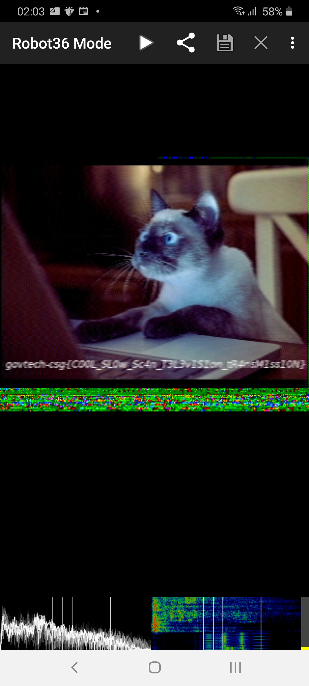

# Beep Boop

730, MISCELLANEOUS, 32 SOLVES

### Description
As part of forensic investigations into servers operated by COViD, an investigator found this sound file in a folder labeled "SPAAAAAAAAAAAAAAAAAACE". Help us uncover the secret of the file.

Please view this Document for download instructions.

## Solution

My friend undefined-func suggested to pass it through SSTV likely because we done this challenge before in DSTA CDDC and other CTFs. Doing so gives the flag in image form.

All that is left is trying to decode the letters. After some trial and error, replacing O with 0, I with 1 and so on. Then I got the flag

## Flag

`govtech-csg{C00L_SL0w_Sc4n_T3L3v1S1on_tR4nsM1ss10N}`