# Mobile

The mobile challenges all use 1 apk, so they are all actually interlinked. As such, I decided to combine all of the challenges I did into 1 writeup.

## Challenges Done

### Contact Us!
790, MOBILE, 29 SOLVES

#### Description
Looks like Korovax has exposed some development comment lines accidentally. Can you get one of the secrets through this mistake?

---------------------------------------------------------------

### Subscribe!
863, MOBILE, 25 SOLVES

#### Description
Korovax would like to keep its users informed about the latest updates of COViD, and there's nothing better but to spam your emails!

---------------------------------------------------------------

### Welcome to Korovax Mobile!
1874, MOBILE, 19 SOLVES

#### Description
To be part of the Korovax team, do you really need to sign up to be a member?

Please view this Document for download instructions.

This challenge:
- Unlocks other challenge(s)

---------------------------------------------------------------

### True or false?
1962, MOBILE, 11 SOLVES

#### Description
True or false, we can log in as admin easily.

Please view this Document for download instructions.

This challenge:
- Unlocks other challenge(s)
- Is eligible for Awesome Write-ups Award
- Prerequisite for Mastery Award - Mobile Ace

---------------------------------------------------------------

### What's with the Search!
984, MOBILE, 10 SOLVES

#### Description
There is an admin dashboard in the Korovax mobile. There aren't many functions, but we definitely can search for something!

This challenge:
- Unlocks other challenge(s)
- Is eligible for Awesome Write-ups Award
- Prerequisite for Mastery Award - Mobile Ace

---------------------------------------------------------------

### All about Korovax!
984, MOBILE, 10 SOLVES

#### Description
As a user and member of Korovax mobile, you will be treated with a lot of information about COViD and a few in-app functions that should help you understand more about COViD and Korovax! Members should be glad that they even have a notepad in there, to create notes as they learn more about Korovax's mission!

This challenge:
- Unlocks other challenge(s)
- Is eligible for Awesome Write-ups Award

## Solution

### Standard Decompilation 

Whenever I have an apk, I decompile them. For this challenge, I used https://www.apkdecompilers.com/ 

I then tried finding the flag using grep (expecting it to be hidden in Java Comments) https://stackoverflow.com/questions/16956810/how-do-i-find-all-files-containing-specific-text-on-linux 
```
$ grep -rnw './' -e 'govtech-csg{'
Binary file ./resources/classes.dex matches
./sources/sg/gov/tech/ctf/mobile/Admin/AdminHome.java:95:                ((TextView) view.findViewById(R.id.alert_detail)).setText("Add govtech-csg{} to what you found!");
./sources/sg/gov/tech/ctf/mobile/Admin/AdminHome.java:126:        if (!enteredFlagString.contains("govtech-csg{")) {
./sources/sg/gov/tech/ctf/mobile/Admin/AdminHome.java:129:        String result = enteredFlagString.replace("govtech-csg{", BuildConfig.FLAVOR);
```
Welp looks like little progress. I downloaded and ran the application on my phone to test. ~~Also I was too lazy to care if it was malware since past CTF challenges on mobile had no malware so I just installed it on my phone. Don't be like me~~

### Native Libraries (Contact Me! and Subscribe!)

Looking around all the activities, the Introduction Activity looks like it's just displaying static text. The MainActivity seems normal.
For the first challenge `Contact Us!`, I think it makes sense to check the Contact page. on my phone 

They said cheat code is abracadabra. I tried entering it in but it just gives a unique error message

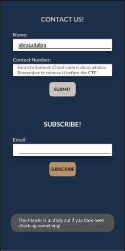

Looking at the code in greater detail, there were these `native` functions `check`, `retrieveFlag` and `retrieveFlag2`. The most important one was `retrieveFlag2` since it was the one used.

From `Decompiled/sources/sg/gov/tech/ctf/mobile/ContactForm.java`

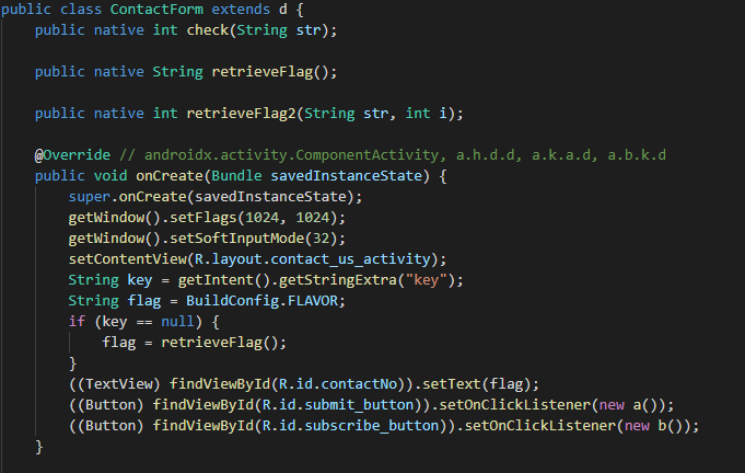
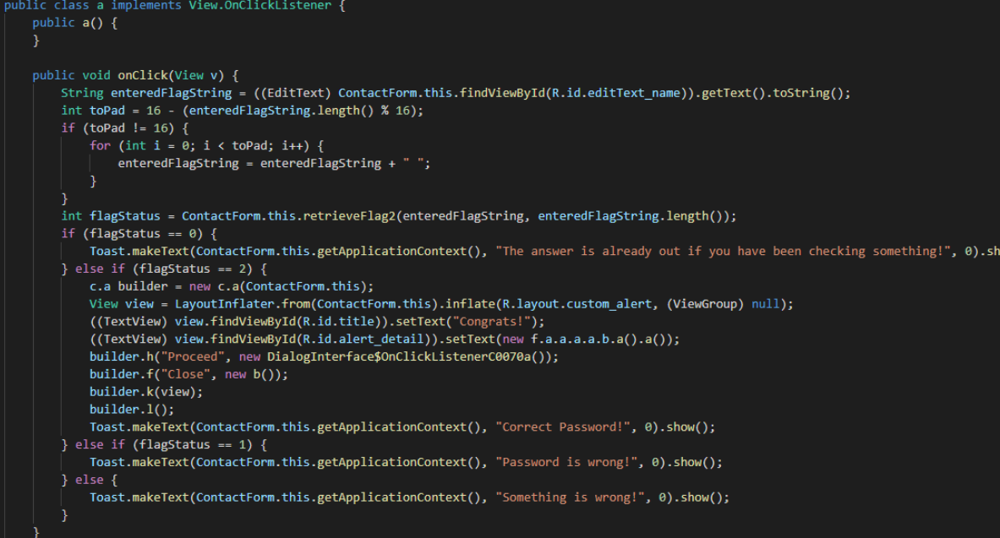

On googling what native means, I realised it is the Java Native Interface, and there are actually binary files.
I decompiled a native library file which looked correct and got the comment

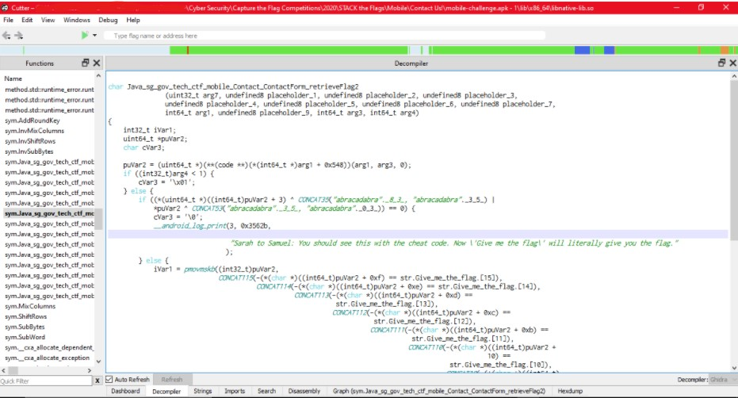

Putting it in the app you get one answer

The next challenge `Subscribe!` is similar. There's an important native function used in `ContactForm.java`, so find it in the decompiled library file, and you have the flag right in the code

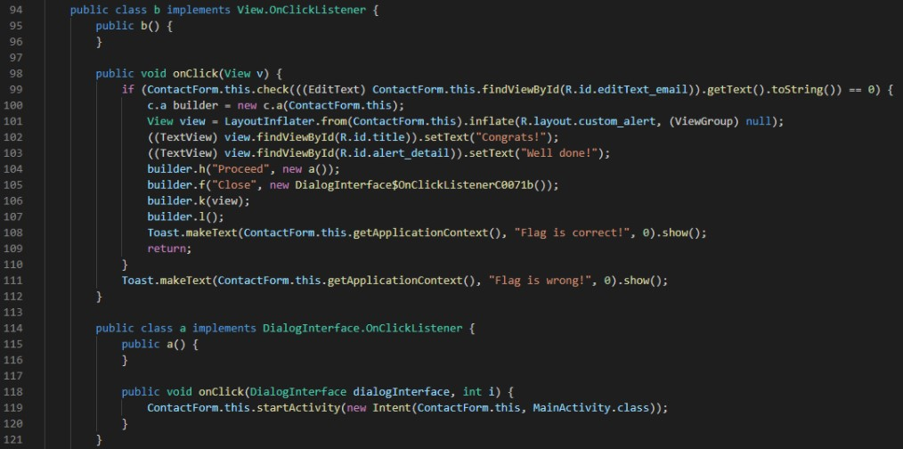

Putting `govtech-csg{th3rE_15_nO_n0bIliTy_In_p0Vert7}` into the Subscribe! section of the ContactForm of the app gives a Congrats! message .

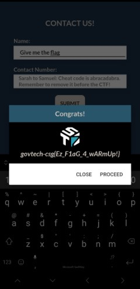

### Reversing (Welcome to Korovax Mobile!, True or False)

On first look at the code, I didn't understand what it meant

Looking at the single letter variable names and classes, I wondered if the code was obfuscated, and through googling, and with the help of  [stackoverflow](https://stackoverflow.com/questions/28423427/after-decompile-apk-why-class-names-and-object-are-letter), find out that it is through obfuscation. I googled for and used a deobfuscator [apk-deguard](http://apk-deguard.com/), and saved the code.

After getting the hint which was totally useless and can even be found in the app, I decided to take a closer look at the User and Admin Authentication Activities

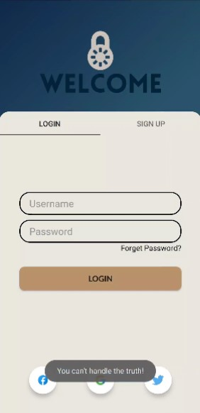
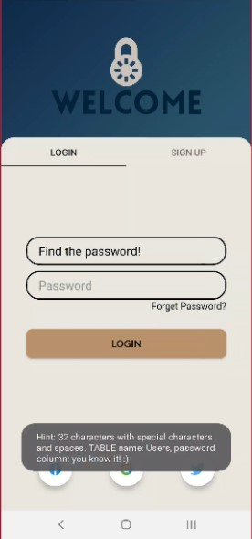

The 2nd hint from the admin heavily suggested SQL injection, which I suck at and didn't want to try. I spent time instead looking at and analysing the deobfuscated code. Knowledge of Basic Android App Development is assumed. The general structure is that (examples used from User)


1. The Main Activity sets up the Sign Up and Login Fragments
   1. Can tell from something like the code below
   ```
   public class b extends FragmentStatePagerAdapter {
        public b(AuthenticationActivity authenticationActivity, FragmentManager fragmentManager) {
            super(fragmentManager);
        }

        @Override // org.sufficientlysecure.rootcommands.PagerAdapter
        public int getCount() {
            return 2;
        }

        @Override // org.androidsoft.app.FragmentStatePagerAdapter
        public Fragment getItem(int i) {
            if (i == 0) {
                return new AbstractFilePickerFragment();
            }
            if (i != 1) {
                return null;
            }
            return new PageFragment();
        }
    }
    ```
1. The Sign up Fragment is useless and just sets up the layout
   1. The main code 
   ```
   public View onCreateView(LayoutInflater layoutInflater, ViewGroup viewGroup, Bundle bundle) {
        ViewGroup $r2 = (ViewGroup) layoutInflater.inflate(R.layout.sign_up_tab_fragment, viewGroup, false);
        EditText editText = (EditText) $r2.findViewById(R.id.user_input);
        EditText editText2 = (EditText) $r2.findViewById(R.id.password_input);
        Button button = (Button) $r2.findViewById(R.id.login_button);
        return $r2;
    }
   ```
1. The Login Fragment Sets up the layout
   1. The important lines suggesting this are like
      ```
      this.b.setOnClickListener(new DashboardFragment$1(this, viewGroup2));
      this.a.setOnClickListener(new h(this, viewGroup2, $r6));
      ```
1. The Hint On Click Listener just returns a static text
   1. The important code is
   ```
   public void onClick(View view) {
        Toast.makeText(this.this$0.getContext(), Logger.toString(-9176810696632L), 0).show();
    }
   ```
1. The Login On Click Listener has the real logic (and a scam thing to fill in)
   1. The important code is 
   ```
   public void onClick(View view) {
        String $r5 = this.this$0.c.getText().toString();
        if ($r5.contains(Logger.toString(-9421623832504L))) {
            Toast.makeText(this.g.getContext(), Logger.toString(-9516113113016L), 0).show();
        }
        if (this.h.get(Logger.toString(-9726566510520L), $r5, this.h.getReadableDatabase(Logger.toString(-9700796706744L))).matches(Logger.toString(-9748041347000L))) {
            AlertDialog.Builder $r12 = new AlertDialog.Builder(this.g.getContext());
            View $r1 = LayoutInflater.from(this.g.getContext()).inflate(R.layout.custom_alert, (ViewGroup) null);
            ((TextView) $r1.findViewById(R.id.title)).setText(Logger.toString(-9842530627512L));
            ((TextView) $r1.findViewById(R.id.alert_detail)).setText(Logger.toString(-9885480300472L));
            $r12.setNeutralButton(Logger.toString(-9997149450168L), new a$b$a(this));
            $r12.setPositiveButton(Logger.toString(-10031509188536L), new a$b$b(this));
            $r12.setView($r1);
            $r12.show();
            return;
        }
        Toast.makeText(this.g.getContext(), Logger.toString(-10057278992312L), 0).show();
    }
   ```

For User
1. Main: `Deobfuscated/output.apk.zip/sources/net/robotmedia/tech/settings/mobile/User/AuthenticationActivity.java`
1. Sign Up Fragment`Deobfuscated/output.apk.zip/sources/de/com/android/android/ui/activity/PageFragment.java`
1. Login Fragment`Deobfuscated/output.apk.zip/sources/de/com/android/android/ui/activity/AbstractFilePickerFragment.java`
1. Hint On Click Listener: `Deobfuscated/output.apk.zip/sources/de/com/android/android/ui/activity/DashboardFragment$1.java`
1. Login On Click Listener: `Deobfuscated/output.apk.zip/sources/de/com/android/android/ui/activity/h.java`

For Admin
1. Main: `Deobfuscated/output.apk.zip/sources/net/robotmedia/tech/settings/mobile/Admin/AdminAuthenticationActivity.java`
1. Sign Up Fragment: Same as User
1. Login Fragment: `Deobfuscated/output.apk.zip/sources/de/com/android/android/ui/prefs/b.java`
1. Hint On Click Listener: `Deobfuscated/output.apk.zip/sources/de/com/android/android/ui/prefs/DashboardFragment$1.java`
1. Login On Click Listener: `Deobfuscated/output.apk.zip/sources/de/com/android/android/ui/prefs/h.java`

I started to see these lines/code `import roboguice.inject.util.Logger;` and `Logger.toString(-9700796706744L)`. Looking into it more these classes and files are involved in this. I suspect that they are involved in the obfuscation of the strings.
1. `Deobfuscated/output.apk.zip/sources/roboguice/inject/util/Logger.java`
1. `Deobfuscated/output.apk.zip/sources/roboguice/inject/util/PersistentBase.java`
1. `Deobfuscated/output.apk.zip/sources/roboguice/inject/util/ByteVector.java`

I extracted this decompiled code, ran it on Sololearn's code playground, and decoded the flags. To extract the unicode characters in the Logger class, I had to open the APK in Android Studio and get the bytecode of the approriate class (i used mapping.txt to find the appropriate class matching logger). I used the code in `sololearnDecoder.java` for Sololearn.

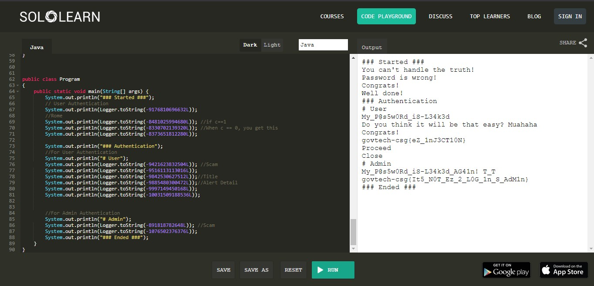

Output
```
### Started ###
You can't handle the truth!
Password is wrong!
Congrats!
Well done!
### Authentication
# User
My_P@s5w0Rd_iS-L34k3d
Do you think it will be that easy? Muahaha
Congrats!
govtech-csg{eZ_1nJ3CT10N}
Proceed
Close
# Admin
My_P@s5w0Rd_iS-L34k3d_AG41n! T_T
govtech-csg{It5_N0T_Ez_2_L0G_1n_S_AdM1n}
### Ended ###
```

###  Exported Activities (All about Korovax!)

I did some research on how to dynamic analysis of Android App, such as using Android Studio.jdwp (which didn't work since I can't connect), adb backups. 
Eventually I learnt how to use adb to directly access some Activities. The only activities which are accessible are `ViewActivity` and `Introduction`. 
* Since I wanted to be able to access all activities, I used APK Editor Pro (just google) to edit the AndroidManifest, and set `android:exported="true"` for all activities. The modified manifest and apk file is in the folder `Patched` on my Github.

Looking at the manifest, it looks like you can pass in data through `ViewActivity`, but I have no idea how to do that

I tried looking at the `UserHomeActivity` and `TextEditorActivity`, but the code doesn't reveal anything or seem suspicious, since they just give text.

Looking closer in the source code of `ViewActivity`, it references `R.string.test`, which I suspect could be the flag
```
      public void onClick(View view) {
            if (ViewActivity.this.next() == 1720543) {
                AlertDialog.Builder $r3 = new AlertDialog.Builder(ViewActivity.this);
                View $r1 = LayoutInflater.from(ViewActivity.this).inflate(R.layout.custom_alert, (ViewGroup) null);
                ((TextView) $r1.findViewById(R.id.title)).setText("Congrats!");
                ((TextView) $r1.findViewById(R.id.alert_detail)).setText(R.string.test);
                de.com.android.android.ui.activity.b.a().onCreate(true);
                $r3.setNeutralButton("Proceed", new DialogInterface$OnClickListenerC0008a());
                $r3.setPositiveButton("Close", new b());
                $r3.setView($r1);
                $r3.show();
                return;
            }
            Toast.makeText(ViewActivity.this, "Something's happening...", 0).show();
            Toast.makeText(ViewActivity.this, "Maybe not.", 0).show();
        }
```

For Android, static values can be stored in xml files `strings.xml`, `values.xml` and stuff like that, mainly in `res/values`. Looking at `strings.xml` for the string `test`, you get 
```
<string name="test">Z292dGVjaC1jc2d7SV9oMFAzX3VfRDFEX04wVF9DbDFjS19VUl9XQHlfSDNyM30=</string>
```

This looks like base64 (since it has `=` at the end to show padding, and the character set consists mainly of the characters in base64 data like letters). Decoding it using an online tool gives `govtech-csg{I_h0P3_u_D1D_N0T_Cl1cK_UR_W@y_H3r3}`. 

Too bad I clicked my way here.

### SHA-1 Decoding

Looking at `AdminHome.java` for the Activity there are some interesting variables functions
```
public String mFolder = getPasswordHash();
```
```
   .....
      public void onClick(View view) {
            AdminHome $r2 = AdminHome.this;
            $r2.mPassword = (EditText) $r2.findViewById(R.id.editText_enteredFlag);
            if (AdminHome.this.hash(AdminHome.this.getValue(AdminHome.this.mPassword.getText().toString())).equalsIgnoreCase(AdminHome.this.mFolder)) {
                AlertDialog.Builder $r7 = new AlertDialog.Builder(AdminHome.this);
                View $r1 = LayoutInflater.from(AdminHome.this).inflate(R.layout.custom_alert, (ViewGroup) null);
                ((TextView) $r1.findViewById(R.id.title)).setText("Congrats!");
                ((TextView) $r1.findViewById(R.id.alert_detail)).setText("Add govtech-csg{} to what you found!");
                $r7.setNeutralButton("Proceed", new a());
                $r7.setPositiveButton("Close", new b());
                $r7.setView($r1);
                $r7.show();
                Toast.makeText(AdminHome.this.getApplicationContext(), "Flag is correct!", 0).show();
                return;
            }
            Toast.makeText(AdminHome.this.getApplicationContext(), "Flag is wrong!", 0).show();
        }
    }
   
    public native String getPasswordHash();

    public final String getValue(String $r1) {
        if (!$r1.contains("govtech-csg{")) {
            return $r1;
        }
        String $r12 = $r1.replace("govtech-csg{", BuildConfig.FLAVOR);
        return $r12.substring(0, $r12.length() - 1);
    }

   public String hash(String str) {
        try {
            MessageDigest $r3 = MessageDigest.getInstance("SHA-1");
            byte[] $r4 = str.getBytes(SQLiteDatabase.KEY_ENCODING);
            $r3.update($r4, 0, $r4.length);
            return bytesToHex($r3.digest());
        } catch (NoSuchAlgorithmException e) {
            System.out.println("Algorithm not recognised");
            return null;
        } catch (UnsupportedEncodingException e2) {
            System.out.println("Something is wrong. Like really.");
            return null;
        }
    }
```
Looking at it it seems like it gets the text filled in the search bar with id `R.id.editText_enteredFlag`, hashes it in `SHA-1` and compares it with the password hash from the native function `getPasswordHash()`. If they match you succeed.

I then checked the native decompiled code from the native library

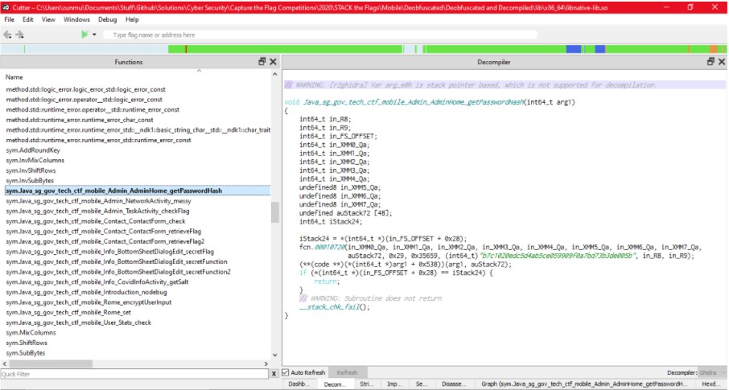

I got the string `b7c1020edc5d4ab5ce059909f0a7bd73b3de005b`. I then passed it through crackstation to find the password from the `SHA-1` hash

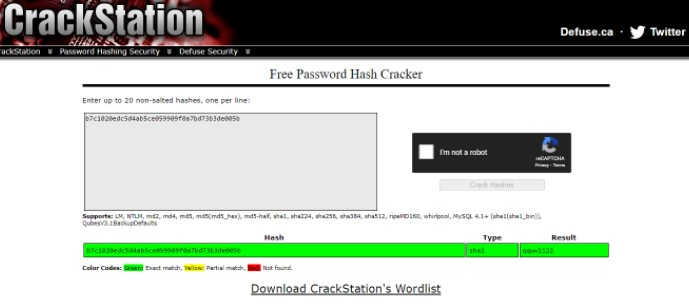

Putting it in the app gives success

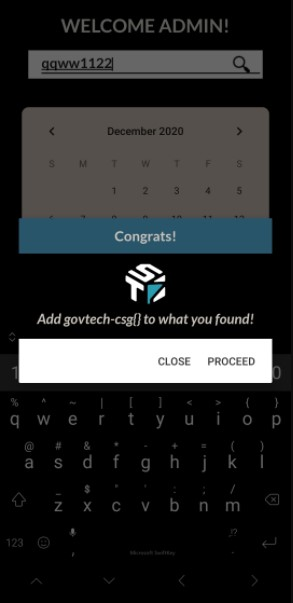

### My Thought process

When trying to solve the Mobile Challenges, I didn't really solve it in this order. What actually happened was more like this
1. Decompiling the code, Installing the app, finding native libraries and opening them in Cutter (underated C decompiler)
   1. Spent time looking at the Info Page before realising I'm supposed to look at the Contact Activity
1. Deobfuscating the code using an online tool
1. Opening the APK up in Android Studio, trying and failing to do debugging and dynamic analysis
1. Try to use JDWP to debug (and Failed)
1. Making a backup using ADB, opening it in DB Browser and finding out it is corrupted and useless
   1. After the competition I was told that it is actually encrupted instead 
1. Learn to use ADB to access exposed Activities
   1. Ended up accessing `sg.gov.tech.ctf.User.ViewActivity`, reversing the code, extracting the flag from `strings.xml` and solving `All about Korovax!`
   1. Also learnt and experimented with drozer (a tool to help with analysis)
1. ~~Pirate~~ Use APK Editor Pro to edit the APK and export all activities (for easy access in apk)
1. Taking the hint to `Welcome to Korovax Mobile!` (which was useless), but forced me to look harder into the program and actually reverse it
1. Reversing `sg.gov.tech.ctf.Admin.AdminHome` and obtaining the flag
1. Randomly putting in the flag I obtained, and then remembering I solved `All about Korovax!`

This took about the entire day, but I learnt quite a lot in the process.

## Flags
1. Contact Me!: `govtech-csg{Ez_F1aG_4_wARmUp!}`
1. Subscribe!: `govtech-csg{th3rE_15_nO_n0bIliTy_In_p0Vert7}`
1. Welcome to Korovax Mobile!: `govtech-csg{eZ_1nJ3CT10N}`
   1. Except no injection
1. True or False: `govtech-csg{It5_N0T_Ez_2_L0G_1n_S_AdM1n}`
   1. That's why don't login as admin just hack your way through
1. What's with the Search!: `govtech-csg{qqww1122}`
1. All about Korovax: `govtech-csg{I_h0P3_u_D1D_N0T_Cl1cK_UR_W@y_H3r3}`
   1. I did. Too bad!
