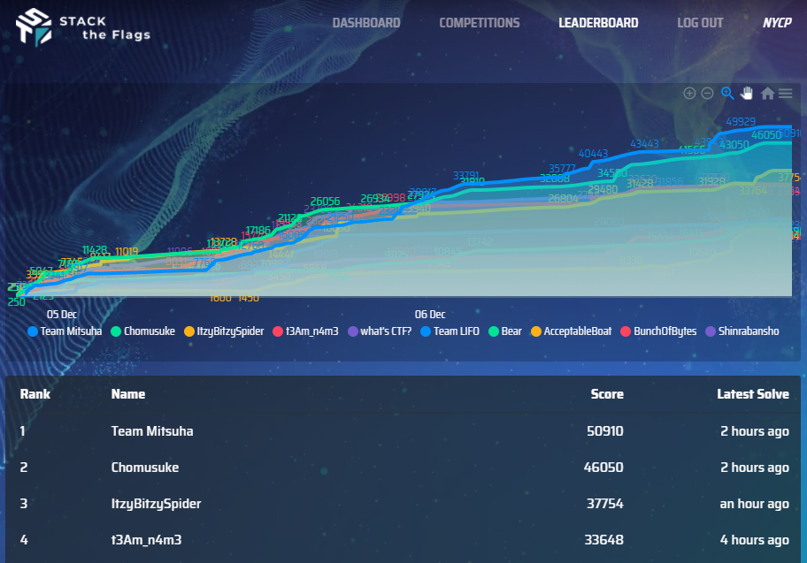
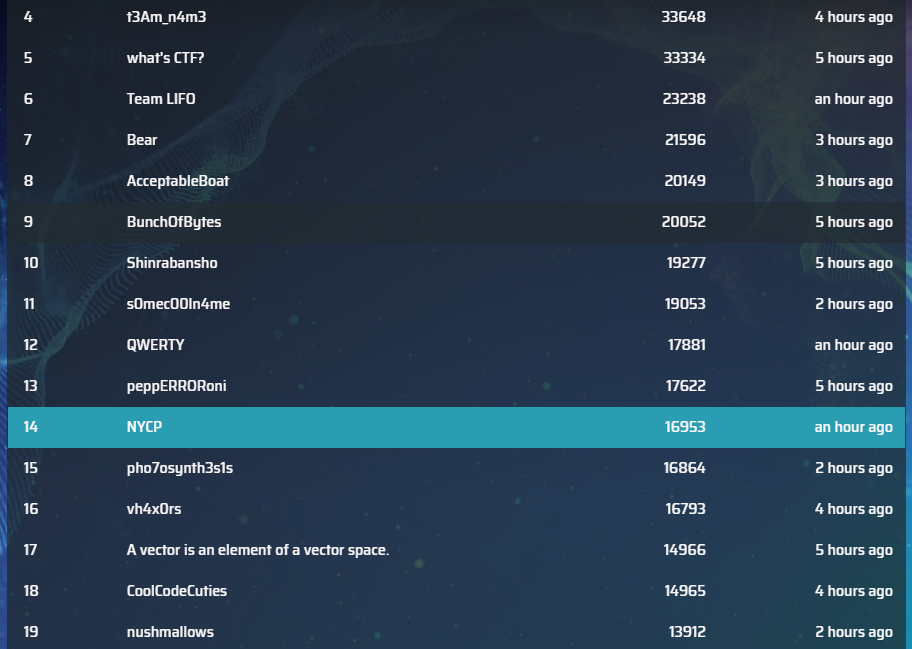

# STACK the Flags 2020

STACK the Flags 2020 is an online, jeopardy style Capture-the-Flag competition organised by the folks in GovTech’s Cyber Security Group (CSG). As part of ongoing efforts to engage the technology community, this CTF is open to everyone! At the end of the competition, attractive prizes will be awarded to the top teams.

There will be 11 challenge categories: 
Binary Exploitation, Cloud, Cryptography, Forensics, Internet of things (IoT), Miscellaneous, Mobile, Open Source Intelligence (OSINT), Reverse Engineering (RE), Social Engineering (SE), Web

Useful Links
1. [Main Site](https://ctf.tech.gov.sg/)
1. [Opening Ceremony](https://www.youtube.com/watch?v=gNaZ9T3Erro), [Opening Ceremony Slides](https://drive.google.com/file/d/1PW8M1nAPIt_WZsSsrkDmWdxN0MsOh4Ro/view), [Closing Ceremony](https://youtu.be/MWmlIuzdXr4)
1. [CTF Platform](https://play.cat3.stf-2020.alttablabs.sg/)
1. [Challenge Dependencies](https://docs.google.com/document/d/1tty0Yv9K35lrxNDHqaXKq-ocmUR3Fmo-8zuPVHP_IKU/edit)
1. [Known Issues](https://docs.google.com/document/d/1GwcJPdV6O0A9jnY6kGJVPMb2RGNazOfbmvZLlCDhQqc/edit)
1. [Category 3 Download Instructions](https://docs.google.com/document/d/1jdGOn98yRZlYOxywxS___i71_gkmqiMJuyCE8TZKTpI/edit)

## Event Details

This event was held from 9pm 5/12/2020 to 10.45pm 7/12/2020. It was extended originally from 9pm 7/12/2020 due to initial issues downloading materials from Dropbox. 

I participated in a team as NYCP in Category 3 (JC/IP/ITE), with these people
1. [Codekrodile](https://github.com/Codekrodile)
2. [bobjohnjones](https://github.com/bobjohnjones)
3. [undefined-func](https://github.com/undefined-func)

I spent the bulk of my item idling into space and learning how to do some Android Hacking. Speaking of which, the Android Hacking challenges were quite interesting, with the introduction of Native Libraries. While doing research (which may not be useful), I learnt many things such as Exported Activities, using ADB to start Activities directly, deobfuscating APKs, drozer and more. I also learnt quite a bit about JSON Web Tokens and others.

However there were also some challenges which I were totally lost (as always). `Emmel` felt so guessy. I lacked experience and knowledge to do the Assembly/C reversing needed for the harder Mobile challenges, as well as the web challenges. I forgot a significant amount of my knowledge from past CTFs too. For future CTFs, I may want to setup a proper CTF toolkit (instead of leaving every unorganised on my computer), as well as a better step by step guide on what I want to do when I encounter different file formats.

Our team got the same numerical ranking (slightly worse compared to others actually though) as in SMU Whitehacks. 14th out of 53 teams who got points. Not too shabby.

After ~~the disaster that is~~ my A Level Examinations, this was a great refresher. ~~Time to suffer in NS soon~~

## My Stuff

Here are the main challenges I did (or helped out with in order). Just traverse the directories to find them
1. `Web/Logged In` , `Web/Unlock Me` 
1. `Miscellaneous/Beep Boop`
1. `Mobile` including `Contact Us!`, `Subscribe!`, `Welcome to Korovax Mobile!`, `True or false?`, `What's with the Search!`, `All about Korovax!`
1. `Forensics/Walking down a colourful memory lane`

Here are the challenges I solved only after the CTF (insert sad face here)
1. `Forensics/Voices in the head`
1. `Cloud/Find the leaking bucket`

Here are the writeups that my teammates did

1. undefined-func: [https://github.com/undefined-func/stack-the-flags-2020-writeups]
2. Codekrodile: [https://docs.google.com/document/d/1Ei3uYbYmOxZwo0zRVe-I864p-H4JN7ys7zU059vJh5A/edit]

## Others' Writeups

Obviously I'm not very good in cybersecurity, so check out other write ups for the challenges! 
1. https://blog.justins.in/stack-the-flags-2020/
1. https://dev.to/k0p1/stacks-2020-ctf-voices-in-the-head-forensic-1bea
1. https://nandynarwhals.org/stack-2020-competition/
1. https://github.com/4yn/slashbadctf/tree/master/govtech20
1. https://github.com/IRS-Cybersec/ctfdump/tree/stack-mitsuha/STACK%20the%20Flags%202020/Mitsuha
