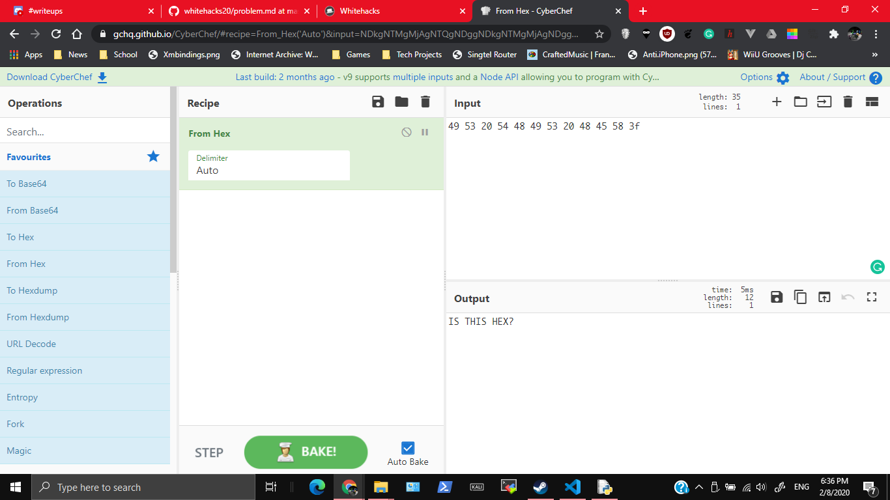
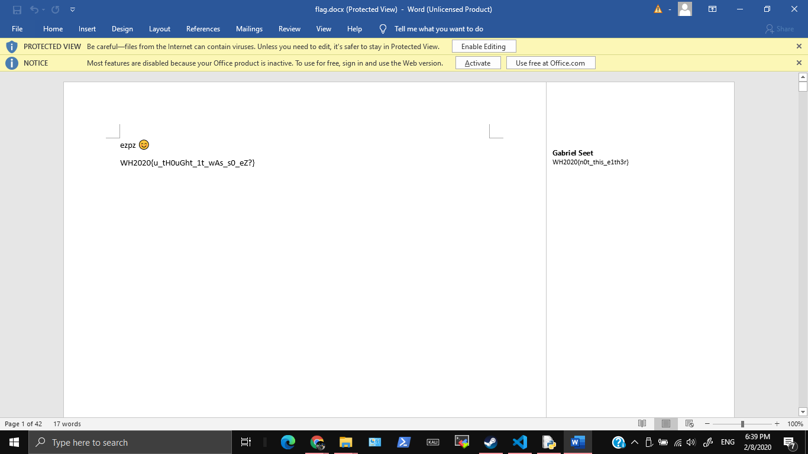
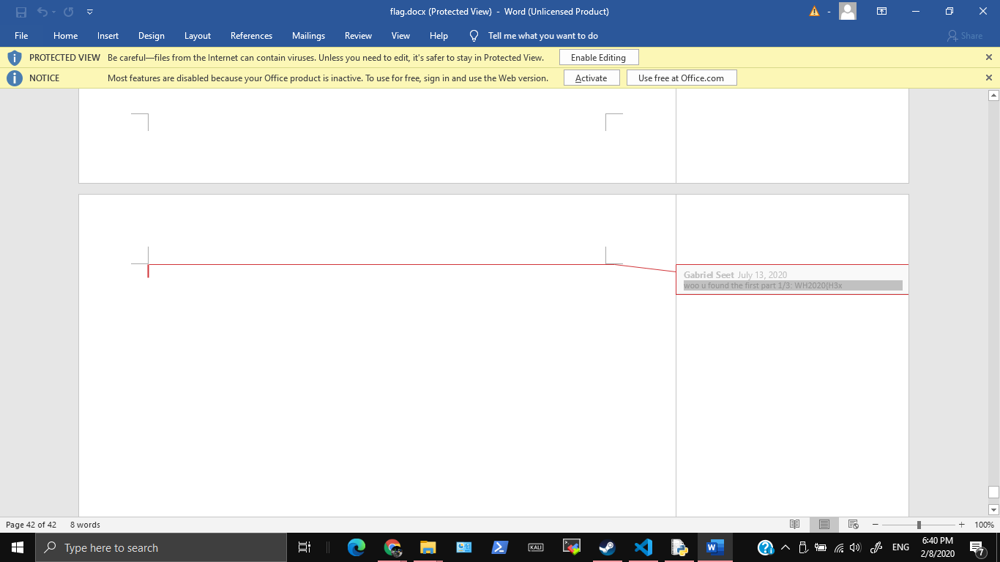
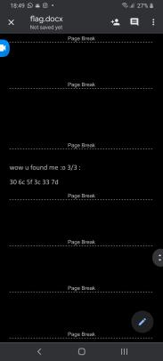

# CYS - 49 53 20 54 48 49 53 20 48 45 58 3f

78 points, CYS, 32 SOLVES

## Description

Cyber Youth Singapore Sponsor Challenge

I find hex very cool :D

## Attached Files

flag.docx

# Solution

Let's check out what the title means. One idea is to convert it from Hex to ASCII.



Oh. Useless

When we open the document, we get depression



and the first part of the flag



You can also use change the extension to `zip`, and use grep to find the first part
```
kali@kali:/tmp/test$ grep -iRl "1/3" ./
./word/comments.xml
$ cat ./word/comments.xml
......</w:pPr><w:r><w:rPr><w:rStyle w:val="CommentReference"/></w:rPr><w:annotationRef/></w:r><w:r><w:t>woo u found the first part</w:t></w:r><w:r w:rsidR="000A66FF"><w:t xml:space="preserve"> 1/3</w:t></w:r><w:r><w:t>: WH2020{H3x</w:t></w:r><w:bookmarkStart w:id="2" w:name="_GoBack"/><w:bookmarkEnd w:id="2"/><w:r><w:t xml:space="preserve">                                                                                                                      </w:t></w:r></w:p></w:comment></w:comments>kali@kali:/tmp/
```

You can run the document through the `strings` command to get the 2nd part of the flag.
```
.
.
.
word/fontTable.xmlPK
word/people.xmlPK
docProps/core.xmlPK
docProps/app.xmlPK
....omg wow 2/3:...._1s_c0
```

Originally when I opened the docx on my phone (using Google Docs, why is my phone faster than my comp), I found the third part of the flag



Just combine all flags

# Flag

`WH2020{H3x_1s_c00l_<3}`
