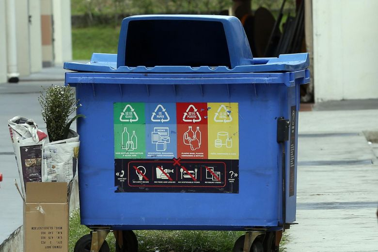

# CYS - Little Matryoshka Doll

55, CYS, 48 SOLVES

## Description
Cyber Youth Singapore Sponsor Challenge

My flag has run away and hide itself inside this matryoshka doll, can you help me find it?


## Attached Files
Matryoshka64

# Solution

Firstly, we run binwalk to figure out what the file is
```
$ binwalk Matryoshka64

DECIMAL       HEXADECIMAL     DESCRIPTION
--------------------------------------------------------------------------------
0             0x0             Zip archive data, at least v2.0 to extract, compressed size: 84396, uncompressed size: 84396, name: Matryoshka63.zip
84420         0x149C4         End of Zip archive, footer length: 22
84504         0x14A18         End of Zip archive, footer length: 22
```

After that we unzip it. However, there is another zip file inside. From the name `Matryoshka63.zip`, we can guess that we have to extract the zip files multiple times. I used a python script to help with this

Even after that, we are left with a bin.jpg



The image doesn't look like it has anything at first glance, but running `strings bin.jpg | grep WH2020{` reveals the flag

The final solution script is `solve.py`

```
Archive:  Matryoshka3.zip
 extracting: Matryoshka2.zip
Archive:  Matryoshka2.zip
 extracting: Matryoshka1.zip
Archive:  Matryoshka1.zip
 extracting: Matryoshka0.zip
WH2020{y0u_f0und_m3_848USHK4_d0lL2!}IEND
```

# Flag

`WH2020{y0u_f0und_m3_848USHK4_d0lL2!}`