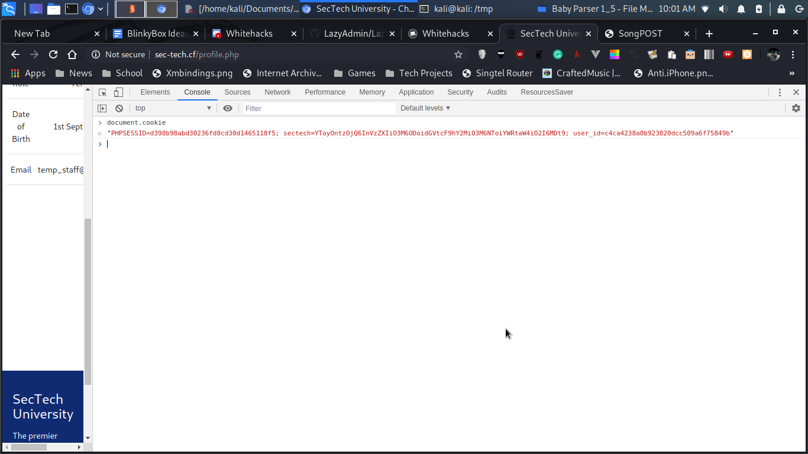
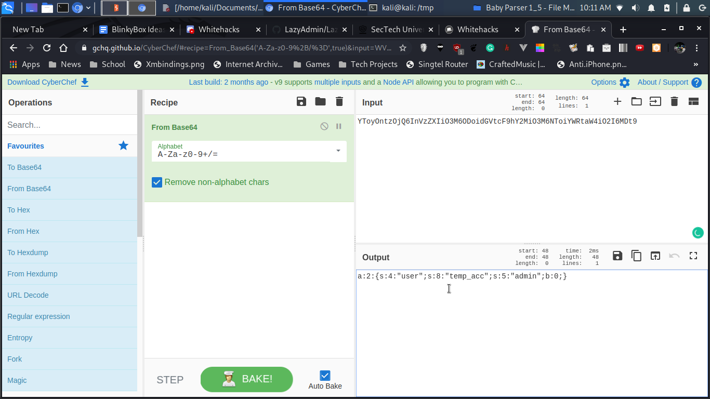
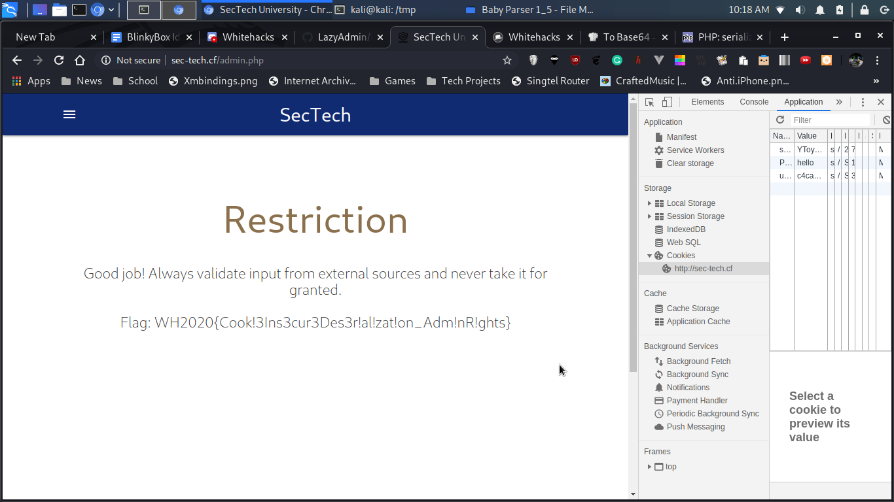

# GovTech SecTech (3/6) - Insecure Deserialization

171, GOVTECH, 24 SOLVES

## Description

GovTech Sponsor Challenge

Trusting serialized data without verification them can be precarious. To this end, we ask that you be like the Cookie Monster, attentive and inquisitive.

[Challenge here](http://sec-tech.cf/)

Login with the username `temp_acc` and password `temp_pass`

# Solution

The word cookie monstor suggested that there was something to do with cookies. So I firstly checked the cookies.

After some deliberation, I thought that the cookie `sectech`  with the value of `YToyOntzOjQ6InVzZXIiO3M6ODoidGVtcF9hY2MiO3M6NToiYWRtaW4iO2I6MDt9` or so might be Base64, so I converted it back to a normal string (with the help of CyberChef).

With this string `a:2:{s:4:"user";s:8:"temp_acc";s:5:"admin";b:0;}`, I was wondering what format it could be. After some experimentation and googling (you can check some of the images if you are interested), [this search query](https://www.google.com/search?q=serialise+a%3A2%3A%7Bs%3A4%3A%22user%22%3Bs%3A8%3A%22temp_acc%22%3Bs%3A5%3A%22admin%22%3Bb%3A0%3B%7D&rlz=1C1CHBF_enSG822SG822&oq=serialise+a%3A2%3A%7Bs%3A4%3A%22user%22%3Bs%3A8%3A%22temp_acc%22%3Bs%3A5%3A%22admin%22%3Bb%3A0%3B%7D&aqs=chrome..69i57.11414j0j4&sourceid=chrome&ie=UTF-8) led me to the [PHP manual on serialize](https://www.php.net/manual/en/function.serialize.php). I just realised all I had to do was change the integer after `admin` from `0` to `1` like so.

`a:2:{s:4:"user";s:8:"temp_acc";s:5:"admin";b:1;}`

Convert it back to base64 (I got the value `YToyOntzOjQ6InVzZXIiO3M6ODoidGVtcF9hY2MiO3M6NToiYWRtaW4iO2I6MTt9`), and replace the `sectech` cookie with this value (with the help of Chrome Dev Tools)

# Flag

`WH2020{Cook!3Ins3cur3Des3r!al!zat!on_Adm!nR!ghts}`