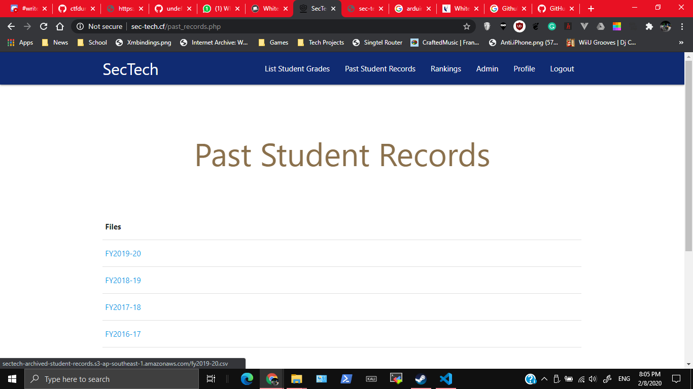
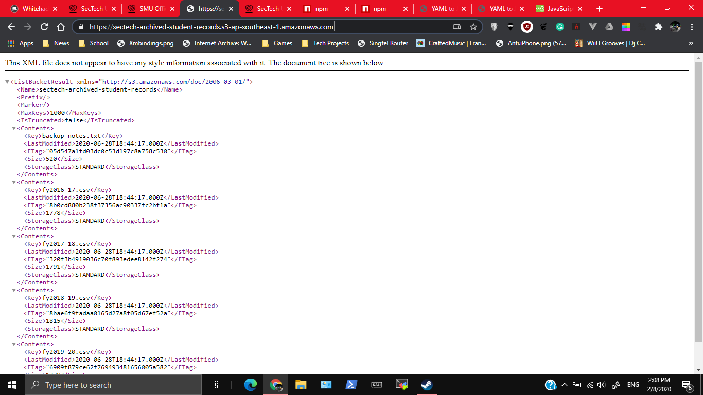
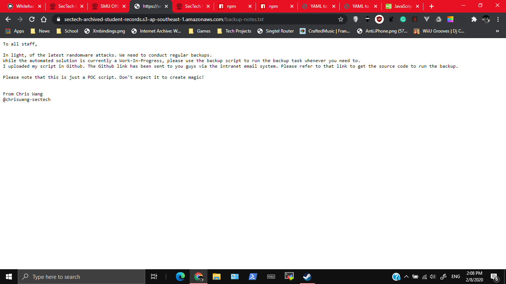
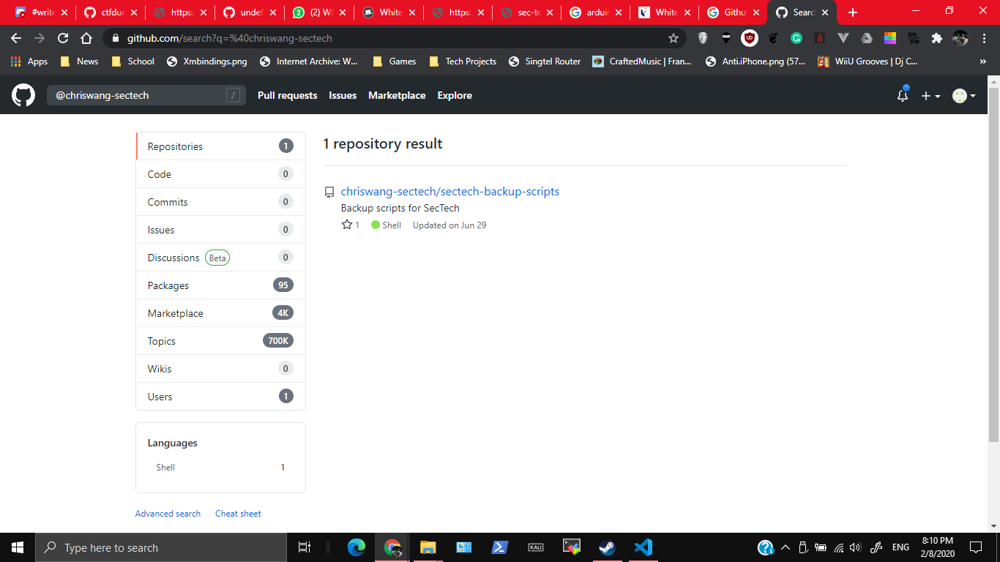
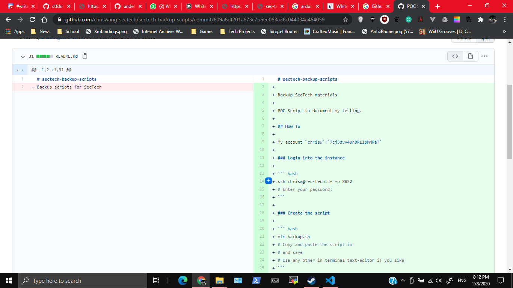
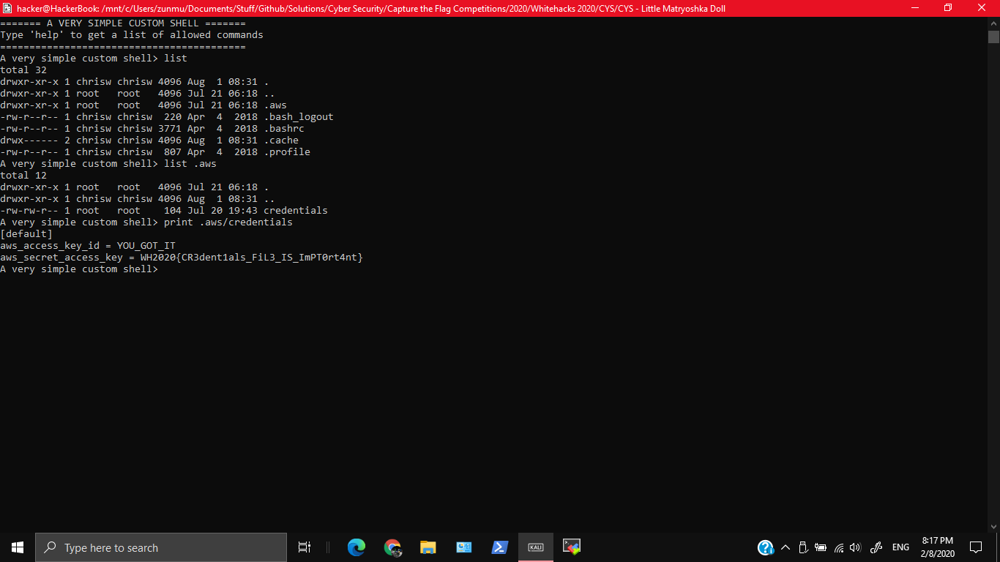

# GovTech SecTech (6/6) - OSINT

500, GOVTECH, 11 SOLVES

## Description

GovTech Sponsor Challenge

We love how the system archives past student records - after all, data is gold. If you don't find the gold, we suggest you dig deeper and look beyond the surface, specifically the 'root' :)

[Challenge here](http://sec-tech.cf/)

Login with the username `temp_acc` and password `temp_pass`

# Solution

This is one of the challenges I'm most proud of doing, especially since the organisers ended up going through this challenge. I'll be talking about how I got this challenge

Firsly, when looking at the past student records, the URL of the links seemed interesting, linking to some AWS server.



I decided to go to the base URL `https://sectech-archived-student-records.s3-ap-southeast-1.amazonaws.com/`, and got these



Most of these are student records, but one interesting thing is the `backup-notes.txt`. On checking that by going to the URL `https://sectech-archived-student-records.s3-ap-southeast-1.amazonaws.com/backup-notes.txt` you get to find some interesting information



Now we know that the script is in github, the person is Chris Wang, and that he can be identified by `@chriswang-sectech`. Doing a quick search on Github, you get this



We know that the main repo is `https://github.com/chriswang-sectech/sectech-backup-scripts`. Looking to it at first glance, there is an SSH command of `ssh chrisw@sec-tech.cf -p 8822`. However, I guessed that it could be hidden in one of the commits. Looking through them, you get to find the username and password



With this important credentials we can SSH into the system using `chrisw`:`7cj5dvv4uhBRLIpMNPeT`. You get a simple command shell.


Originally I was stuck at this. `list` is just a simplified version of `ls`, `print` is a simplified version of `cat` and so on. On experimenting, I tried to do something like this to get a shell
```
print | bash
```
After that I realised that characters like `>`, `|` and more are eliminated.

And then, [undefined-func](https://github.com/undefined-func) reminded me that you can just `list .aws` and stuff.



# Flag

`WH2020{CR3dent1als_FiL3_IS_ImPT0rt4nt}`