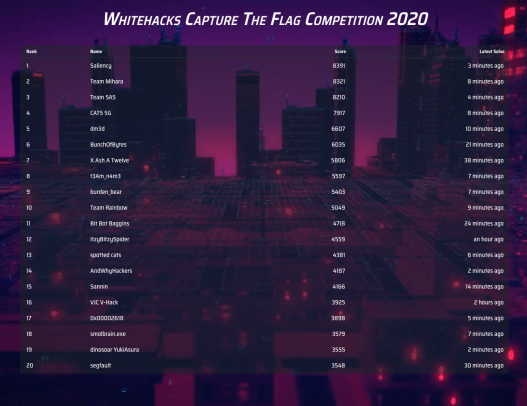

# SMU Whitehacks

https://sis.smu.edu.sg/newsletter/35096

## Event Details

Due to Covid 19, the event was held online on 2/8/2020, 9.10am to 5.10pm. There also was a Zoom Livestream of the scoreboard (Good to know no annoying hidden scoreboards near the end of the event).

I participated and led the team `AndWhyHackers` (get it? because NY for Nanyang?), with these people
1. [Codekrodile](https://github.com/Codekrodile)
2. [undefined-func](https://github.com/undefined-func)

I did a good number of challeges which were interesting. The challenges were quite interesting. A few were very beginner friendly and nice like `gdbtutor` and `BofSchool`

I tried to do several various Reverse Engineering challenges , but I was stuck and didn't know what to do. 

In the end, I feel we did decent. Out of 63 teams who got points, we got 14th.

## My Stuff

Here are the flags for listening to the talks on Saturday (1/8/2020) and in the morning at 8am-9am
1. (GovTech): `WH2020{paying_attention_points_15362}`
2. (SQLi): `WH2020{i_love_whitehacks_2020_loot_crate_929292}`
3. (CSIT): `WH2020{bonus_points_1a2b6c7d3e1}`
4. (RE): `WH2020{random_flag_name_cant_guess_121212}`
5. (CSA): `WH2020{final_bonus_day_1_yay_woohoo}`
6. (GovTech Day 2): `WH2020{all_the_best_CTF_whitehacks2020_GLHF_8934}`

Here are the flags for listening to the booths:
1. CSIT: `WH2020{r00ty0uRfutur3w1ThC$1T}`
2. CSA: `WH2020{CSA_IS_SOOOOOOOOO_AMAZING?!?!?}`
3. GovTech: `WH2020{GOVTECH_IS_CRAZY_AWESOME?!?!?}`

Here are the main challenges I did (or helped out with). Just traverse the directories to find them
1. `CYS/CYS - 49 53 20 54 48 49 53 20 48 45 58 3f`
2. `CYS/CYS - Little Matryoshka Doll`
3. `Binary Exploitation/BofSchool`
4. `RE/gdbtutor`
5. `Misc/Talk To Me`
6. `GovTech/GovTech SecTech (3/6) - Insecure Deserialization`
7. `GovTech/GovTech/GovTech SecTech (6/6) - OSINT` (Helped by `undefined-func`)
8. `GovTech/GovTech SecTech (2/6) - IDOR` (Helped `undefined-func`)
9. `Crypto/RSB (2/4)`

Some solutions for other challenges (Probably not done by me)

For `GovTech SecTech (1/6) - LFI`:
* Go to `http://sec-tech.cf/transcript.php?user=temp_acc&password=temp_pass&user_id=1&file=/etc/passwd` to get a list of passwd
* You can figure out the directory of the flag from this so go to `http://sec-tech.cf/transcript.php?user=temp_acc&password=temp_pass&user_id=1&file=/secret_path/lfi_flag.txt` and you can find the flag `WH2020{Loc@l_F1l3_Inclus10n_buT_N0t_sh3ll}`

## Other's Writeups
Obviously I'm not very good at cybersecurity, so check out other write ups for the challenges!
1. https://github.com/IRS-Cybersec/ctfdump/blob/master/Whitehacks%202020/Crypto/Whos%20My%20Waifu/whos_my_waifu.md
2. https://github.com/IRS-Cybersec/ctfdump/blob/master/Whitehacks%202020/web/Baby0Day/README.md

Alternatively, if you actually participated in the competition, check out the discord server for writeups under `#writeups`
