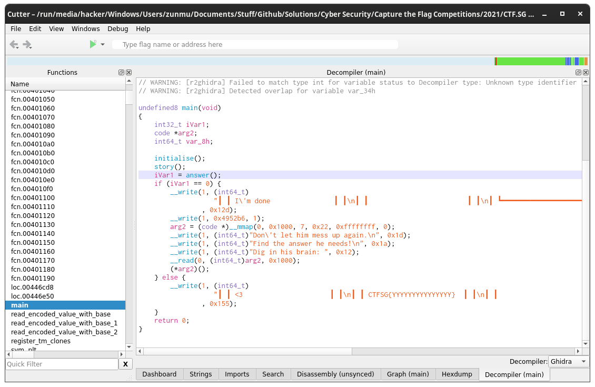
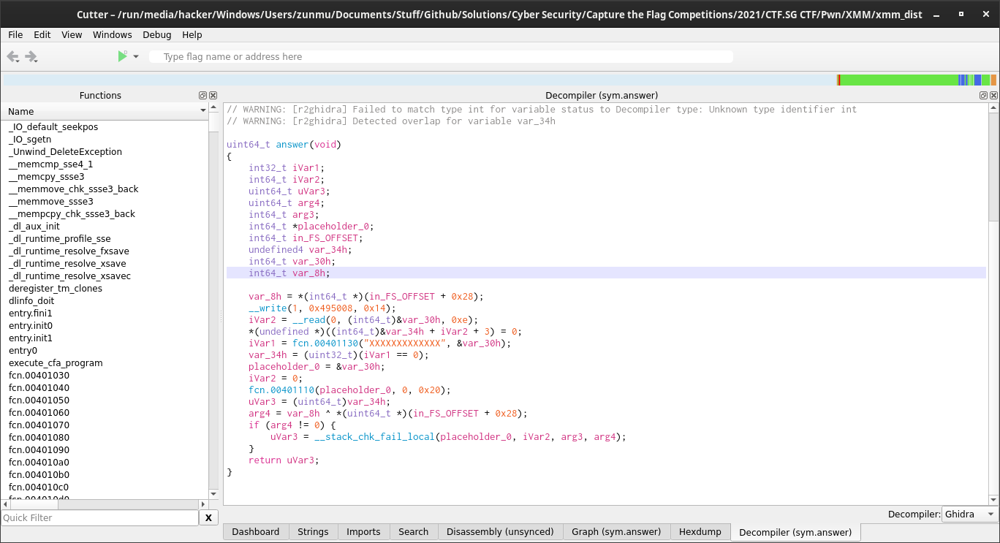
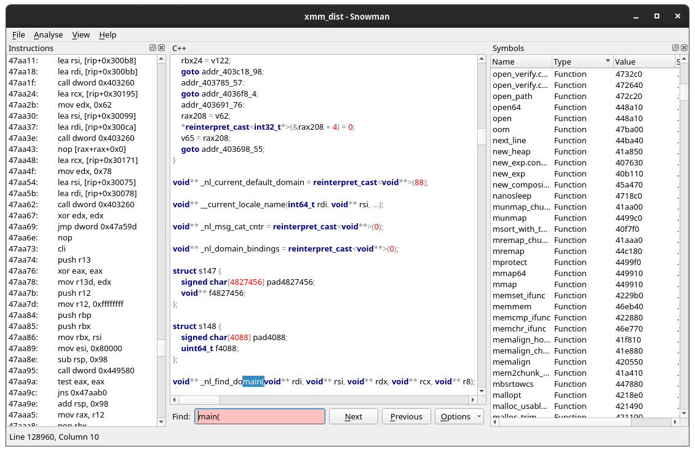
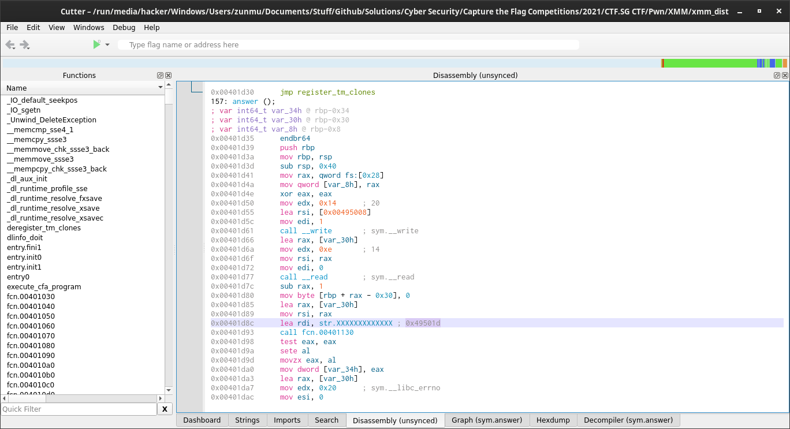

# XMM

This is a challenge from the CTF.SG CTF. I didn't actually solve this challenge in the competition, but I wanted to try to understand it now.

## Initial Knowledge needed
You need
1. Basic Understanding of Binary Exploitation (more specifically, google Buffer Overflows)
 - Google on LiveOverflow's Videos on Binary Exploitation
2. x86 Assembly (because you write x86 assembly)

## Explanation of Solution

### Basic Analysis

1st thing first, decompile the binary. I used cutter (ghidra decompiler). I don't advice using worse decompilers like snowman because they suck. You can't even find the `main` function with snowman. Some observations I noted
1. There's this `answer()` function, which looking at it, just checks if the input matches `XXXXXXXXXXXXX` (Of course the input is fake). If it matches, it shows the flag `CTFSG{YYYYYYYYYYYYYYY} `(which is of course fake, we have to check the server to get the actual one)
2. If not it just reads input I guess and then does nothing
  -  `mmap`? On googling, I realised that It basically gets the address of the memory location? and saves it to `arg2`? as a code data type
  - The `read` function immediately catches my attention. It does not check if you write too much characters and affect the rest of the stack.
  - `(*arg2)();` Woah this is code execution. So basically you run the code that you input in.





Next, run the Binary. I get a segmenation fault which is interesting. The most interesting thing is that there is illegal instruction if you put something (for the next blank), which suggests that you can put shellcode.

```
(base) [hacker@hackerbook XMM]$ ./xmm_dist
╭━━━━━━━━━━━━━━━━━━━━━━━━━━━━━╮
┃ ┏━━━━━━━━━━━━━━━━━━━━━━━━━┓ ┃
┃ ┃ <Msgs    xmm    Details ┃ ┃
┃ ┃------------------------ ┃ ┃
┃ ┃                  hey ;) ┃ ┃
┃ ┃ hey?                    ┃ ┃
┃ ┃            wanna go out ┃ ┃
┃ ┃ sure let's              ┃ ┃
┃ ┃ go eat my               ┃ ┃
┃ ┃ favourite               ┃ ┃
┃ ┃             erm... what ┃ ┃
┃ ┃             was your    ┃ ┃
┃ ┃             fav again?  ┃ ┃
┃ ┃ you can't               ┃ ┃
┃ ┃ even rmb?               ┃ ┃
┃ ┃             of course I ┃ ┃
┃ ┃             rmb, it's   ┃ ┃
┃ ┃             lolcat
┃ ┃ I'm done                ┃ ┃
┃ ┃                         ┃ ┃
┃ ┗━━━━━━━━━━━━━━━━━━━━━━━━━┛ ┃
┃             ◯               ┃
╰━━━━━━━━━━━━━━━━━━━━━━━━━━━━━╯
Don't let him mess up again.
Find the answer he needs!
Dig in his brain:      
Segmentation fault (core dumped)
(base) [hacker@hackerbook XMM]$ ./xmm_dist
╭━━━━━━━━━━━━━━━━━━━━━━━━━━━━━╮
┃ ┏━━━━━━━━━━━━━━━━━━━━━━━━━┓ ┃
┃ ┃ <Msgs    xmm    Details ┃ ┃
┃ ┃------------------------ ┃ ┃
┃ ┃                  hey ;) ┃ ┃
┃ ┃ hey?                    ┃ ┃
┃ ┃            wanna go out ┃ ┃
┃ ┃ sure let's              ┃ ┃
┃ ┃ go eat my               ┃ ┃
┃ ┃ favourite               ┃ ┃
┃ ┃             erm... what ┃ ┃
┃ ┃             was your    ┃ ┃
┃ ┃             fav again?  ┃ ┃
┃ ┃ you can't               ┃ ┃
┃ ┃ even rmb?               ┃ ┃
┃ ┃             of course I ┃ ┃
┃ ┃             rmb, it's   ┃ ┃
┃ ┃             a
┃ ┃ I'm done                ┃ ┃
┃ ┃                         ┃ ┃
┃ ┗━━━━━━━━━━━━━━━━━━━━━━━━━┛ ┃
┃             ◯               ┃
╰━━━━━━━━━━━━━━━━━━━━━━━━━━━━━╯
Don't let him mess up again.
Find the answer he needs!
Dig in his brain: a
Illegal instruction (core dumped)
(base) [hacker@hackerbook XMM]$ ./xmm_dist
╭━━━━━━━━━━━━━━━━━━━━━━━━━━━━━╮
┃ ┏━━━━━━━━━━━━━━━━━━━━━━━━━┓ ┃
┃ ┃ <Msgs    xmm    Details ┃ ┃
┃ ┃------------------------ ┃ ┃
┃ ┃                  hey ;) ┃ ┃
┃ ┃ hey?                    ┃ ┃
┃ ┃            wanna go out ┃ ┃
┃ ┃ sure let's              ┃ ┃
┃ ┃ go eat my               ┃ ┃
┃ ┃ favourite               ┃ ┃
┃ ┃             erm... what ┃ ┃
┃ ┃             was your    ┃ ┃
┃ ┃             fav again?  ┃ ┃
┃ ┃ you can't               ┃ ┃
┃ ┃ even rmb?               ┃ ┃
┃ ┃             of course I ┃ ┃
┃ ┃             rmb, it's   ┃ ┃
┃ ┃             XXXXXXXXXXXXX
┃ ┃ <3                      ┃ ┃
┃ ┃ CTFSG{YYYYYYYYYYYYYYY}  ┃ ┃
┃ ┃                         ┃ ┃
┃ ┗━━━━━━━━━━━━━━━━━━━━━━━━━┛ ┃
┃             ◯               ┃
╰━━━━━━━━━━━━━━━━━━━━━━━━━━━━━╯(base) [hacker@hackerbook XMM]$
```

### Trying to script out something

I copied/ wrote some code in `exploit.py`. Since can run shellcode, try to get out a shell?
```
base) [hacker@hackerbook XMM]$ python2 exploit.py
[*] '/run/media/hacker/Windows/Users/zunmu/Documents/Stuff/Github/Solutions/Cyber Security/Capture the Flag Competitions/2021/CTF.SG CTF/Pwn/XMM/xmm_dist'
    Arch:     amd64-64-little
    RELRO:    Partial RELRO
    Stack:    Canary found
    NX:       NX enabled
    PIE:      No PIE (0x400000)
[+] Starting local process './xmm_dist': pid 56213
[*] Switching to interactive mode
$ ls
README.md  Screenshots    exploit.py  objdump_disassembly.txt  xmm_dist
$
```


However, the challenge description said NOT to get a shell. So the idea is to leak the key(The `XXXXXXXXXXXXX`) from the shell. But how can we do that? One Possible way is to just print the value of the key? I checked the disassembly of the `answer` function



From here we know the location of the key is `0x49501d`. It shouldn't change on the server because its part of the binary.Now my idea is to pass it into the write statement. For that we just use pwntools

You can do the same thing with the flag. Just write


### Reference

I just straight away looked at these writeups

I referred to these writeups
1. https://gist.github.com/lordidiot/05692aa8e2661e9b93b7d5226d48240c
2. https://github.com/IRS-Cybersec/ctfdump/blob/master/CTFSG%202021/pwn/xmm_dist.md
3. https://ariana1729.github.io/writeups/CTFSG/XMM/2021-03-14-XMM.html

## Reflections

Well this seemed so easy and I should have tried harder for this challenge. But then again everything is easier on hindsight.

Learning Points
1. Injecting Shellcode doesn't mean just getting a shell? Also Pwntools is Lit!
2. I should really do a proper analysis of the binary and take my time to read through
