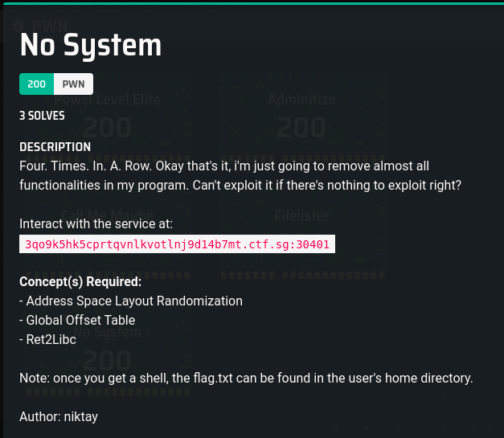

# No System

### Description




## Solution

### Initial Analysis

I disassembled using `objdump` (output in `Analysis/disassembly.txt`), found out the ROPgadgets using `ROPgadget` (output in `Analysis/ROPgadgets.txt`), and ran the binary in gdb.
```
_______  _     _  __    _  _______  __   __  _______  _______  ______   
|       || | _ | ||  |  | ||       ||  | |  ||       ||       ||    _ |  
|    _  || || || ||   |_| ||_     _||  | |  ||_     _||   _   ||   | ||  
|   |_| ||       ||       |  |   |  |  |_|  |  |   |  |  | |  ||   |_||_
|    ___||       ||  _    |  |   |  |       |  |   |  |  |_|  ||    __  |
|   |    |   _   || | |   |  |   |  |       |  |   |  |       ||   |  | |
|___|    |__| |__||_|  |__|  |___|  |_______|  |___|  |_______||___|  |_|

=========================================================================
                        Stage 5: No System
=========================================================================
Enter Username => Aa0Aa1Aa2Aa3Aa4Aa5Aa6Aa7Aa8Aa9Ab0Ab1Ab2Ab3Ab4Ab5Ab6Ab7Ab8Ab9Ac0Ac1Ac2Ac3Ac4Ac5Ac6Ac7Ac8Ac9Ad0Ad1Ad2Ad3Ad4Ad5Ad6Ad7Ad8Ad9Ae0Ae1Ae2Ae3Ae4Ae5Ae6Ae7Ae8Ae9Af0Af1Af2Af3Af4Af5Af6Af7Af8Af9Ag0Ag1Ag2Ag3Ag4Ag5Ag6Ag7Ag8Ag9Ah0Ah1Ah2Ah3Ah4Ah5Ah6Ah7Ah8Ah9Ai0Ai1Ai2Ai3Ai4Ai5Ai6Ai7Ai8Ai9Aj0Aj1Aj2Aj3Aj4Aj5Aj6Aj7Aj8Aj9
Greetings Aa0Aa1Aa2Aa3Aa4Aa5Aa6Aa7Aa8Aa9Ab0Ab1Ab2Ab3Ab4Ab5Ab6Ab7Ab8Ab9Ac0Ac1Ac2Ac3Ac4Ac5Ac6Ac7Ac8Ac9Ad0Ad1Ad2Ad3Ad4Ad5Ad6Ad7Ad8Ad9Ae0Ae1Ae2Ae3Ae4Ae5Ae6Ae7Ae8Ae9Af0Af1Af2Af3Af4Af5Af6Af7Af8Af9Ag0Ag1Ag2Ag3Ag4Ag5Ag6Ag7Ag8Ag9Ah0Ah1Ah2Ah3Ah4Ah5Ah6Ah7Ah8Ah9Ai0Ai1Ai2Ai3Ai4Ai5Ai6Ai7Ai8Ai9Aj0Aj1Aj2Aj3Aj4Aj5Aj6Aj7Aj8Aj9!
Program received signal SIGSEGV, Segmentation fault.
0x00000000004007b9 in main ()
(gdb) info reg
rax            0x0                 0
rbx            0x4007c0            4196288
rcx            0x0                 0
rdx            0x0                 0
rsi            0x7fffffffc290      140737488339600
rdi            0x7ffff7f9b4d0      140737353725136
rbp            0x3769413669413569  0x3769413669413569
rsp            0x7fffffffe4b8      0x7fffffffe4b8
r8             0xfffffffffffffffa  -6
r9             0x7ffff7f5d0c0      140737353470144
r10            0x7ffff7f5cfc0      140737353469888
r11            0x246               582
r12            0x4005c0            4195776
r13            0x0                 0
r14            0x0                 0
r15            0x0                 0
rip            0x4007b9            0x4007b9 <main+202>
eflags         0x10202             [ IF RF ]
cs             0x33                51
ss             0x2b                43
ds             0x0                 0
es             0x0                 0
fs             0x0                 0
gs             0x0                 0
(gdb) x/128wx 0x7fffffffe4b8
0x7fffffffe4b8:	0x41386941	0x6a413969	0x316a4130	0x41326a41
0x7fffffffe4c8:	0x6a41336a	0x356a4134	0x41366a41	0x6a41376a
0x7fffffffe4d8:	0x396a4138	0x00007f00	0x004007c0	0x00000000
0x7fffffffe4e8:	0x1aaa24a1	0x0a215e57	0x004005c0	0x00000000
0x7fffffffe4f8:	0x00000000	0x00000000	0x00000000	0x00000000
0x7fffffffe508:	0x00000000	0x00000000	0xd32a24a1	0xf5dea1a8
0x7fffffffe518:	0xcf1e24a1	0xf5deb1e8	0x00000000	0x00000000
0x7fffffffe528:	0x00000000	0x00000000	0x00000000	0x00000000
0x7fffffffe538:	0x00000001	0x00000000	0xffffe5a8	0x00007fff
0x7fffffffe548:	0xffffe5b8	0x00007fff	0xf7ffe1e0	0x00007fff
0x7fffffffe558:	0x00000000	0x00000000	0x00000000	0x00000000
0x7fffffffe568:	0x004005c0	0x00000000	0xffffe5a0	0x00007fff
0x7fffffffe578:	0x00000000	0x00000000	0x00000000	0x00000000
0x7fffffffe588:	0x004005e9	0x00000000	0xffffe598	0x00007fff
0x7fffffffe598:	0x0000001c	0x00000000	0x00000001	0x00000000
0x7fffffffe5a8:	0xffffe882	0x00007fff	0x00000000	0x00000000
0x7fffffffe5b8:	0xffffe945	0x00007fff	0xffffe955	0x00007fff
0x7fffffffe5c8:	0xffffe9af	0x00007fff	0xffffe9c3	0x00007fff
0x7fffffffe5d8:	0xffffe9da	0x00007fff	0xffffe9fc	0x00007fff
0x7fffffffe5e8:	0xffffea03	0x00007fff	0xffffea2c	0x00007fff
0x7fffffffe5f8:	0xffffea47	0x00007fff	0xffffea65	0x00007fff
0x7fffffffe608:	0xffffeb23	0x00007fff	0xffffeb42	0x00007fff
0x7fffffffe618:	0xffffeb51	0x00007fff	0xffffeb66	0x00007fff
0x7fffffffe628:	0xffffeb81	0x00007fff	0xffffeb90	0x00007fff
0x7fffffffe638:	0xffffebb9	0x00007fff	0xffffebc6	0x00007fff
0x7fffffffe648:	0xffffebd5	0x00007fff	0xffffebde	0x00007fff
0x7fffffffe658:	0xffffebf3	0x00007fff	0xffffec05	0x00007fff
0x7fffffffe668:	0xffffec15	0x00007fff	0xffffec26	0x00007fff
0x7fffffffe678:	0xffffec40	0x00007fff	0xffffec4b	0x00007fff
0x7fffffffe688:	0xffffec5c	0x00007fff	0xffffec7a	0x00007fff
0x7fffffffe698:	0xffffecd0	0x00007fff	0xffffece7	0x00007fff
0x7fffffffe6a8:	0xffffecfb	0x00007fff	0xffffed06	0x00007fff
```

### Pwning on the local System

This should be easy enough I think. Basically Return Oriented Programming, but this time to libc, and linking to the global offset table.
So here are some of the steps
1. Pad 256 characters to fill up the variable and overflow
2. Add some random location
3. Using the ROPgadget `0x0000000000400823 : pop rdi ; ret`, you can pass in the string `/bin/sh` into a function
   * I used pwntools to find the `/bin/sh` in libc
4. Put the `system` function address
   * I found the address of system using `print system` in gdb.
   ```
   (gdb) print system
   $4 = {<text variable, no debug info>} 0x7ffff7e21120 <system>
   ```
   * However, the stack initially didn't have the value I input in (when I  checked with gdb). Then I realised that `scanf` doesn't allow for the encoding of `0x20` (Space character) for `%s`.
   * What i did was to disassemble `system`, and jump to the next instruction. Luckily the first instruction doesn't appear to be important.
   ```
   (gdb) disassemble system
    Dump of assembler code for function system:
       0x00007ffff7e21120 <+0>:	endbr64
       0x00007ffff7e21124 <+4>:	test   %rdi,%rdi
       0x00007ffff7e21127 <+7>:	je     0x7ffff7e21130 <system+16>
       0x00007ffff7e21129 <+9>:	jmp    0x7ffff7e20b80 <do_system>
       0x00007ffff7e2112e <+14>:	xchg   %ax,%ax
       0x00007ffff7e21130 <+16>:	sub    $0x8,%rsp
       0x00007ffff7e21134 <+20>:	lea    0x142833(%rip),%rdi        # 0x7ffff7f6396e
       0x00007ffff7e2113b <+27>:	call   0x7ffff7e20b80 <do_system>
       0x00007ffff7e21140 <+32>:	test   %eax,%eax
       0x00007ffff7e21142 <+34>:	sete   %al
       0x00007ffff7e21145 <+37>:	add    $0x8,%rsp
       0x00007ffff7e21149 <+41>:	movzbl %al,%eax
       0x00007ffff7e2114c <+44>:	ret    
    End of assembler dump.
  ```

  My code is in `localsolve.py`

### Pwning on the Remote server

The real challenge is finding the locations of the string `/bin/sh`, as well as the `system` function on the remote server.

Luckily, I googled "ASLR find libc", and found this guide [here](https://www.ret2rop.com/2020/04/got-address-leak-exploit-unknown-libc.html). It says
```
If you look at man page of printf for format specifier "%s", it takes memory location of char array as an argument and prints characters from there until a null byte is encountered. That means it will print memory data from any address we provide to it. So if we provide address of GOT section, it will print the resolved libc address that was stored there.
```


I realised that `printf` could be used to leak the libc address.
1. Firstly I found the address of the string in the disassembly (testing using gdb) `0x400b07`
2. From the disassembly, we can figure out the address of the GOT is `0x601000`, based on this comment `# 601008 <_GLOBAL_OFFSET_TABLE_+0x8>`
3. The address of `printf` can be found in the PLT section `0000000000400570 <printf@plt>:`


## Flag

``
