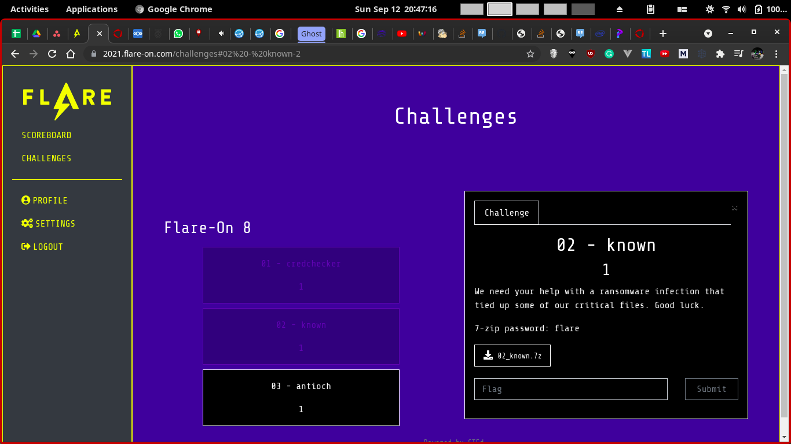
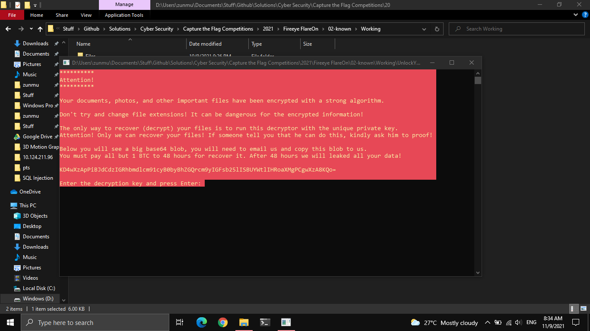
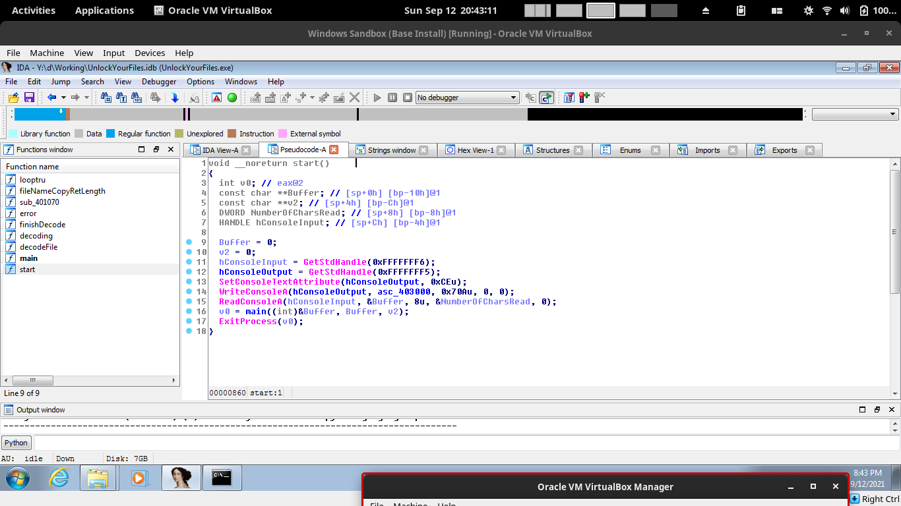
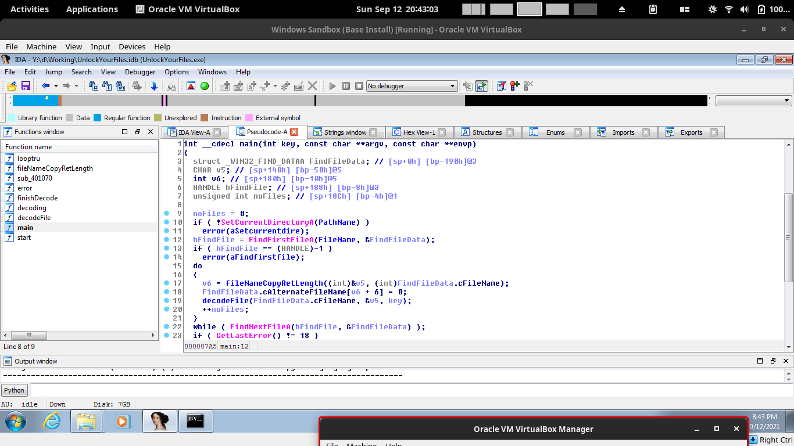
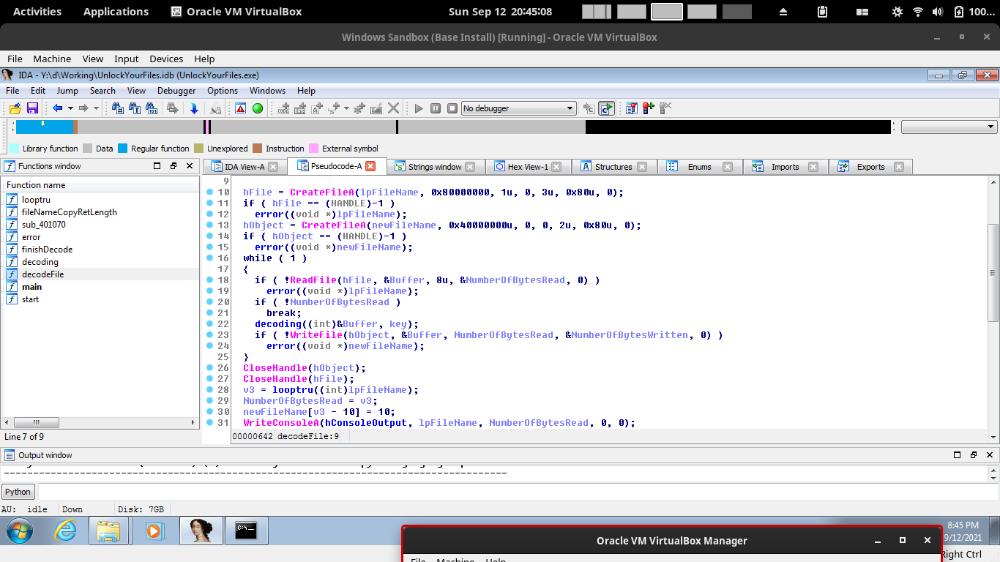
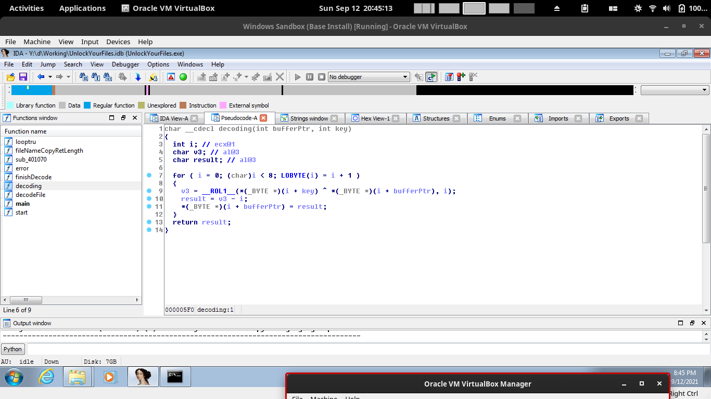

# known

### Description

## Solution

In short, use IDA Pro Hex Rays to decompile the binary (My working is in `Working/UnlockYourFiles.idb`). After that you see a few main functions
1. `start` which displays the message, takes in the key as an input, and passes it to the `main` function
2. `main` which opens the file (and does error checking), and passes it into the `decodeFile` function
3. `decodeFile`, which passes in the file data to the `decode` function, 8 characters at a time
4. `decode`, which does some XOR logic and stuff to get the extracted file

I made a python program to reverse the `decode` function, and tested it with the actual program (to check my understanding)
Afterwards, I reversed the steps, on the `capa.png`. For PNG Files, they have a png header of the first few bytes (more than 8).
We can use that as the desired output, reverse it (using the encrypted file) to get the key.

The password is `No1Trust`. Putting in the password will decrypt the remaining files. The flag is in `critical_data.txt`

## Flag
`You_Have_Awakened_Me_Too_Soon_EXE@flare-on.com`
