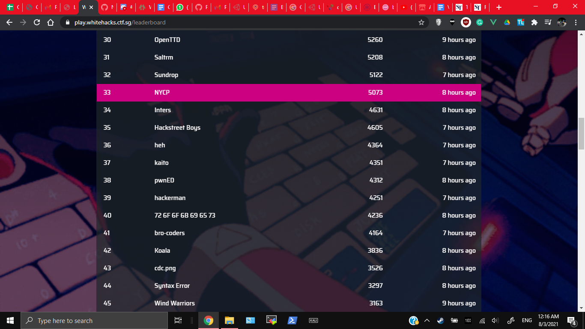

# Whitehacks 2021

A Cybersecurity Competition hosted by SMU. Their resoruces can be found [here](https://linktr.ee/whitehacks2021)

## Event Details

I participated it over the weekend (6 to 7 March 2021) for fun, with [undefined_func](https://github.com/undefined-func/whitehacks-2021-writeups)

In the competition I basically only did Pwn. The Pwn challenges were quite fun. `Piggy Bank` and `Piggy_Bank_Revenge` were basic. `Puddi Puddi` was a good challenge to get people interested in binary exploitation and buffer overflows. I almost solved Hopscotch (Overcome the Bad Canary and put shellcode on the stack but just could not run it for some reason and spent 2.5h). For some reason though I ended up learning to use Cutter (The reverse engineering program) to modify the binaries, which was fun but totally useless

In the end our result felt shit though, being at 33rd place. ~~Is this what NS does to your brain?~~

## Challenges

List the challenges I have completed. Example:

Here are the main challenges I did (or helped out with in order). Just traverse the directories to find them
1. `Pwn/Piggy Bank` (Just look at the image, you basically give a negative value)
2. `Pwn/Piggy_Bank_Revenge`
3. `Pwn/Puddi Puddi`

The writeup format follows what they prefer, so its different from my usual writeup format. Also I'm an NSF now ~~so my writeups are kind of shit~~.

## Others' Writeups

Check my teammate's writeups [here](https://github.com/undefined-func/whitehacks-2021-writeups)

Here are some much better writeups
1. https://github.com/IRS-Cybersec/ctfdump/tree/master/Whitehacks%202021/crypto/LENcrypt, https://github.com/IRS-Cybersec/ctfdump/tree/master/Whitehacks%202021/pwn/Hopscotch, https://github.com/IRS-Cybersec/ctfdump/tree/master/Whitehacks%202021/pwn/Padoru%20Padoru
2. https://ariana1729.github.io/writeups.html
3. https://github.com/caprinux/WhiteHacks-2021-Writeups