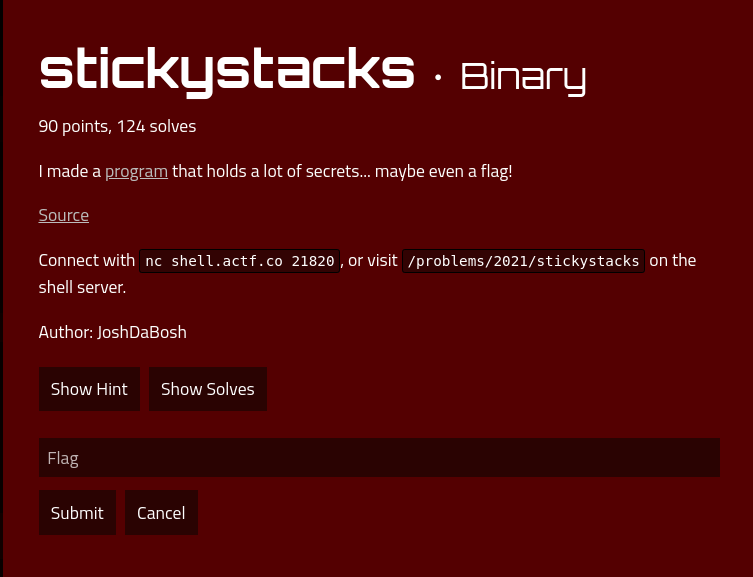

# stickystacks

### Description



## Solution

I decompiled it in Cutter and looked at the `vuln` function
```
var_8h = fopen("flag.txt", 0x402008);
  if (var_8h == 0) {
      printf("Missing flag.txt. Contact an admin if you see this on remote.");
      exit(1);
  }
  fgets((int64_t)&var_9ah + 2, 0x80, var_8h, (int64_t)&var_9ah + 2);
  puts("Name: ");
  fgets(format, 6, _reloc.stdin);
  printf("Welcome, ");
  printf(format);
  .plt.sec(10);
```

When I saw `printf(format);` I knew it was a format string vulnerability.
If we are lucky we could somehow leak the value of `var_8h` which stores the flag's contents

To find the location of the value, let's disassemble this. I used `objdump -M intel -d stickystacks`
```
401369:	48 8d 35 98 0c 00 00 	lea    rsi,[rip+0xc98]        # 402008 <_IO_stdin_used+0x8>
401370:	48 8d 3d 93 0c 00 00 	lea    rdi,[rip+0xc93]        # 40200a <_IO_stdin_used+0xa>
401377:	e8 74 fd ff ff       	call   4010f0 <fopen@plt>
40137c:	48 89 45 f8          	mov    QWORD PTR [rbp-0x8],rax
```
The variable is `rbp-0x8`. We could access this in gdb

Next step is to test the vulnerability. This includes printing whatever is on the stack, and finding out what parts of the stack we can control
```

```


## Flag
``
