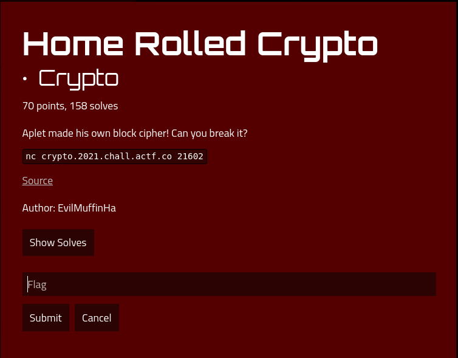

# Home Rolled Crypto

### Description



## Solution

In short I basically reversed the code, such that I can extract the key to the
encryption program from the algorithm (with the help of z3 solver).

### Understanding what the program does

We are given `chall.py` which essentially
1. Generates a random key at the start
2. Provides you a menu that allows you to
  - Encrypt a string -> You could probably reverse the key from there
  - Gives you 10 random encryption challenges. Once finishing them you get the flag

The encryption algorithm basically
1. Takes in
  - a key as a fixed length of to_bytes
  -  Takes in a message string and pads it to be a multiple of the BLOCK_SIZE
2. Splits up the message by BLOCK_SIZE.
  - It also splits the key into 3 sections.
  - The message block and key
3. For each block it
 - Does a Binary AND and XOR operation using each section of the key (the sections are used in order)
 - Converts the resulting integer to its hexadecimal representation, and Pads it to be BLOCK_SIZE*2 in length (which is basically the same amount of characters per inital block)
```
enc = int.from_bytes(block, "big")
for i in range(self.ROUNDS):
    k = int.from_bytes(self.key[i*self.BLOCK_SIZE:(i+1)*self.BLOCK_SIZE], "big")
    enc &= k
    enc ^= k
    debug("k, enc", k, enc)
```
4.  Concatenates all the encoded blocks together

### Approach

I decided to reverse the program to get the flag. However, I did not know exactly how to reverse the process of Binary AND and XOR operations in 3(ii). Looking at past reverse engineering challenge writeups, I decided to try using z3 again (last time I used it was the `FREE FLAGS!!1!!` challenge)

The solution code does this
1. It connects to the server
2. It asks to encrypt about 100 randomly generated strings, and stores the inputs and outputs of the server into 2 lists.
  - 100 times so that the program can come up with a definitive solution for the key
3. It uses those lists to generate various constraints. These constraints are then used to solve for 3 sections of the keys
4. The 3 sections of the keys are processed to form back the initial key
5. The initial key is passed into the `Cipher` algorithm initially given in the challenge, and used to solve the challenges on the server
6. It shows the flag

Some interesting things I took note of
1. For Z3, since we had to do bitwise operations, I used `BitVecs`. I was initially unsure of what to put for the bitwidth, but since each section has 16 characters, and 1 character is 8 bits, I decided on a bitwidth of 128 bits

Some resources I referrenced:
1. https://ericpony.github.io/z3py-tutorial/guide-examples.htm
  - https://stackoverflow.com/questions/12598408/z3-python-getting-python-values-from-model/12600208
  - https://www.cs.tau.ac.il/~msagiv/courses/asv/z3py/guide-examples.htm (About BitVecs)
2. https://discuss.python.org/t/converting-integer-to-byte-string-problem-in-python-3/5058

### Extracting out the flag

Running `solve/main.py`
```
[*] Switching to interactive mode
W
actf{no_bit_shuffling_is_trivial}
```

## Flag

`actf{no_bit_shuffling_is_trivial}`
