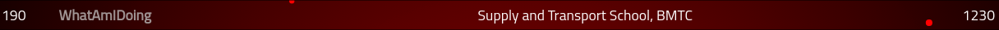

# ångstromCTF

## Event Details

This is a ctf that exists and that I found on CTF Time. I'll probably never properly fill up this yet.
Either Way I did some Binary Exploitation and Reverse Engineering Practice (Though that was too basic).
I learnt how to use z3 and learnt something new so thats a win. However, I was too lazy and dumb to be able to do any of the other pwn challenges.

I participated in it on 3rd to 7th April 2021 with [undefined_func](https://github.com/undefined-func)

We did a decent number of challenges and scored decent I think.

## Challenges

List the challenges I have completed. Example:

Some challenges which I didn't do writeups for are
1. `Misc/Sanity Check`: Just join the discord server and go to `#general`
2. `Misc/Survey`: Just do the google forms

Here are the main challenges I did (or helped out with in order). Just traverse the directories to find them
1. `Misc/Float On`
2. `Rev/FREE FLAGS!!1!!`
3. `Binary/Secure Login`, `Binary/tranquil`, `Binary/Sanity Checks`
4. `Crypto/Home Rolled Crypto`

Here are some challenges I had writeups/ solutions to (but actually my teammate solved it)
1. `Web/Jar`

Here are challenges I solved AFTER the CTF (sad noises)
1. `Binary/stickystacks`

## Others' Writeups

List writeups from others if any
