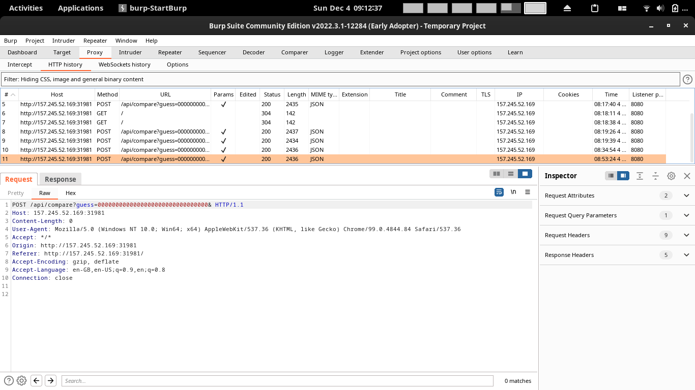

# Encryptdle

### Description

A popular word game, but encrypted!

# Solution

### Bypass lockout

You can submit the flag through the webpage and have it be compared through the hash


The data returned is a json object with the `hash`, and which characters of the hash match with the ANSWER hash


However there's only a fixed amount of words I can send before the webpage is locked and you can't send anymore.


To bypass this, I analysed the request and sent it through Burp Repeater, which worked.



### Bypass Algorithm

This part is actually done by my teammate, Codekrodile.

He looked at the encryption algorithm. The program pads the word by adding the flag behind and adding `\x00` as padding, and then cutting the length of the string to 32.

```python
def pad(bstring):
    return (bstring + FLAG + b'\x00' * MAX_LEN)[:MAX_LEN]


def encrypt(bstring):
    padded_data = pad(bstring)
    cipher = Cipher(algorithms.Camellia(KEY), modes.CBC(IV))
    encryptor = cipher.encryptor()
    return encryptor.update(padded_data) + encryptor.finalize()

```

We can exploit this by inputting a lot of 0s and figuring out what is the flag one word at a time

1. Input 31 0s first to the website eg. 0000000000000000000000000000000
2. The program will pad it to `0000000000000000000000000000000<unknown char>`, and return the hash to you
	1. In the 1st case it would be `0000000000000000000000000000000S`
3. Afterwards you can brute force the characters and input to the website `0000000000000000000000000000000a`, `0000000000000000000000000000000b`, ... to get their hashes
	1. Check which hash matches the hash in 2)
	2. The character with the matching hash is the unknown character
4. Input 30 0s, the program will pad it to `0000000000000000000000000000000<first 2 characters of flag>`
	1. In this case would be  `000000000000000000000000000000ST`
5. You can brute force the characters as such:
	1. `000000000000000000000000000000Sa`, `000000000000000000000000000000Sb`
	2. Check for matching hash again
6. Repeat steps 4 and 5 for decreasing number of 0s, until you get the whole flag


### Exploit

```python
import requests
import json
import urllib.parse
import string

URL = 'http://157.245.52.169:31981'
charset = string.printable

def getData(guess):
  response = requests.post(f"{URL}/api/compare?guess={urllib.parse.quote_plus(guess)}", data={})
  hashObj = json.loads(response.text)
  output = ""
  for obj in hashObj:
    output += obj["letter"]
  return output, hashObj

#output, _ = getData(guess)
#print(output)

### Enumerating through Guesses

def guessEnumerateChar(currProgress, charset=charset):
  ### Get initial hash
  noZeros = 32 - len(currProgress) - 1 # -1 for the current bruteforcing character
  initialHash, _ = getData("0"*noZeros)
  ### Enumerate for next flag character
  guess = "0"*noZeros + currProgress 
  for c in charset:
    currGuess = guess + c
    #print(c, end="")
    guessHash, _ = getData(currGuess)
    if guessHash == initialHash:
      return c
  return ''
  
  
currProgress = ""
for i in range(32 - len(currProgress)): # Loop for remaining characters
  print(f"\nCharacter {i} : {currProgress}")
  newchar = guessEnumerateChar(currProgress, charset)
  currProgress += newchar
  
print(currProgress)
```

```python
Character 30 : STF22{iNS3CuR3!_S+4+iC_IVs!!}

Character 31 : STF22{iNS3CuR3!_S+4+iC_IVs!!}
STF22{iNS3CuR3!_S+4+iC_IVs!!}
```

# Flag

`STF22{iNS3CuR3!_S+4+iC_IVs!!}`