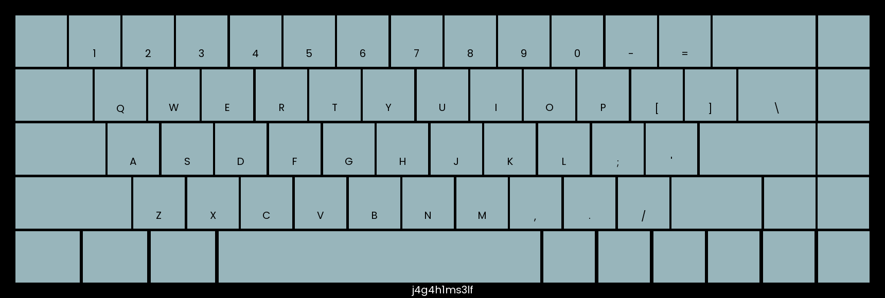

# Heatkeeb

### Description

Jaga had gained interest in custom keyboards and has created a platform to create your own keebs! We know we created his custom keeb on the 22nd of September 2022, at **09:41:17** SGT. Oddly specific but we know it's true.

# Solution

I looked at the source code and tested the app.

This application allows you to generate keyboard images given the colours of the keys, frame etc. The overall layout is this

1. Generate Keeb using your given colours
2. You receive a token generated using a timestamp
3. Input the token to the main page to access the various functions, which include
	1. Generating a keyboard image
	2. Generating a heatmap using your given words (Images as shown below)
	3. Input a word to check if it is the flag




I realised I needed to do 2 things

1. Reverse Admin Token to get access to the admin account
2. Reverse key from the heatmap image

### Timestamp?

Since the timestamp of when the keeb was created was given, it is likely to do
I used Ctrl-F to find things to do with timestamp in the Python file. Turns out, the token is generated using the timestamp as a seed `seed = int(t.timestamp())`, `random.seed(seed)`.

In `/app/app.py`

```python
@app.post("/build")
def build(request: Request, name: str = Form(...), frameColor: str = Form(...), keyColor: str = Form(...), textColor: str = Form(...), specialColor: str = Form(...)):
    t = datetime.datetime.now(pytz.timezone('Asia/Singapore'))
    seed = int(t.timestamp())
    random.seed(seed)
    token = ''.join(random.choices('abcdefghijklmnopqrstuvwxyzABCDEFGHIJKLMNOPQRSTUVWXYZ0123456789', k=16))
    with shelve.open('keebdb') as db:
        db[token] = {
            'name': name,
            'frameColor': hex_to_rgb(frameColor),
            'keyColor': hex_to_rgb(keyColor),
            'textColor': hex_to_rgb(textColor),
            'specialColor': hex_to_rgb(specialColor),
            'text': 'default'
        }
    img = draw_keeb(name, hex_to_rgb(frameColor), hex_to_rgb(keyColor), hex_to_rgb(textColor), hex_to_rgb(specialColor))
    img.save(f'keebs/keeb-{token}.png')
    request.session['token'] = token
    return templates.TemplateResponse("build.html", {"request": request, "resp": "Success!", "token": token})

```


I know in the given `app.py` the Admin token is hardcoded

```python
FLAG = "STF22{REDACTED}"
KEY = "REDACTED"
ADMIN_TOKEN = "REDACTED"
...
with shelve.open('keebdb') as db:
    db[ADMIN_TOKEN] = {
            'name': adminName,
            'frameColor': adminFrame,
            'keyColor': adminKeys,
            'textColor': adminText,
            'specialColor': adminKeys,
            'text': KEY
        }
...
img = draw_heatmap(adminName, adminFrame, adminKeys, adminText, adminKeys, KEY)
```

But maybe we can reverse using the timestamp. For a given seed, random number generators (PNG) would generate the same output. The reason for this is because RNG are pseudo random, but generally that is not going to be covered here.

Either way, since we know the seed, theoretically the token generated would be the same as the admin one on the remote web portal

```python
# Generate Admin Token
'''
Since we know the time the token was generated, which is the seed, we 
can generate the exact same token

Time when token was generated is 22nd of September 2022, at 09:41:17 SGT.
'''
import datetime, pytz
import random
def generateToken():
    #t = datetime.datetime.now(pytz.timezone('Asia/Singapore'))
    t = datetime.datetime(2022, 9, 22, 9, 41, 17) #, tzone=pytz.timezone('Asia/Singapore')) # Redundant
    print(t)
    seed = int(t.timestamp())
    random.seed(seed)
    token = ''.join(random.choices('abcdefghijklmnopqrstuvwxyzABCDEFGHIJKLMNOPQRSTUVWXYZ0123456789', k=16))
    return token
    
print(generateToken())
# Token is rMwwbpMkzAwyRoWs
```

```
rMwwbpMkzAwyRoWs
```


### Retrieving Key & Unscrambling

The `draw_heatmap` function seems interesting. especially looking at this function call

```
img = draw_heatmap(adminName, adminFrame, adminKeys, adminText, adminKeys, KEY)
```

Check `keebcreator.py`, it looks like it just highlights the letters in the `KEY`

```python
def draw_heatmap(name, frameColor, keyColor, textColor, specialColor, htext, keeb=keeb, height=580, width=1720, unit=100):

    def draw_key(image, key, x, y, w, h, color):
        x = int(x)
        y = int(y)
        text = key['t']
        if text == '':
            color = specialColor
        elif text in htext:
            color = (255, 84, 84)
        image[y:int(y+h), x:int(x+w)] = color
        img_pil = Image.fromarray(image)
        draw = ImageDraw.Draw(img_pil)
        font = ImageFont.truetype('Poppins-Regular.ttf', 20)
        textsize = font.getsize(text)
        textX = (w - textsize[0]) / 2
        textY = (h + textsize[1]) / 2
        draw.text((x+textX, y+textY), text, textColor, font=font, align='center')
        return np.array(img_pil)

    image = np.zeros((height, width, 3), np.uint8)
    image[:] = frameColor
    img_pil = Image.fromarray(image)
    draw = ImageDraw.Draw(img_pil)
    font = ImageFont.truetype('Poppins-Regular.ttf', 20)
    textsize = font.getsize(name)
    textX = (width - textsize[0]) / 2
    textY = height - 30
    draw.text((textX, textY), name, (255,255,255,255), font=font, align='center')
    image = np.array(img_pil)
    x = 30
    y = 30
    for row in keeb:
        gap = (width - x * 2 - unit * sum([key['w'] for key in row])) / (len(row) - 1)
        for key in row:
            w = unit * key['w']
            h = unit
            image = draw_key(image, key, x, y, w, h, keyColor)
            x += w + gap
            # draw gap
        x = 30
        y += unit + 5
    
    image = Image.fromarray(image)
    return image
```

Looking at the endpoint to retrieve the images again, they downsize the image then send it.

```python
@app.post('/heatmap/generate')
def generate_heatmap(request: Request, text: str = Form(...)):
    if 'token' in request.session:
        token = request.session['token']
        with shelve.open('keebdb') as db:
            if token in db:
                name = db[token]['name']
                frameColor = db[token]['frameColor']
                keyColor = db[token]['keyColor']
                textColor = db[token]['textColor']
                specialColor = db[token]['specialColor']
                img = draw_heatmap(name, frameColor, keyColor, textColor, specialColor, text.upper())
                imgSmall = img.resize((int(img.width / 100), int(img.height / 100)), Image.BILINEAR)
                result = imgSmall.resize(img.size, Image.NEAREST)
                result.save(f'keebs/heatmap-{token}.png')
                db[token] = {
                    'name': name,
                    'frameColor': frameColor,
                    'keyColor': keyColor,
                    'textColor': textColor,
                    'specialColor': specialColor,
                    'text': text.upper()
                }
                return FileResponse(f"keebs/heatmap-{token}.png")
```

To overcome the downsizing, I mainly just overlaid the images to get the characters used
https://overlay.imageonline.co/

![[heatkeeb-1.png]]


Since the key is likely a word I then unscrambled the letters obtained
https://word.tips/unscramble/ASERTGHNIL/

![[heatkeeb-2.png]]

On trying the unscrambled letters I get the flag.

![[heatkeeb-3.png]]

### TLDR

The methodology I used is quite standard

1. Use Ctrl - F to find the things needed to find (eg. `timestamp`, `token`, `KEY`)
2. Retrace/Reverse the steps used to generate the quantities (eg. timestamp to generate token, kinda reversing the image to get the letters)

# Flag

`STF22{h34t_k3yb04rD}`