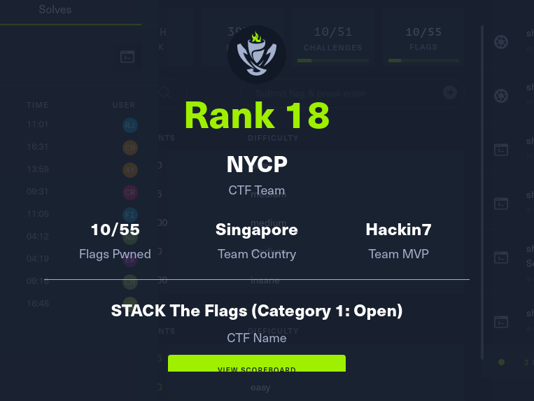

# STACK the Flags 2022

STACK the Flags is a 48-hour, online jeopardy style Capture-the-Flag competition organised by GovTech’s Cyber Security Group.

Participants will get to compete and test their cybersecurity skills in challenges across 11 different cybersecurity domains.

The categories are:

-   Binary Exploitation
-   Cloud
-   Cryptography
-   Forensics
-   Internet of things (IoT)
-   Miscellaneous
-   Mobile
-   Open Source Intelligence (OSINT)
-   Reverse Engineering (RE)
-   Fullpwn
-   Web

## Event Details

I participated it on 2-4 Dec with undefined-func and Codekrodile. Overall my 1st CTF in a long time, and good that I easily finished 4 Web challenges in the first 6 hours, and the remaining 3 challenges took 4 hours or so. However, I was stuck on the other challenges.

Overall I think our performance is ok. PortSwigger labs really helped with the Web Challenges. However, there's room to improve my methodology, as some of the challenges I felt I could have done. Time to grind!

Now that I think about it probably should have went Category 2 to aim for a higher rank lmao.

## Challenges

Here are the main challenges I did (or helped out with in order). Just traverse the directories to find them

Web

Name | Concept
-|-
[Blogpost](Web/Blogpost/README.md) | XSS into stored context
[Blogpost 2](Web/Blogpost%202/README.md) | XSS and CSRF Bypass
[PyRunner](Web/PyRunner/README.md) | OS Command Injection
[Hyper Proto Secure Note 1](Web/Hyper%20Proto%20Secure%20Note%201/README.md) | Parameter Pollution

Misc

Name | Concept
-|-
[2 Pain](Misc/2%20Pain/README.md)  | Decompilation of apk & Reversing
[guthib actions](Misc/guthib%20actions/README.md) | Cronjob Privesc
[HeatKeeb](Misc/HeatKeeb/README.md) | Time seed used in RNG & Anagram

Crypto

Name | Concept
-|-
[Encryptdle](Crypto/Encryptdle/README.md) | Brute Forcing

Solved After the CTF

## Others' Writeups

1. https://jh123x.com/

