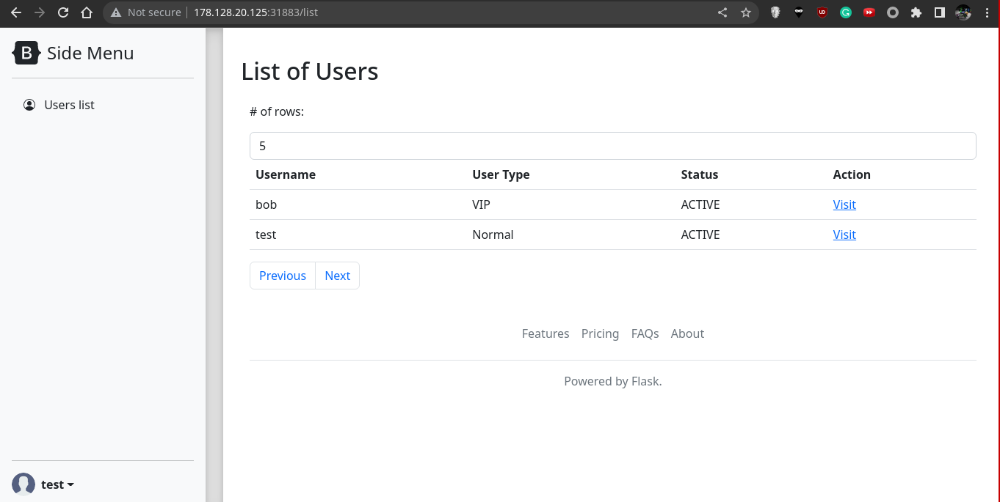

# Hyper Proto Secure Note 1

### Description

An evil organization has been plotting to pollute the nearby village with its smog engine. Our intelligence team tells us that they have found that the smog engine has an exposed RDP service, and they have the username but not the password. The password is stored in the secure note application that bob uses. Find a way to steal the password to turn off the smog machine.

Has Docker Container & Files

# Solution

## 1. Remote Instance

### Register for an account first

In a CTF if you can register an account you probably should try to test what you can do with such an account

<!--![[Web/Hyper Proto Secure Note 1/1.png]]-->


<!--![[Web/Hyper Proto Secure Note 1/3.png]]-->


<!--![[4.png]]-->


<!--![[5.png]]-->


### Cannot access key

<!--![[Web/Hyper Proto Secure Note 1/2.png]]-->


<!--![[6.png]]-->


## 2. Source Code

Whenever I have source code, I always look at the **main app code** first, in this case
 `src/flaskapp/app.py`, the Flask App code, and `src/flaskapp/fastapiapp/main.py`

I found the linking code between flask and fastapi in `src/flaskapp/app.py`, which supposedly remediated IDOR attack. Hmm, when they said they "Remediated IDOR attack from recent PT report", It sounds like the Challenge author is trying to signal to us that the issue is not fully resolved...

```python
@app.route("/fastapi/", methods=["GET"])
@app.route("/fastapi/<apiname>", methods=["GET"], strict_slashes=False)
@login_required
def retrievekey(apiname=''):
    '''Obtain a secure note key from backend API. 
    Update: Remediated IDOR attack from recent PT report.'''
    if (request.args.get("uid")):
        uid = request.args.get("uid")  

        if(not uid.isnumeric()):    # input validation - data type
            return "Invalid Data Type: only numeric uid is accepted."
            
        if(uid == str(current_user.user["id"]) or current_user.user["isadmin"]):    # Authorisation check to prevent IDOR.

            # pass the url behind to fastapi
            fullurl = request.url 
            path = fullurl.replace(request.url_root, "").replace("fastapi", "")
            forwardurl = "http://localhost:8000" + path
            app.logger.debug("Forwarded URL to Fastapi: %s", forwardurl)
            r = requests.get(forwardurl)
            if(r.ok):
                try:
                    j = r.json()
                    msg = j['message']
                    return Response(msg, status=200)
                except requests.exceptions.JSONDecodeError:
                    return Response(r.text, status=200)
                except KeyError:
                    return r.json()
                except:
                    return Response("An unknown error occurred", status=500)
            else:
                return "HTTP "+ str(r.status_code) +": An error occurred"
        else:
            # authorisation check - failed
            html = "Unauthorised: You cannot retrieve the key of another user!"
            html += "\n<!-- uid="+uid+" current_user.user['id']="+str(current_user.user["id"])+" -->"
            return html
    else:
        return "Missing uid parameter."
```

Either way the important lines are these

```python
fullurl = request.url 
path = fullurl.replace(request.url_root, "").replace("fastapi", "")
forwardurl = "http://localhost:8000" + path
```

In other words, the query parameters are passed along to the fastapi

- The 2nd line could be used for something. I think the idea is to replace the first few characters of the path (eg. `fastapi/<apiname>` -> `/<apiname`) to remove unwanted parts.
- but we can also use it to smuggle unwanted parameters (eg. `fastapi/retrievekey?ufastapiid=` -> `/retrievekey?uid=`)
- In the end the Exploit never used this, but its good to know

## 3. Exploit

What if I add more than 1 `uid` parameter, what would they choose?

```
/fastapi/retrievekey?uid=3&uid=2
```

<!--![[7.png]]-->


<!--![[8.png]]-->


In the end I learnt that this technique is called HTTP Parameter Pollution

## Flag

`STF22{iDOr_W1tH_ServerSide_HTTP_PaR@m3t3r_P0lluT10n_BypAss}`