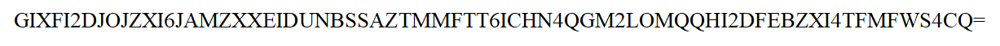

# Level 3


## Things to do

[x] File Type

[x] File Carving
 - Autopsy, Scapel, 


## Solution

### Mounting

This looks like the image of a partition https://superuser.com/questions/1502676/what-are-the-hidden-sectors-in-the-output-of-the-file-command-for-partitions

If cannot mount, run testdisk to fix the boot sector

```bash
[hacker@hackerbook tmp]$ file PATIENT0 
PATIENT0: DOS/MBR boot sector, code offset 0x52+2, OEM-ID "NTFS    ", sectors/cluster 8, Media descriptor 0xf8, sectors/track 0, FAT (1Y bit by descriptor); NTFS, physical drive 0xab3566f7, sectors 12287, $MFT start cluster 4, $MFTMirror start cluster 767, bytes/RecordSegment 2^(-1*246), clusters/index block 1, serial number 05c66c6b160cddda1
[hacker@hackerbook tmp]$ mkdir /tmp/t
[hacker@hackerbook tmp]$ sudo mount PATIENT0 /tmp/t
[sudo] password for hacker: 
[hacker@hackerbook tmp]$ cd /tmp/t
[hacker@hackerbook t]$ ls -al
total 12
drwxrwxrwx  1 root root 4096 Aug 20 01:37 .
drwxrwxrwt 17 root root  540 Aug 27 01:32 ..
-rwxr-xr-x  1 root root 6049 Aug 20 00:40 message.png
[hacker@hackerbook t]$
```




I used an image to text converter [here](https://www.imagetotext.info/)

`GIXFI2DJOJZXI6JAMZXXEIDUNBSSAZTMMFTT6ICHN4QGM2LOMQQHI2DFEBZXI4TFMFWS4CQ=`

I then used cyberchef to identify it was base32, and then convert it as such.
```bash
[hacker@hackerbook t]$ echo "GIXFI2DJOJZXI6JAMZXXEIDUNBSSAZTMMFTT6ICHN4QGM2LOMQQHI2DFEBZXI4TFMFWS4CQ=" | base32 -d
2.Thirsty for the flag? Go find the stream.
[hacker@hackerbook t]$ 
```

### Autopsy


```bash
┌──(kali㉿kali)-[/tmp]
└─$ tsk_recover PATIENT0 files      
Files Recovered: 1

┌──(kali㉿kali)-[/tmp]
└─$ ls files                                        
broken.pdf

┌──(kali㉿kali)-[/tmp]
└─$ 
```


```bash
┌──(kali㉿kali)-[/tmp]
└─$ exiftool /tmp/broken.pdf 
ExifTool Version Number         : 12.36
File Name                       : broken.pdf
Directory                       : /tmp
File Size                       : 499 KiB
File Modification Date/Time     : 2022:08:27 05:24:56-04:00
File Access Date/Time           : 2022:08:27 05:24:57-04:00
File Inode Change Date/Time     : 2022:08:27 05:24:56-04:00
File Permissions                : -rwxr-xr-x
File Type                       : PDF
File Type Extension             : pdf
MIME Type                       : application/pdf
PDF Version                     : 1.7
Linearized                      : No
Author                          : user
Create Date                     : 2022:08:20 03:35:28+10:00
Modify Date                     : 2022:08:20 03:35:28+10:00
Producer                        : Microsoft: Print To PDF
Title                           : Microsoft Word - Document1
Page Count                      : 1
                                                                                                                                                                        
┌──(kali㉿kali)-[/tmp]
└─$ 
```

### File Stream

When I read the word **stream**, I immediately thought of file stream, which lead me to this: 
https://docs.microsoft.com/en-us/windows/win32/fileio/file-streams


### Clues

1. The BPB is broken, can you fix it?
2. Thirsty for the flag? Go find the stream.
3. Are these True random bytes for Cryptology
4. If you need a password, the original reading of the BPB was actually Checked and ReChecked 32 times!

### Googling for terms


I assume its about analysing the BIOS Parameter Blocks. Now need to find the term to do so.

### Analysing BPB

I opened the file in a hex editor and tried to check on the BIOS Parameter Blocks


https://en.wikipedia.org/wiki/NTFS#Partition_Boot_Sector_(PBS)

Comparison shows 0x18, 0x1a, 0x1c values are 0

- https://www.google.com/search?q=The+number+of+disk+sectors+in+a+drive+track.&rlz=1C1ONGR_enSG945SG945&sourceid=chrome&ie=UTF-8

0x28 is diff but its because its the partition size, 0x48 diff because unique, 0x20 is diff but its useless


End of Sector Marking


According to Wikipedia, Sector 1 0x20


The Byte Offset 0x20 is supposed to be all `00`, while 0x24 is supposed to be `80 00 80 00` (Little Endian, causing things to be reversed. However, in the file they are different, as shown.


Selecting those 4 bytes and wrapping them gives the flag

## Flag
`TISC{f76635ab}`


# Level 3 - Part 2

<!---->


<!---->


## Solution - Continued


Looking at Hints 2 & 3, you can infer that the solution is TrueCrypt

Clue 4 Capitalises the letters C, R, C and includes the number 32, suggesting the algorithm is CRC32.


I fixed the disk image using the `testdisk` command. Opening the file with that command, I then fixed the boot sector (since the corrupted bytes are there). This is to allow us to mount the image.

I mounted the disk image in Windows using OSFMount


I downloaded the NTFS Data Stream message.png:$RAND using the AlternateStreamView Program. This is to extract the stream properly. I was stuck on extracting it through Autopsy, and it didn't extract the volume properly.


Afterwards, I removed the text characters at the start. They are likely data added on to the initial data.


Used `f76635ab` as password (The Flag)


Inside the volume has this image


### CRC32 Cracking

I downloaded a CRC32 cracking program and used it to crack the modified bytes. I modified the program to crack for the specific situation

```bash
┌──(kali㉿kali)-[/tmp]
└─$ git clone https://github.com/theonlypwner/crc32.git                                                                                              
Cloning into 'crc32'...
remote: Enumerating objects: 53, done.
remote: Counting objects: 100% (34/34), done.
remote: Compressing objects: 100% (19/19), done.
remote: Total 53 (delta 13), reused 30 (delta 11), pack-reused 19
Receiving objects: 100% (53/53), 43.08 KiB | 6.15 MiB/s, done.
Resolving deltas: 100% (19/19), done.
                                                                                                                                                                        
┌──(kali㉿kali)-[/tmp]
└─$ cd crc32                                                     
                                                                                                                                                                        
┌──(kali㉿kali)-[/tmp/crc32]
└─$ ls   
crc32.py  LICENSE.txt  README.md  test_data.py  test.py
           
┌──(kali㉿kali)-[/tmp/crc32]
└─$ mousepad crc32.py

┌──(kali㉿kali)-[/tmp/crc32]
└─$ python crc32.py reverse 0xf76635ab > gen                                                                                                                    1 ⨯ 1 ⚙
                                                                                                                                                                        
┌──(kali㉿kali)-[/tmp/crc32]
└─$ 
```

Here are the modifications I made to crc32.py

```python
def reverse_callback():
    # initialize tables
    init_tables(get_poly())
    # find reverse bytes
    desired = parse_dword(args.desired)
    accum = parse_dword(args.accum)
    # 4-byte patch
    patches = findReverse(desired, accum)
    for patch in patches:
        text = ''
        if all(p in permitted_characters for p in patch):
            text = '{}{}{}{} '.format(*map(chr, patch))
        out('4 bytes: {}{{0x{:02x}, 0x{:02x}, 0x{:02x}, 0x{:02x}}}'.format(text, *patch))
        checksum = calc(patch, accum)
        out('verification checksum: 0x{:08x} ({})'.format(
            checksum, 'OK' if checksum == desired else 'ERROR'))

    def print_permitted_reverse(patch):
            patches = findReverse(desired, calc(patch, accum))
            for last_4_bytes in patches:
                if all(p in permitted_characters for p in last_4_bytes):
                    patch2 = patch + last_4_bytes
                    out('{} bytes: {} ({})'.format(
                        len(patch2),
                        ''.join(map(chr, patch2)),
                        'OK' if calc(patch2, accum) == desired else 'ERROR'))

    # 5-byte alphanumeric patches
    for i in permitted_characters:
        print_permitted_reverse((i,))
    # 6-byte alphanumeric patches
    for i in permitted_characters:
        for j in permitted_characters:
            print_permitted_reverse((i, j))
    # 7-byte alphanumeric patches
    for i in permitted_characters:
        for j in permitted_characters:
            for k in permitted_characters:
                print_permitted_reverse((i, j, k))
    # 9-byte
    for i in permitted_characters:
        for j in permitted_characters:
            for k in permitted_characters:
                for x in permitted_characters:
                        y = ord('c')
                        print_permitted_reverse((y, i, j, k, x))
```

What came out was a list of potential passwords, which if passed though CRC32, could produce the modified bytes. One of the entries, `c01lis1on`, seemed interesting.

### PPT File

Keying in `c01lis1on` as the password, I get `flag.ppsm`, which is a PowerPoint presentation.


Opening it gives me a tip on how to get the flag


I then extracted the mp3 file from the PowerPoint Slide.

```
┌──(kali㉿kali)-[~]
└─$ cp /media/sf_Stuff/flag.ppsm /tmp
                                                                                                                                                                        
┌──(kali㉿kali)-[~]
└─$ file /tmp/flag.ppsm 
/tmp/flag.ppsm: Microsoft PowerPoint 2007+
                                                                                                                                                                        
┌──(kali㉿kali)-[~]
└─$ cd /tmp                          
                                                                                                                                                                        
┌──(kali㉿kali)-[/tmp]
└─$ dtrx flag.ppsm         
dtrx: ERROR: could not handle flag.ppsm
dtrx: ERROR: not a known archive type
                                                                                                                                                                        
┌──(kali㉿kali)-[/tmp]
└─$ cp flag.ppsm flag.zip                                                                                                                                           1 ⨯
                                                                                                                                                                        
┌──(kali㉿kali)-[/tmp]
└─$ dtrx flag.zip 
                                                                                                                                                                        
┌──(kali㉿kali)-[/tmp]
└─$ cd flag              
                                                                                                                                                                        
┌──(kali㉿kali)-[/tmp/flag]
└─$ ls                         
'[Content_Types].xml'   docProps   ppt   _rels
                                                                                                                                                                        
┌──(kali㉿kali)-[/tmp/flag]
└─$ ls -alR                    
.:
total 24
drwx------  5 kali kali 4096 Sep  8 08:47  .
drwxrwxrwt 18 root root 4096 Sep  8 08:47  ..
-rw-r--r--  1 kali kali 3273 Jan  1  1980 '[Content_Types].xml'
drwxr-xr-x  2 kali kali 4096 Sep  8 08:47  docProps
drwxr-xr-x  8 kali kali 4096 Sep  8 08:47  ppt
drwxr-xr-x  2 kali kali 4096 Sep  8 08:47  _rels

./docProps:
total 28
drwxr-xr-x 2 kali kali  4096 Sep  8 08:47 .
drwx------ 5 kali kali  4096 Sep  8 08:47 ..
-rw-r--r-- 1 kali kali  1299 Jan  1  1980 app.xml
-rw-r--r-- 1 kali kali   644 Jan  1  1980 core.xml
-rw-r--r-- 1 kali kali 11197 Jan  1  1980 thumbnail.jpeg

./ppt:
total 48
drwxr-xr-x 8 kali kali 4096 Sep  8 08:47 .
drwx------ 5 kali kali 4096 Sep  8 08:47 ..
drwxr-xr-x 2 kali kali 4096 Sep  8 08:47 media
-rw-r--r-- 1 kali kali 3380 Jan  1  1980 presentation.xml
-rw-r--r-- 1 kali kali  816 Jan  1  1980 presProps.xml
drwxr-xr-x 2 kali kali 4096 Sep  8 08:47 _rels
drwxr-xr-x 3 kali kali 4096 Sep  8 08:47 slideLayouts
drwxr-xr-x 3 kali kali 4096 Sep  8 08:47 slideMasters
drwxr-xr-x 3 kali kali 4096 Sep  8 08:47 slides
-rw-r--r-- 1 kali kali  182 Jan  1  1980 tableStyles.xml
drwxr-xr-x 2 kali kali 4096 Sep  8 08:47 theme
-rw-r--r-- 1 kali kali  810 Jan  1  1980 viewProps.xml

./ppt/media:
total 1112
drwxr-xr-x 2 kali kali   4096 Sep  8 08:47 .
drwxr-xr-x 8 kali kali   4096 Sep  8 08:47 ..
-rw-r--r-- 1 kali kali  16169 Jan  1  1980 image1.png
-rw-r--r-- 1 kali kali 147982 Jan  1  1980 image2.jpg
-rw-r--r-- 1 kali kali 961443 Jan  1  1980 media1.mp3

./ppt/_rels:
total 12
drwxr-xr-x 2 kali kali 4096 Sep  8 08:47 .
drwxr-xr-x 8 kali kali 4096 Sep  8 08:47 ..
-rw-r--r-- 1 kali kali  976 Jan  1  1980 presentation.xml.rels

./ppt/slideLayouts:
total 72
drwxr-xr-x 3 kali kali 4096 Sep  8 08:47 .
drwxr-xr-x 8 kali kali 4096 Sep  8 08:47 ..
drwxr-xr-x 2 kali kali 4096 Sep  8 08:47 _rels
-rw-r--r-- 1 kali kali 2946 Jan  1  1980 slideLayout10.xml
-rw-r--r-- 1 kali kali 3170 Jan  1  1980 slideLayout11.xml
-rw-r--r-- 1 kali kali 3648 Jan  1  1980 slideLayout1.xml
-rw-r--r-- 1 kali kali 2891 Jan  1  1980 slideLayout2.xml
-rw-r--r-- 1 kali kali 4384 Jan  1  1980 slideLayout3.xml
-rw-r--r-- 1 kali kali 3756 Jan  1  1980 slideLayout4.xml
-rw-r--r-- 1 kali kali 6285 Jan  1  1980 slideLayout5.xml
-rw-r--r-- 1 kali kali 2223 Jan  1  1980 slideLayout6.xml
-rw-r--r-- 1 kali kali 1897 Jan  1  1980 slideLayout7.xml
-rw-r--r-- 1 kali kali 4704 Jan  1  1980 slideLayout8.xml
-rw-r--r-- 1 kali kali 4623 Jan  1  1980 slideLayout9.xml

./ppt/slideLayouts/_rels:
total 52
drwxr-xr-x 2 kali kali 4096 Sep  8 08:47 .
drwxr-xr-x 3 kali kali 4096 Sep  8 08:47 ..
-rw-r--r-- 1 kali kali  311 Jan  1  1980 slideLayout10.xml.rels
-rw-r--r-- 1 kali kali  311 Jan  1  1980 slideLayout11.xml.rels
-rw-r--r-- 1 kali kali  311 Jan  1  1980 slideLayout1.xml.rels
-rw-r--r-- 1 kali kali  311 Jan  1  1980 slideLayout2.xml.rels
-rw-r--r-- 1 kali kali  311 Jan  1  1980 slideLayout3.xml.rels
-rw-r--r-- 1 kali kali  311 Jan  1  1980 slideLayout4.xml.rels
-rw-r--r-- 1 kali kali  311 Jan  1  1980 slideLayout5.xml.rels
-rw-r--r-- 1 kali kali  311 Jan  1  1980 slideLayout6.xml.rels
-rw-r--r-- 1 kali kali  311 Jan  1  1980 slideLayout7.xml.rels
-rw-r--r-- 1 kali kali  311 Jan  1  1980 slideLayout8.xml.rels
-rw-r--r-- 1 kali kali  311 Jan  1  1980 slideLayout9.xml.rels

./ppt/slideMasters:
total 28
drwxr-xr-x 3 kali kali  4096 Sep  8 08:47 .
drwxr-xr-x 8 kali kali  4096 Sep  8 08:47 ..
drwxr-xr-x 2 kali kali  4096 Sep  8 08:47 _rels
-rw-r--r-- 1 kali kali 12846 Jan  1  1980 slideMaster1.xml

./ppt/slideMasters/_rels:
total 12
drwxr-xr-x 2 kali kali 4096 Sep  8 08:47 .
drwxr-xr-x 3 kali kali 4096 Sep  8 08:47 ..
-rw-r--r-- 1 kali kali 1991 Jan  1  1980 slideMaster1.xml.rels

./ppt/slides:
total 16
drwxr-xr-x 3 kali kali 4096 Sep  8 08:47 .
drwxr-xr-x 8 kali kali 4096 Sep  8 08:47 ..
drwxr-xr-x 2 kali kali 4096 Sep  8 08:47 _rels
-rw-r--r-- 1 kali kali 3653 Jan  1  1980 slide1.xml

./ppt/slides/_rels:
total 12
drwxr-xr-x 2 kali kali 4096 Sep  8 08:47 .
drwxr-xr-x 3 kali kali 4096 Sep  8 08:47 ..
-rw-r--r-- 1 kali kali  838 Jan  1  1980 slide1.xml.rels

./ppt/theme:
total 16
drwxr-xr-x 2 kali kali 4096 Sep  8 08:47 .
drwxr-xr-x 8 kali kali 4096 Sep  8 08:47 ..
-rw-r--r-- 1 kali kali 6807 Jan  1  1980 theme1.xml

./_rels:
total 12
drwxr-xr-x 2 kali kali 4096 Sep  8 08:47 .
drwx------ 5 kali kali 4096 Sep  8 08:47 ..
-rw-r--r-- 1 kali kali  738 Jan  1  1980 .rels
                                                                                                                                                                        
┌──(kali㉿kali)-[/tmp/flag]
└─$ md5sum ./ppt/media/media1.mp3 
f9fc54d767edc937fc24f7827bf91cfe  ./ppt/media/media1.mp3
            
```

# Flag

`TISC{f9fc54d767edc937fc24f7827bf91cfe}`

# Others

However, after mounting it, I found out it needs to be formatted


Mounting in linux also kinda fails

https://kenfavors.com/code/how-to-open-a-truecrypt-container-using-cryptsetup/

```BASH
┌──(kali㉿kali)-[~]
└─$ sudo cryptsetup --type tcrypt open message.RAND.cleaned TISC
[sudo] password for kali: 
Enter passphrase for message.RAND.cleaned: 

┌──(kali㉿kali)-[~]
└─$ mkdir /tmp/media 

┌──(kali㉿kali)-[~]
└─$ sudo mount /dev/mapper/TISC /tmp/media                                                            
mount: /tmp/media: wrong fs type, bad option, bad superblock on /dev/mapper/TISC, missing codepage or helper program, or other error.

┌──(kali㉿kali)-[~]
└─$ lsblk                                                                                                                                                          32 ⨯
NAME   MAJ:MIN RM  SIZE RO TYPE  MOUNTPOINT
loop0    7:0    0    2M  0 loop  
└─TISC 254:0    0  1.8M  0 crypt 
sda      8:0    0   80G  0 disk  
├─sda1   8:1    0   79G  0 part  /
├─sda2   8:2    0    1K  0 part  
└─sda5   8:5    0  975M  0 part  [SWAP]
sr0     11:0    1 1024M  0 rom   

┌──(kali㉿kali)-[~]
└─$                                                     
```


```bash
┌──(kali㉿kali)-[/tmp]
└─$ wget https://raw.githubusercontent.com/openwall/john/2a18678301cef281a168ea6d84980449d5c8e4da/run/truecrypt2john.py                                             1 ⨯
--2022-08-30 11:32:39--  https://raw.githubusercontent.com/openwall/john/2a18678301cef281a168ea6d84980449d5c8e4da/run/truecrypt2john.py
Resolving raw.githubusercontent.com (raw.githubusercontent.com)... 185.199.109.133, 185.199.110.133, 185.199.111.133, ...
Connecting to raw.githubusercontent.com (raw.githubusercontent.com)|185.199.109.133|:443... connected.
HTTP request sent, awaiting response... 200 OK
Length: 3205 (3.1K) [text/plain]
Saving to: ‘truecrypt2john.py’

truecrypt2john.py                         100%[=====================================================================================>]   3.13K  --.-KB/s    in 0.001s  

2022-08-30 11:32:39 (2.18 MB/s) - ‘truecrypt2john.py’ saved [3205/3205]

┌──(kali㉿kali)-[/tmp]
└─$ 

┌──(kali㉿kali)-[/tmp]
└─$ nano newwordlist

┌──(kali㉿kali)-[/tmp]
└─$ cat newwordlist                                    
f76635ab

┌──(kali㉿kali)-[/tmp]
└─$ john message --wordlist=/tmp/newwordlist                  
Warning: detected hash type "tc_aes_xts", but the string is also recognized as "tc_ripemd160"
Use the "--format=tc_ripemd160" option to force loading these as that type instead
Using default input encoding: UTF-8
Loaded 6 password hashes with 6 different salts (tc_aes_xts, TrueCrypt AES256_XTS [SHA512/RIPEMD160/WHIRLPOOL 256/256 AVX2 4x])
Loaded hashes with cost 1 (hash algorithm [1:SHA512 2:RIPEMD160 3:Whirlpool]) varying from 1 to 3
Will run 2 OpenMP threads
Press 'q' or Ctrl-C to abort, almost any other key for status
Warning: Only 1 candidate left, minimum 8 needed for performance.
f76635ab         (message.RAND.cleaned)
1g 0:00:00:00 DONE (2022-08-30 11:36) 50.00g/s 50.00p/s 300.0c/s 300.0C/s f76635ab
Use the "--show" option to display all of the cracked passwords reliably
Session completed

┌──(kali㉿kali)-[/tmp]
└─$ cat ~/.john/john.pot | tail
...
truecrypt_SHA_512$4b76187a6697eb45d824d0dc517e428d5a183a90044de9ae849406d4e6febd37c754ae25385d0029bfa20bf045c97eef59f958281d5124ef3bf2264478dd332ac0b6a89da4d60ab63ea719ec6b4f44bc62a2f122f29c52b03c72be2b2f04e2e9220bc8b3326bb605826d696111d4e3c1d4fa0d6717e9b1e623b722686ac2cd56e5d7015c1c3a9213d3758018a0c6e26d5c686ff98af743cbc9a0852ad2150d67cb9fd0eb47330eea5ca312c6ba9a9f9f008e9b0de83cd231ba7a1796aec89656994752a41fc24431f7d531f983f9eb445465d589910ada2f72a4dbf7ae851986c2d7d75486c08454ba4c5de2abf36de992fed6a5d9d59b1a2394fee0b645bd02beb88f9073c94611dbe578a23dadd66a039349bf2d217a92fa7a0d5fe9e8c223282007f9f84bec4b40721fa3ff4bb23360a5a169440d55682f5adf6f6040d7adba44a052ee4e3d1ebb84dc4e61efd583d9c4fd2f410d3ab41beff937e8aece3e173558cce298d29eab5bed650adf52050caf43d12f52d2f0c66918c694e94f53a625aae86c514cbb404acc2ce78cd4f96128a444f1c79049a8622303d13b8f21a$SOURCE_HASH$293c80ee37831bda276f6f035f759ca5:f76635ab

┌──(kali㉿kali)-[/tmp]
└─$ cat message
message.RAND.cleaned:truecrypt_RIPEMD_160$4b76187a6697eb45d824d0dc517e428d5a183a90044de9ae849406d4e6febd37c754ae25385d0029bfa20bf045c97eef59f958281d5124ef3bf2264478dd332ac0b6a89da4d60ab63ea719ec6b4f44bc62a2f122f29c52b03c72be2b2f04e2e9220bc8b3326bb605826d696111d4e3c1d4fa0d6717e9b1e623b722686ac2cd56e5d7015c1c3a9213d3758018a0c6e26d5c686ff98af743cbc9a0852ad2150d67cb9fd0eb47330eea5ca312c6ba9a9f9f008e9b0de83cd231ba7a1796aec89656994752a41fc24431f7d531f983f9eb445465d589910ada2f72a4dbf7ae851986c2d7d75486c08454ba4c5de2abf36de992fed6a5d9d59b1a2394fee0b645bd02beb88f9073c94611dbe578a23dadd66a039349bf2d217a92fa7a0d5fe9e8c223282007f9f84bec4b40721fa3ff4bb23360a5a169440d55682f5adf6f6040d7adba44a052ee4e3d1ebb84dc4e61efd583d9c4fd2f410d3ab41beff937e8aece3e173558cce298d29eab5bed650adf52050caf43d12f52d2f0c66918c694e94f53a625aae86c514cbb404acc2ce78cd4f96128a444f1c79049a8622303d13b8f21a15892f6a8872a1bbaff3c38a99ab72703263a16ff7b6b4990a9673540ad4ee85da02235523610288d4b6073f7faeaed494901e170d5cc9b39dceb18bf064b7bb11ce4b8af6ebca39ba9cf08e8fd5d501b9db591e2b4489ead710833a8bb8f23:normal::::/home/kali/message.RAND.cleaned
message.RAND.cleaned:truecrypt_SHA_512$4b76187a6697eb45d824d0dc517e428d5a183a90044de9ae849406d4e6febd37c754ae25385d0029bfa20bf045c97eef59f958281d5124ef3bf2264478dd332ac0b6a89da4d60ab63ea719ec6b4f44bc62a2f122f29c52b03c72be2b2f04e2e9220bc8b3326bb605826d696111d4e3c1d4fa0d6717e9b1e623b722686ac2cd56e5d7015c1c3a9213d3758018a0c6e26d5c686ff98af743cbc9a0852ad2150d67cb9fd0eb47330eea5ca312c6ba9a9f9f008e9b0de83cd231ba7a1796aec89656994752a41fc24431f7d531f983f9eb445465d589910ada2f72a4dbf7ae851986c2d7d75486c08454ba4c5de2abf36de992fed6a5d9d59b1a2394fee0b645bd02beb88f9073c94611dbe578a23dadd66a039349bf2d217a92fa7a0d5fe9e8c223282007f9f84bec4b40721fa3ff4bb23360a5a169440d55682f5adf6f6040d7adba44a052ee4e3d1ebb84dc4e61efd583d9c4fd2f410d3ab41beff937e8aece3e173558cce298d29eab5bed650adf52050caf43d12f52d2f0c66918c694e94f53a625aae86c514cbb404acc2ce78cd4f96128a444f1c79049a8622303d13b8f21a15892f6a8872a1bbaff3c38a99ab72703263a16ff7b6b4990a9673540ad4ee85da02235523610288d4b6073f7faeaed494901e170d5cc9b39dceb18bf064b7bb11ce4b8af6ebca39ba9cf08e8fd5d501b9db591e2b4489ead710833a8bb8f23:normal::::/home/kali/message.RAND.cleaned
message.RAND.cleaned:truecrypt_WHIRLPOOL$4b76187a6697eb45d824d0dc517e428d5a183a90044de9ae849406d4e6febd37c754ae25385d0029bfa20bf045c97eef59f958281d5124ef3bf2264478dd332ac0b6a89da4d60ab63ea719ec6b4f44bc62a2f122f29c52b03c72be2b2f04e2e9220bc8b3326bb605826d696111d4e3c1d4fa0d6717e9b1e623b722686ac2cd56e5d7015c1c3a9213d3758018a0c6e26d5c686ff98af743cbc9a0852ad2150d67cb9fd0eb47330eea5ca312c6ba9a9f9f008e9b0de83cd231ba7a1796aec89656994752a41fc24431f7d531f983f9eb445465d589910ada2f72a4dbf7ae851986c2d7d75486c08454ba4c5de2abf36de992fed6a5d9d59b1a2394fee0b645bd02beb88f9073c94611dbe578a23dadd66a039349bf2d217a92fa7a0d5fe9e8c223282007f9f84bec4b40721fa3ff4bb23360a5a169440d55682f5adf6f6040d7adba44a052ee4e3d1ebb84dc4e61efd583d9c4fd2f410d3ab41beff937e8aece3e173558cce298d29eab5bed650adf52050caf43d12f52d2f0c66918c694e94f53a625aae86c514cbb404acc2ce78cd4f96128a444f1c79049a8622303d13b8f21a15892f6a8872a1bbaff3c38a99ab72703263a16ff7b6b4990a9673540ad4ee85da02235523610288d4b6073f7faeaed494901e170d5cc9b39dceb18bf064b7bb11ce4b8af6ebca39ba9cf08e8fd5d501b9db591e2b4489ead710833a8bb8f23:normal::::/home/kali/message.RAND.cleaned
message.RAND.cleaned:truecrypt_RIPEMD_160$7f88d877b6be9c7f9ca08244abe8766cf2f2ee3e43054e85de8a0fc7dfef36fdd2ebd62c650ea1340909b3727effac5fe0dffb88147dad70d1412c145d28b52d79b9aa9a29b71185eec7e5eb375c50bd8950288b568da56cc67f63905c1801311e3c061fbe0403868b1918800c3e2ee795411958691953bd3425ca5555405ad455f76fc5979feb65f5e1c60fad650116657401a411c53508ba545aab691041c4704db3b9c1d222095c71517027816b51ebce009b0ad00a6179c2bd70c6761e3fdf23cf4ccc1ebc14d01a0f3c595a4296d644953e251780ad3147892587527bb0bb4f05fb8ff761b47755d0e1cbd03b5fd14e9af1c3642f50cfaf1710a9f3b03763a91eafb7120f7b4a89453b319749f76617e7ee01b51209660291e0e3f24164098e8334c3307aca6ad9e455542e85e4d8899e35c677b5ef06936c12b17c6c68f2a6520f2ac740cfd751ffa106d155f8354305ded2f5765d5abbeed2be43e0c6bb83723ca1c8cca56f7193f354f2029db23fcedae9140ec7bd14c2be53008f634aaa730388f0b20d99218992a98dfa7a2d0781ad3a0853982d6bd252738308dfd55cac80523c3c6d34984196262945e1aacaa0e7702cfcc8e18c1f2b62ebbe643c7a5f4fb7fd3b20d9d7c18dc495aac92b3872cfce828d2216a929ba5b99e3402d4791be6780e8a1ec150909ccf6beaeec50ec879ae4b4897f6e3de9d40c9fbc:hidden::::/home/kali/message.RAND.cleaned
message.RAND.cleaned:truecrypt_SHA_512$7f88d877b6be9c7f9ca08244abe8766cf2f2ee3e43054e85de8a0fc7dfef36fdd2ebd62c650ea1340909b3727effac5fe0dffb88147dad70d1412c145d28b52d79b9aa9a29b71185eec7e5eb375c50bd8950288b568da56cc67f63905c1801311e3c061fbe0403868b1918800c3e2ee795411958691953bd3425ca5555405ad455f76fc5979feb65f5e1c60fad650116657401a411c53508ba545aab691041c4704db3b9c1d222095c71517027816b51ebce009b0ad00a6179c2bd70c6761e3fdf23cf4ccc1ebc14d01a0f3c595a4296d644953e251780ad3147892587527bb0bb4f05fb8ff761b47755d0e1cbd03b5fd14e9af1c3642f50cfaf1710a9f3b03763a91eafb7120f7b4a89453b319749f76617e7ee01b51209660291e0e3f24164098e8334c3307aca6ad9e455542e85e4d8899e35c677b5ef06936c12b17c6c68f2a6520f2ac740cfd751ffa106d155f8354305ded2f5765d5abbeed2be43e0c6bb83723ca1c8cca56f7193f354f2029db23fcedae9140ec7bd14c2be53008f634aaa730388f0b20d99218992a98dfa7a2d0781ad3a0853982d6bd252738308dfd55cac80523c3c6d34984196262945e1aacaa0e7702cfcc8e18c1f2b62ebbe643c7a5f4fb7fd3b20d9d7c18dc495aac92b3872cfce828d2216a929ba5b99e3402d4791be6780e8a1ec150909ccf6beaeec50ec879ae4b4897f6e3de9d40c9fbc:hidden::::/home/kali/message.RAND.cleaned
message.RAND.cleaned:truecrypt_WHIRLPOOL$7f88d877b6be9c7f9ca08244abe8766cf2f2ee3e43054e85de8a0fc7dfef36fdd2ebd62c650ea1340909b3727effac5fe0dffb88147dad70d1412c145d28b52d79b9aa9a29b71185eec7e5eb375c50bd8950288b568da56cc67f63905c1801311e3c061fbe0403868b1918800c3e2ee795411958691953bd3425ca5555405ad455f76fc5979feb65f5e1c60fad650116657401a411c53508ba545aab691041c4704db3b9c1d222095c71517027816b51ebce009b0ad00a6179c2bd70c6761e3fdf23cf4ccc1ebc14d01a0f3c595a4296d644953e251780ad3147892587527bb0bb4f05fb8ff761b47755d0e1cbd03b5fd14e9af1c3642f50cfaf1710a9f3b03763a91eafb7120f7b4a89453b319749f76617e7ee01b51209660291e0e3f24164098e8334c3307aca6ad9e455542e85e4d8899e35c677b5ef06936c12b17c6c68f2a6520f2ac740cfd751ffa106d155f8354305ded2f5765d5abbeed2be43e0c6bb83723ca1c8cca56f7193f354f2029db23fcedae9140ec7bd14c2be53008f634aaa730388f0b20d99218992a98dfa7a2d0781ad3a0853982d6bd252738308dfd55cac80523c3c6d34984196262945e1aacaa0e7702cfcc8e18c1f2b62ebbe643c7a5f4fb7fd3b20d9d7c18dc495aac92b3872cfce828d2216a929ba5b99e3402d4791be6780e8a1ec150909ccf6beaeec50ec879ae4b4897f6e3de9d40c9fbc:hidden::::/home/kali/message.RAND.cleaned

┌──(kali㉿kali)-[/tmp]
└─$ 
```

Comment out last line in `john.pot`

```bash
┌──(kali㉿kali)-[/tmp]
└─$ egrep -i "^[a-z0-9-]{9}$" /usr/share/wordlists/rockyou.txt > /tmp/wordlist

┌──(kali㉿kali)-[/tmp]
└─$ cat m      
message.RAND.cleaned:truecrypt_SHA_512$7f88d877b6be9c7f9ca08244abe8766cf2f2ee3e43054e85de8a0fc7dfef36fdd2ebd62c650ea1340909b3727effac5fe0dffb88147dad70d1412c145d28b52d79b9aa9a29b71185eec7e5eb375c50bd8950288b568da56cc67f63905c1801311e3c061fbe0403868b1918800c3e2ee795411958691953bd3425ca5555405ad455f76fc5979feb65f5e1c60fad650116657401a411c53508ba545aab691041c4704db3b9c1d222095c71517027816b51ebce009b0ad00a6179c2bd70c6761e3fdf23cf4ccc1ebc14d01a0f3c595a4296d644953e251780ad3147892587527bb0bb4f05fb8ff761b47755d0e1cbd03b5fd14e9af1c3642f50cfaf1710a9f3b03763a91eafb7120f7b4a89453b319749f76617e7ee01b51209660291e0e3f24164098e8334c3307aca6ad9e455542e85e4d8899e35c677b5ef06936c12b17c6c68f2a6520f2ac740cfd751ffa106d155f8354305ded2f5765d5abbeed2be43e0c6bb83723ca1c8cca56f7193f354f2029db23fcedae9140ec7bd14c2be53008f634aaa730388f0b20d99218992a98dfa7a2d0781ad3a0853982d6bd252738308dfd55cac80523c3c6d34984196262945e1aacaa0e7702cfcc8e18c1f2b62ebbe643c7a5f4fb7fd3b20d9d7c18dc495aac92b3872cfce828d2216a929ba5b99e3402d4791be6780e8a1ec150909ccf6beaeec50ec879ae4b4897f6e3de9d40c9fbc:hidden::::/home/kali/message.RAND.cleaned

┌──(kali㉿kali)-[/tmp]
└─$ john m --wordlist=/tmp/wordlist --format=tc_sha512                                                                                                              1 ⨯
Using default input encoding: UTF-8
Loaded 1 password hash (tc_sha512, TrueCrypt AES256_XTS [SHA512 256/256 AVX2 4x])
Will run 2 OpenMP threads
Press 'q' or Ctrl-C to abort, almost any other key for status
0g 0:00:00:04 0.95% (ETA: 12:19:33) 0g/s 4700p/s 4700c/s 4700C/s faithful2..Lovergirl
0g 0:00:00:19 4.20% (ETA: 12:20:04) 0g/s 4474p/s 4474c/s 4474C/s stlouises..spartanoo
0g 0:00:01:14 14.77% (ETA: 12:20:53) 0g/s 4078p/s 4078c/s 4078C/s 042421479..040434342
0g 0:00:02:39 31.66% (ETA: 12:20:54) 0g/s 4075p/s 4075c/s 4075C/s peguipebi..peebles15
0g 0:00:04:21 49.35% (ETA: 12:21:20) 0g/s 3872p/s 3872c/s 3872C/s japormsme..janrekk28
0g 0:00:05:00 56.12% (ETA: 12:21:27) 0g/s 3826p/s 3826c/s 3826C/s flamin123..flaca0420
0g 0:00:05:33 59.95% (ETA: 12:21:47) 0g/s 3686p/s 3686c/s 3686C/s dexymama1..devonte67
0g 0:00:08:56 89.23% (ETA: 12:22:32) 0g/s 3409p/s 3409c/s 3409C/s 123369chi..123012300
0g 0:00:10:08 DONE (2022-08-30 12:22) 0g/s 3365p/s 3365c/s 3365C/s 000021296..---000123
Session completed

┌──(kali㉿kali)-[/tmp]
└─$ john m --wordlist=/usr/share/wordlists/rockyou.txt --format=tc_sha512
Using default input encoding: UTF-8
Loaded 1 password hash (tc_sha512, TrueCrypt AES256_XTS [SHA512 256/256 AVX2 4x])
Will run 2 OpenMP threads
Press 'q' or Ctrl-C to abort, almost any other key for status
0g 0:00:00:01 0.04% (ETA: 13:14:15) 0g/s 7168p/s 7168c/s 7168C/s droopy..thesimpsons
0g 0:00:01:43 2.95% (ETA: 13:34:35) 0g/s 4760p/s 4760c/s 4760C/s luckyred..lovelife11
0g 0:00:01:48 3.12% (ETA: 13:34:09) 0g/s 4785p/s 4785c/s 4785C/s doblado..diegoal
0g 0:00:02:23 4.12% (ETA: 13:34:13) 0g/s 4750p/s 4750c/s 4750C/s cherokee4..chata74
0g 0:00:09:44 18.88% (ETA: 13:27:56) 0g/s 5003p/s 5003c/s 5003C/s vch812..vc1102
0g 0:00:12:07 23.84% (ETA: 13:27:12) 0g/s 4962p/s 4962c/s 4962C/s soy3y3..soxey100
0g 0:00:46:01 DONE (2022-08-30 13:22) 0g/s 5194p/s 5194c/s 5194C/s !!!!!!b..*7¡Vamos!
Session completed

┌──(kali㉿kali)-[/tmp]
└─$
```


```
┌──(kali㉿kali)-[/tmp]
└─$ fls /tmp/PATIENT0                                                                                                                                             32 ⨯
r/r 4-128-1:    $AttrDef
r/r 8-128-2:    $BadClus
r/r 8-128-1:    $BadClus:$Bad
r/r 6-128-1:    $Bitmap
r/r 7-128-1:    $Boot
d/d 11-144-2:   $Extend
r/r 2-128-1:    $LogFile
r/r 0-128-1:    $MFT
r/r 1-128-1:    $MFTMirr
r/r 9-128-2:    $Secure:$SDS
r/r 9-144-7:    $Secure:$SDH
r/r 9-144-4:    $Secure:$SII
r/r 10-128-1:   $UpCase
r/r 10-128-2:   $UpCase:$Info
r/r 3-128-3:    $Volume
r/r 31-128-1:   message.png
r/r 31-128-3:   message.png:$RAND
-/r * 32-128-1: broken.pdf
V/V 256:        $OrphanFiles

┌──(kali㉿kali)-[~]
└─$ icat -f ntfs /tmp/PATIENT0 31-128-3 > /tmp/cryptfile                                                                                                         130 ⨯
                  
```


```                                                                     
┌──(kali㉿kali)-[/tmp]
└─$ wget https://raw.githubusercontent.com/openwall/john/2a18678301cef281a168ea6d84980449d5c8e4da/run/truecrypt2john.py 
--2022-09-08 07:06:03--  https://raw.githubusercontent.com/openwall/john/2a18678301cef281a168ea6d84980449d5c8e4da/run/truecrypt2john.py
Resolving raw.githubusercontent.com (raw.githubusercontent.com)... 185.199.110.133, 185.199.111.133, 185.199.108.133, ...
Connecting to raw.githubusercontent.com (raw.githubusercontent.com)|185.199.110.133|:443... connected.
HTTP request sent, awaiting response... 200 OK
Length: 3205 (3.1K) [text/plain]
Saving to: ‘truecrypt2john.py’

truecrypt2john.py                         100%[====================================================================================>]   3.13K  --.-KB/s    in 0s      

2022-09-08 07:06:04 (41.3 MB/s) - ‘truecrypt2john.py’ saved [3205/3205]

                                                                                                                                                                       
┌──(kali㉿kali)-[/tmp]
└─$ echo "f76635ab" >  newwordlist
                                                                                                                                                                       
┌──(kali㉿kali)-[/tmp]
└─$ python truecrypt2john.py /tmp/cleaned.dat  > message 

┌──(kali㉿kali)-[/tmp]
└─$ john /tmp/message --wordlist=/tmp/newwordlist  
Warning: detected hash type "tc_aes_xts", but the string is also recognized as "tc_ripemd160"
Use the "--format=tc_ripemd160" option to force loading these as that type instead
Using default input encoding: UTF-8
Loaded 6 password hashes with 6 different salts (tc_aes_xts, TrueCrypt AES256_XTS [SHA512/RIPEMD160/WHIRLPOOL 256/256 AVX2 4x])
Loaded hashes with cost 1 (hash algorithm [1:SHA512 2:RIPEMD160 3:Whirlpool]) varying from 1 to 3
Will run 2 OpenMP threads
Press 'q' or Ctrl-C to abort, almost any other key for status
Warning: Only 2 candidates left, minimum 8 needed for performance.
f76635ab         (cleaned.dat)
1g 0:00:00:00 DONE (2022-09-08 07:12) 50.00g/s 100.0p/s 600.0c/s 600.0C/s f76635ab
Use the "--show" option to display all of the cracked passwords reliably
Session completed
                                                                                                                                                                        
┌──(kali㉿kali)-[/tmp]
└─$ 

```
