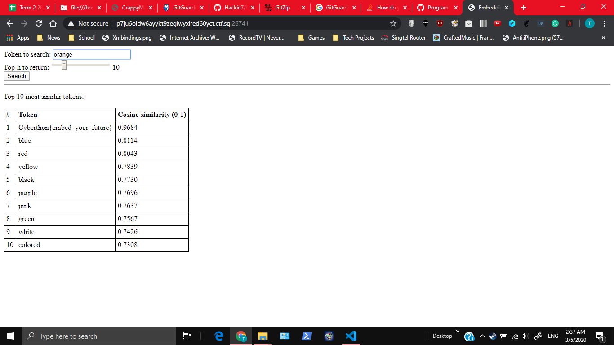

# My New Language
120, DATA SCIENCE, 49 SOLVES

## Description
The attackers created their own language for their secret communication. We were able to intercept a file but it doesn't seem to make any sense! Further tracing to the attackers' C2 allowed us to find a program that would give some hints as to what the file might mean...

Can you figure out the hidden message?

http://p7ju6oidw6ayykt9zeglwyxired60yct.ctf.sg:26741

Note: The flag will appear in the form Cyberthon{...}.

## Given
file.txt

# Solution
This is a question I couldn't do in the competition (my friends solved it first). 
I'm not very sure how to solve it, but here's what I gather from my understanding.

On Inspecting `file.txt`, you get this
```
weigen inhanus catets acteous aticittier
```

By testing all the words in the file with the website, you get `fruit that is a color`.
By searching orange, you can get the flag. You can also end up with this when you query for a colour.


# Flag
`Cyberthon{embed_your_future}`