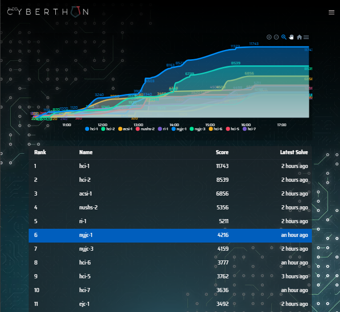

# Cyberthon 2020 Finals

[Cyberthon 2020 ](https://www.cyberthon.hci.edu.sg/)

"Cyberthon is organised by Hwa Chong Institution (College Section), in collaboration with Defence Cyber Organisation (DCO) and Centre for Strategic Infocomm Technologies (CSIT) providing technical expertise. It is a cybersecurity competition that aims to enthuse and inspire students to develop crucial skills relating to Infocomm Technology. The competition is designed to be a skill-appropriate competition for students studying in the equivalent of Junior College/Centralised Institute Year 1 to Year 3.

Through this competition, students will gain a deeper understanding of real-life cyber security issues as well as opportunities to pit their cybersecurity skills against the best in their age group. In the long term, we hope that the competition can help to identify and nurture a core group of Infocomm talents with deep expertise in cyber defence."

## Event Details

Due to Covid 19, the event was held online on 2/5/2020, 10am to 4.30pm. There also was a Youtube Livestream.

I participated in a team as `nyjc-1`, with these people
1. [Codekrodile](https://github.com/Codekrodile)
2. [bobjohnjones](https://github.com/bobjohnjones)
3. [undefined-func](https://github.com/undefined-func)

During the competition, I basically only solved 2 tasks, 
4. Network security: Baba Suppliers' Chat
	- I solved it quite early into the thing, around 11am, taking 10min or so
5. Web Services: Caged Up

I tried to do several various challenges like Treasure Hunt, Meow, Loosen That Ratcher, but I was stuck and didn't know what to do. Also my Windows computer like just hung midway while extracting the VM (over 20 minutes to extract the 15GB VM).

In the end, even though I felt I could have probably done better, our team managed to get 6th place in the overall competition (undefined-func carried Data Science).

Livestream Photo:

## My Stuff
In this folder is mainly a bunch of code and experiments, most of which failed and went nowhere. However, there are writeups for Baba Supplies' Chat in `Network Security/Baba Supplier's Chat` and Caged Up in `Web Services/Caged Up`, and maybe more if I do them after the competition.

## Other's Writeups
Obviously I'm not very good at cybersecurity, so check out other write ups for the challenges!

1. https://jloh02.github.io/ctf/cyberthon-2020
2. https://oceankoh.github.io/articles/2020-05/Cyberthon-Finals
3. https://github.com/willi123yao/Cyberthon2020_Writeups

Alternatively, if you actually participated in the competition, check out the discord server for writeups under `#writeups`
