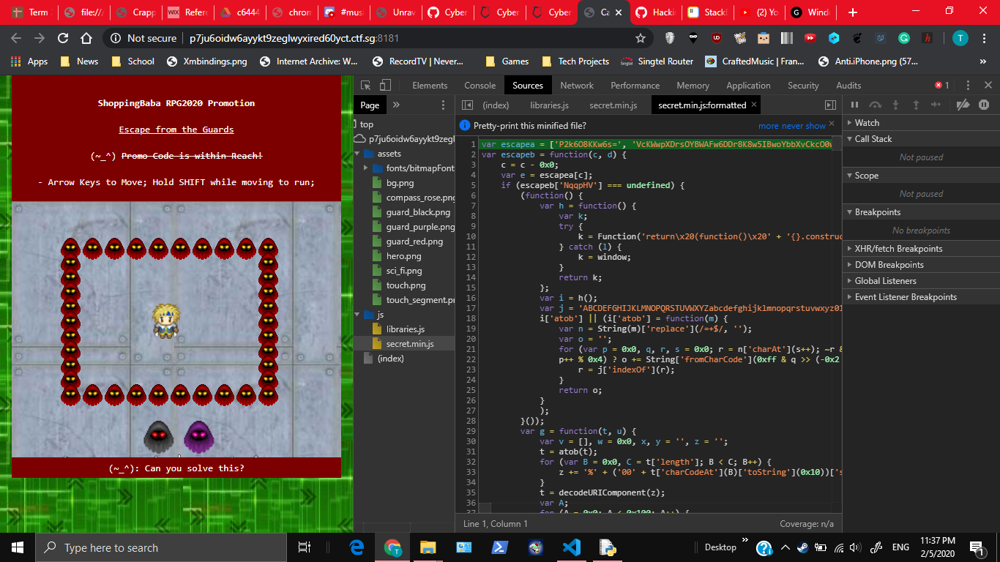
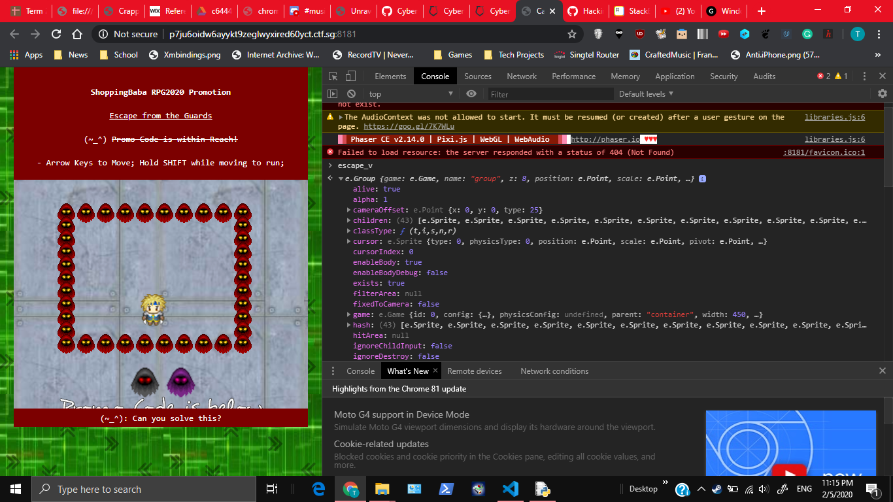
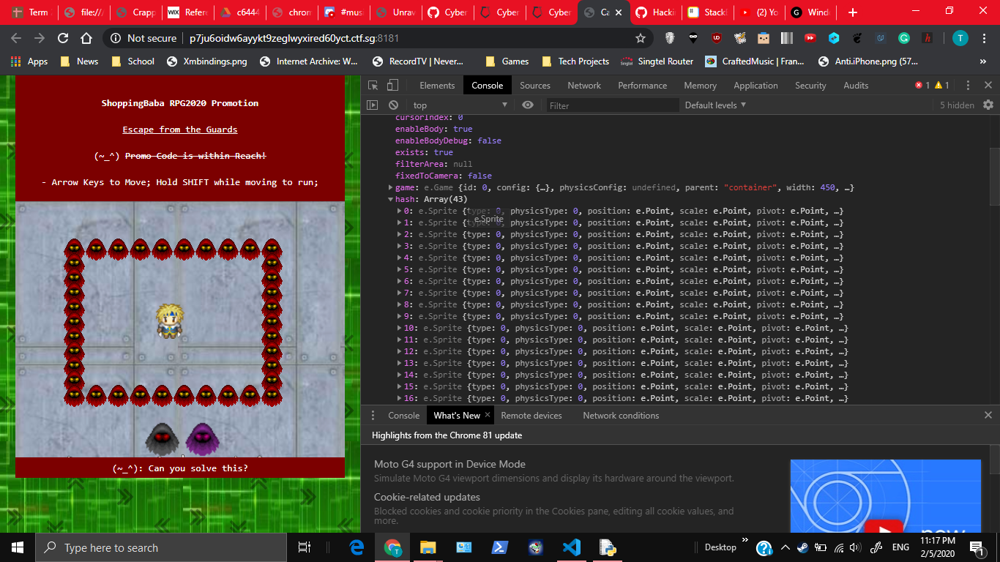
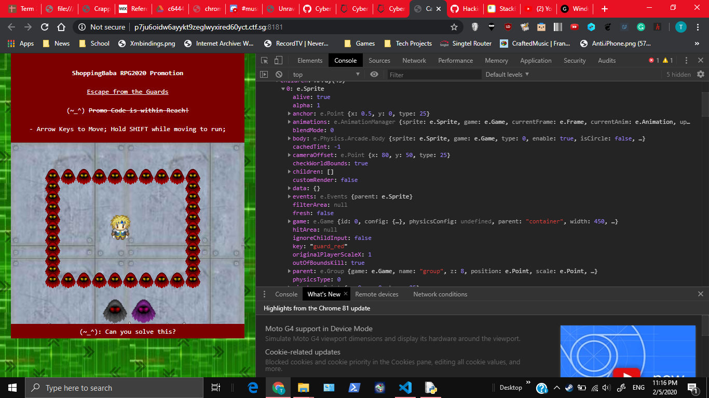
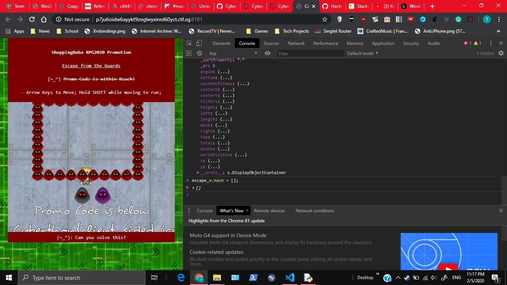
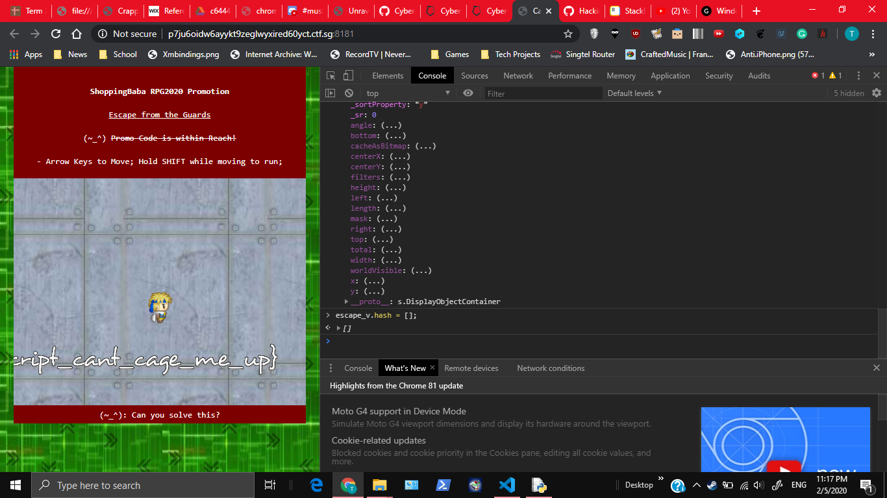
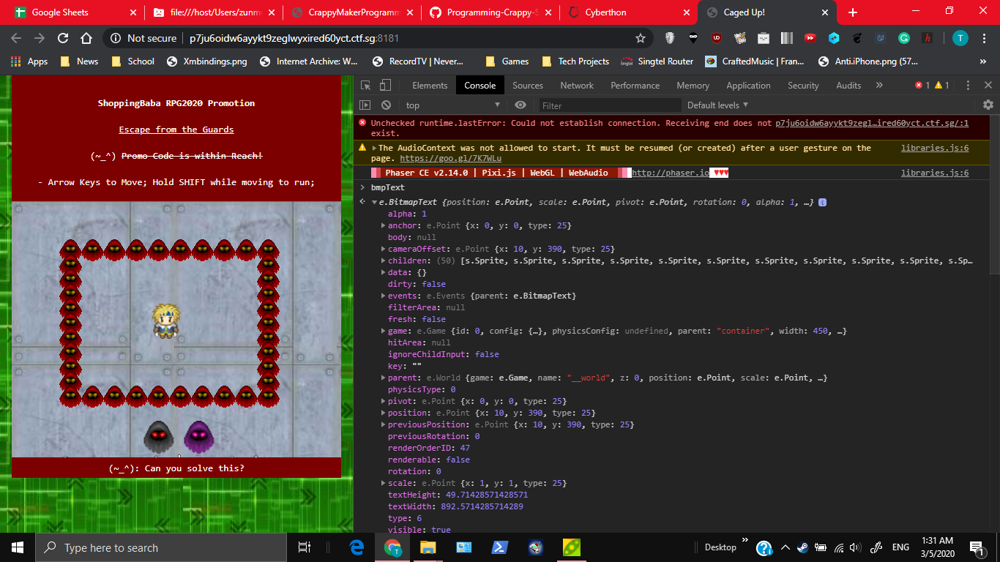
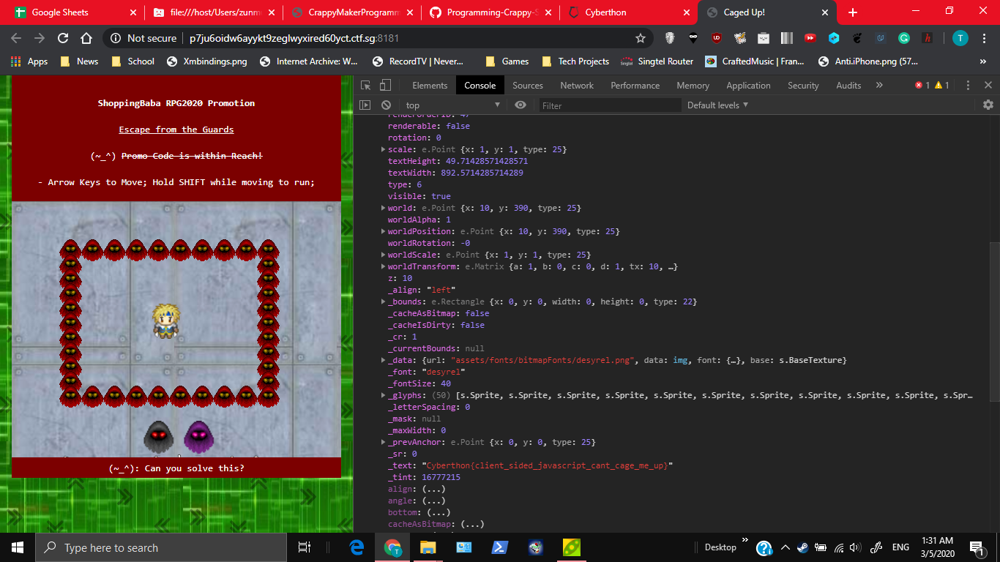

# Caged Up
700, WEB SERVICES, 32 SOLVES

## Description
Having accessed the database, the attacker modified the promotion banner for a product sold on ShoppingBaba, preventing the promo code from being revealed! The promo code can be found on the website http://p7ju6oidw6ayykt9zeglwyxired60yct.ctf.sg:8181 Can you find out what was the promo code?

NOTE: You do not have to compromise/pen-test the webserver

# Solution

Here's a basic inspection of the page

Observations
1. It is client side javascript (at least I didn't find networking functions or stuff in the files)
2. To be more specific, it's using a Javascript game-making library called Phaser.
3. The code's obfuscated with single character variable names (yay to ~~poor~~ competitive programming practices)
4. The basic idea is to move down to access the flag, as hinted by the text below `Promo code is below` (It's in the images below)

I had no idea how to continue, and I'm not going to read up on the entirety of Phaser documentation, or reverse engineer the code step by step. Hence, I just checked out the local variables to hope I luck out and run into some powerful cheat code or something.

On checking out the Javascript with the Chrome Dev Tools Console, you can notice many variables. Of course, their name's aren't meaningful, but hey this is something I can look into.

I checked the contents of the variables with the console. One of these variables, `escape_v` has promise, as it seemed quite long.

In particular, 2 properties of `escape_v`, `children` and `hash` had a list of `e.Sprite`, which could represent the walls/ enemies.

Upon tinkering around with the `children property`, all the elements are removed. The player character is gone, and you can't move the camera with the joystick/ arrow keys either.

Let's try tinkering with the `hash` property next, clearing all sprites.

Now we can move around. And yeah here's the flag.

## Alternative Solution
From what I heard in the discord chat, there's a variable `bmpText` with the flag

# Flag
`Cyberthon{client_side_javascript_cant_cage_me_up}`