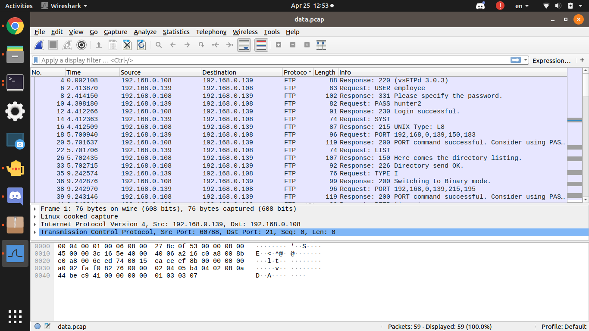
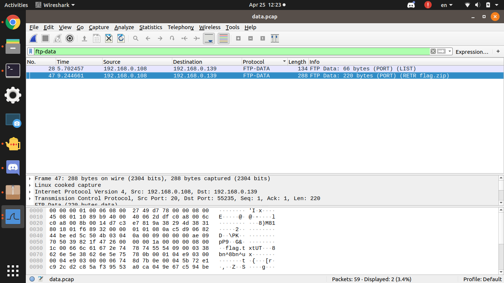
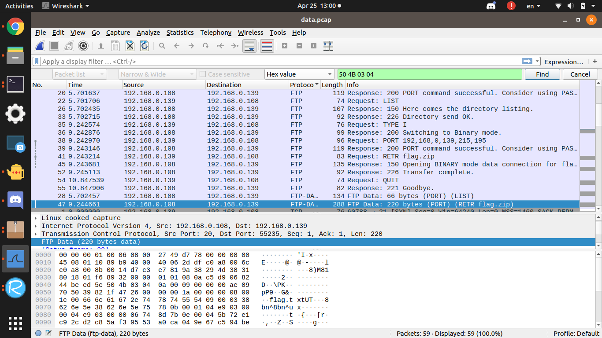
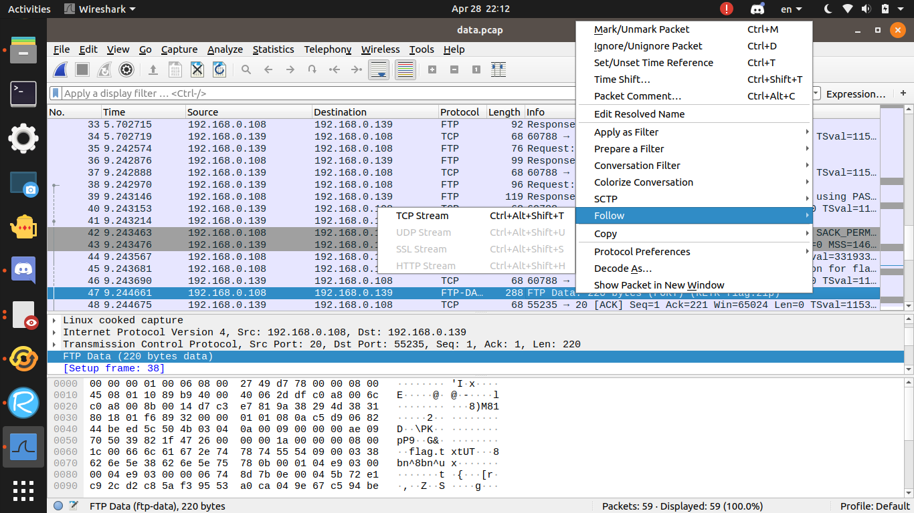
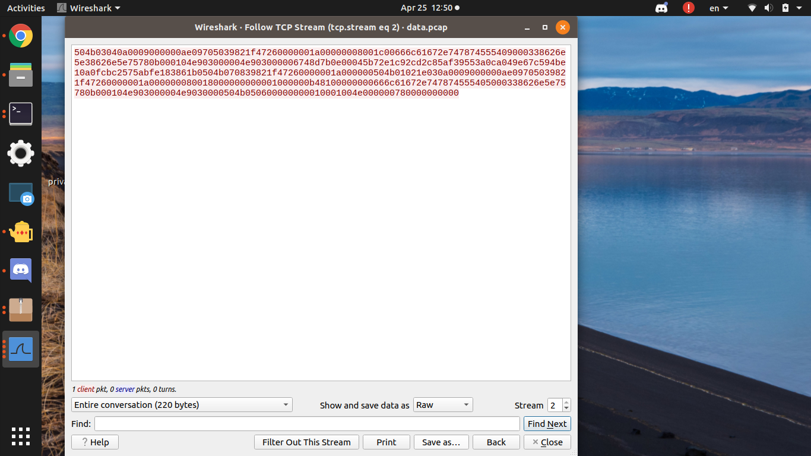
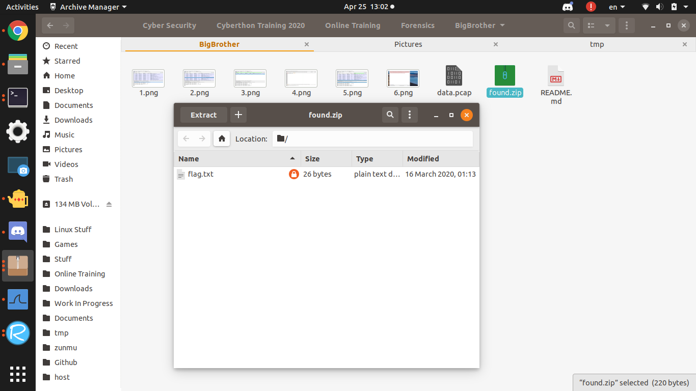
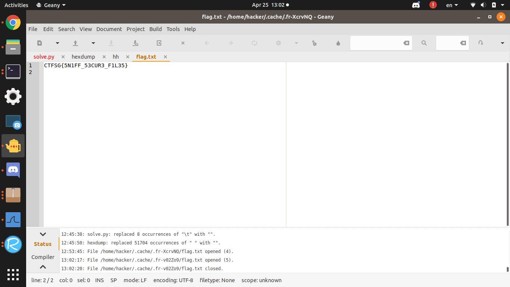

# BigBrother
200, Forensics, 53 solves as of Solving

## Description
This employee was so careless that he didn't realize his traffic was being sniffed. Unfortunately for him, he downloaded the flag while being watched. Can you recover the flag from the captured traffic?

## Useful tools:
Wireshark

## Given
data.pcap

# Solution

Analysing the pcap file, there are 3 kinds of packets: TCP, FTP, and FTP-DATA

You also get to know the username `employee` and password `hunter2`

From [here](https://sceweb.sce.uhcl.edu/abeysekera/itec3831/labs/FILE%20SIGNATURES%20TABLE.pdf), you know the zip file header is `50 4B 03 04`, and by googling, you get [this website](https://shankaraman.wordpress.com/tag/how-to-extract-ftp-files-from-wireshark-packet/) which tells you how to extract ftp files from wireshark.

I searched for the zip file header, followed the TCP packet and saved the data as raw with .zip

Opening up the zip file, the flag.txt file is password protected. But just by guessing the password `hunter2` (because employee password), you can see the flag

# Flag
`CTFSG{5N1FF_53CUR3_F1L35}`
