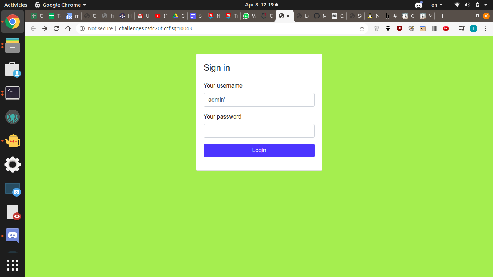

# Amnesia

# Description
Log in as admin into http://challenges.csdc20t.ctf.sg:10043/

# Solution

Assuming the SQL statement is in this form `"SELECT * FROM users WHERE username='$username' AND password='$password'"`

You basically want to select the row where the user is admin, and don't care about the password
So this is how you do it

Username: `admin'--`
Password: Put in anything, it's commented out anyway

# Flag
`CTFSG{S3QU3L_T0_A_K3WL_ST0RY}`
