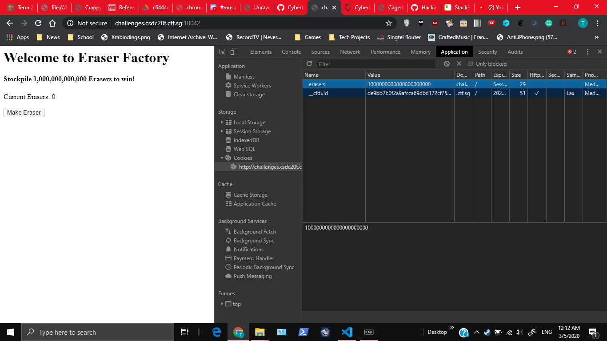
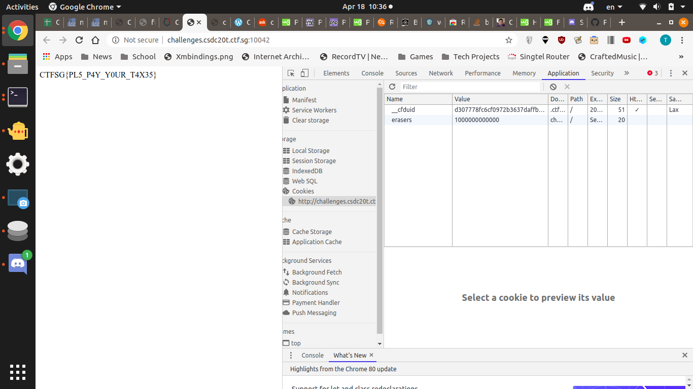

# EraserFactory
200, WEB, 88 SOLVES

## Description
Deeply inspired by the highly addictive [Paperclip](https://www.decisionproblem.com/paperclips/index2.html) game, I decided to develop my own game called [EraserFactory](http://challenges.csdc20t.ctf.sg:10042/)! Win my game to get the flag.

# Solution
For Web Challenges, let's first inspect the page

Since there is a POST request, there may be cookies storing information. Let's use Chrome Dev Tools to inspect.

Let's modify the cookie and refresh the page.

# Flag
`CTFSG{PL5_P4Y_Y0UR_T4X35}`