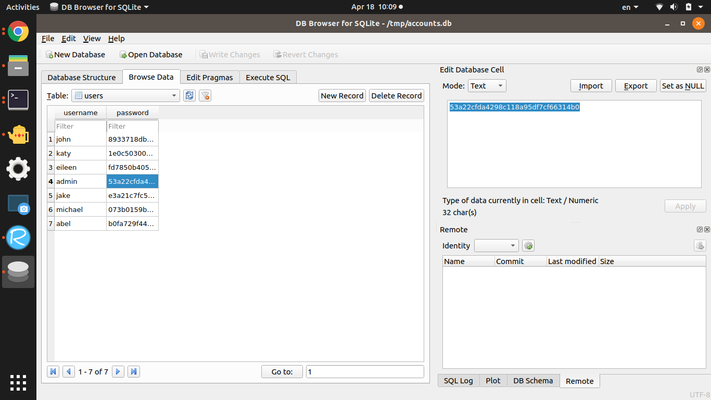
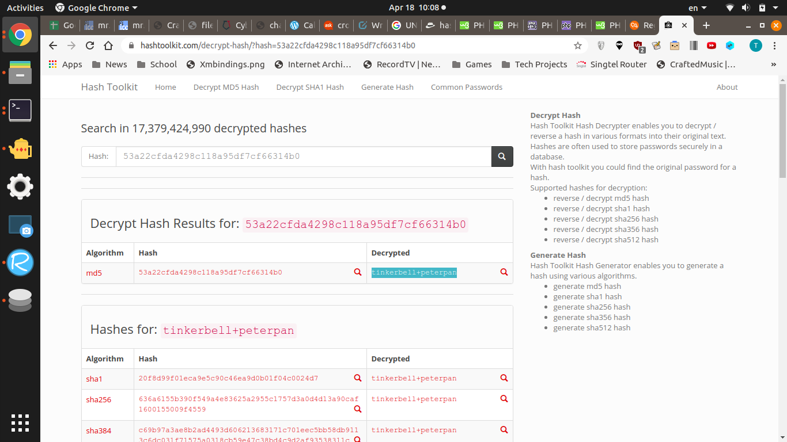
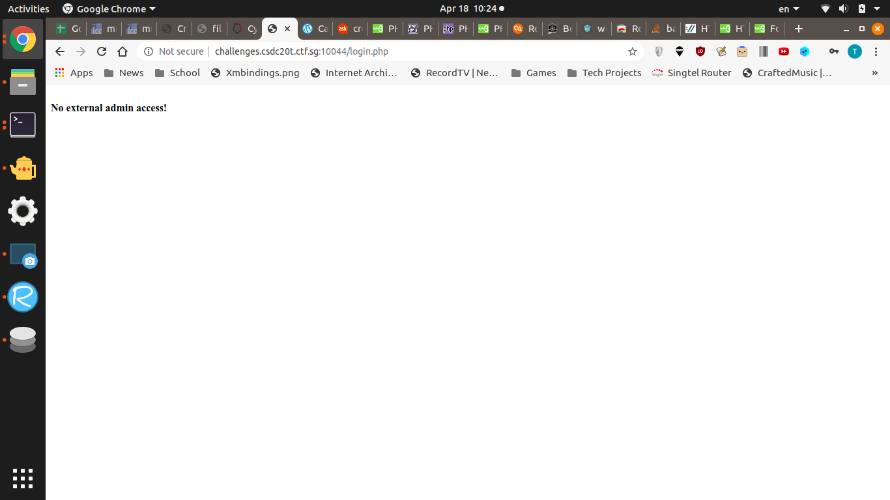

# Hotfix
400 Points, Web, 8 Solves as of solving

## Description
Thanks to the shenanigans you pulled in the previous challenge to log yourself in, the developers of this website are now in a state of panic and deployed a series of hotfixes. I'm not completely convinced they did a good job.


## Given
login.php

# Solution

## Experiments

The php code given tells us that we can't use the  `admin`,`'` and whitespaces. So the idea is to craft a SQL injection without needing any of those (Because doing it from the password is unrealistic)

BUT
1. the word `admin` is replaced first before replacing `'`. So theoretically, we can put in `ad'min` and it will become `admin` 


Google, my best friend

Fun things researched upon (may be a sidetrack)
1. % is a wildcard character
2. \ is an escape character
3. https://ctf-wiki.github.io/ctf-wiki/web/sqli/
4. https://websec.wordpress.com/2010/12/04/sqli-filter-evasion-cheat-sheet-mysql/


Unicode Smuggling (Using `ʼ` instead of `'`) doesn't work

By the way, sqlmap fails


## robots.txt
After spending so much time trying to find vulnerabilities in the PHP and SQL, I decided to just try checking `robots.txt`


`http://challenges.csdc20t.ctf.sg:10044/robots.txt`
```
User-Agent: *
Disallow: /accounts.db
```

If you go to `http://challenges.csdc20t.ctf.sg:10044/accounts.db`, you get to download the database file. Then 
read the db file for the password


Oh yeah we need to decrypt the md5 password first. I used this [online converter](https://hashtoolkit.com/decrypt-hash/?hash=53a22cfda4298c118a95df7cf66314b0)


Username: `ad'min`

Password: `tinkerbell+peterpan`



## Referrer

Ah right, no external login. Let's use `curl` to change our referrer
```
$ curl -d "username=ad%20min&password=tinkerbell%2Bpeterpan" "http://challenges.csdc20t.ctf.sg:10044/login.php"
<br /><b>No external admin access!</b>
$ curl -e internal.krytec.org -d "username=ad%20min&password=tinkerbell%2Bpeterpan" "http://challenges.csdc20t.ctf.sg:10044/login.php"
<h1>Hello</h1><br/>Username: admin<br />CTFSG{H0TF1X_M0R3_L1K3_H0TC4K35}
```

# Flag

`CTFSG{H0TF1X_M0R3_L1K3_H0TC4K35}`